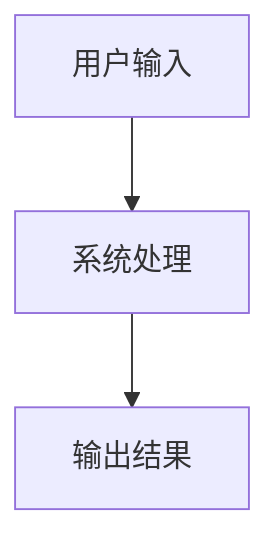
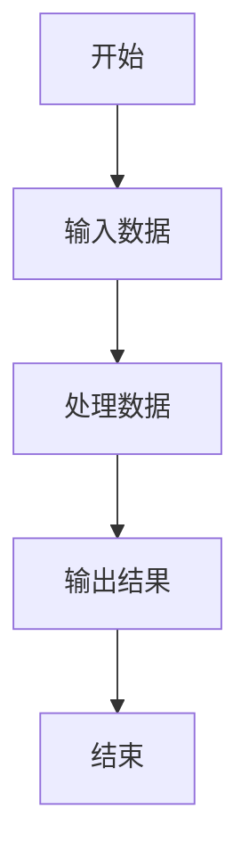

## 介绍

系统分析方法是信息系统开发过程中的关键步骤之一。它旨在通过系统化的方式理解、分析和设计复杂的信息系统。系统分析方法帮助开发团队明确需求、识别问题并提出解决方案，从而确保最终的系统能够满足用户的需求。

在系统分析过程中，通常会涉及多个步骤，包括需求收集、数据分析、流程建模和系统设计等。这些步骤共同构成了系统分析的核心内容。

## 系统分析方法的基本步骤

### 1. 需求收集

需求收集是系统分析的第一步。通过与用户、利益相关者进行沟通，了解他们的需求和期望。这一步骤通常包括以下活动：

- **访谈**：与用户进行面对面的交流，了解他们的需求。
- **问卷调查**：通过问卷收集大量用户的反馈。
- **观察**：观察用户的工作流程，了解他们的实际需求。

:::tip
在需求收集过程中，确保记录所有需求，并将其分类为功能需求和非功能需求。
:::

### 2. 数据分析

数据分析是系统分析的核心步骤之一。通过对现有数据的分析，识别系统中的问题和改进点。数据分析通常包括以下内容：

- **数据流图**：展示数据在系统中的流动过程。
- **数据字典**：定义系统中使用的所有数据项及其属性。

### 3. 流程建模

流程建模是通过图形化的方式展示系统中的业务流程。常用的流程建模工具包括流程图和数据流图。

### 4. 系统设计

在完成需求收集、数据分析和流程建模后，系统设计阶段将根据分析结果设计系统的架构和功能模块。系统设计通常包括以下内容：

- **系统架构设计**：定义系统的整体结构。
- **模块设计**：设计系统的各个功能模块。
- **接口设计**：定义系统与外部系统的交互接口。

## 实际案例

假设我们正在为一个图书馆开发一个新的图书管理系统。以下是系统分析方法在该项目中的应用：

1. **需求收集**：通过与图书馆管理员和读者的访谈，我们了解到系统需要支持图书借阅、归还、查询等功能。
2. **数据分析**：我们分析了现有的图书借阅记录，发现借阅高峰期集中在下午3点到5点。
3. **流程建模**：我们绘制了图书借阅的流程图，明确了借阅过程中的各个步骤。
4. **系统设计**：根据分析结果，我们设计了系统的架构，包括用户管理模块、图书管理模块和借阅管理模块。

## 总结

系统分析方法是信息系统开发过程中不可或缺的一部分。通过系统化的需求收集、数据分析、流程建模和系统设计，开发团队能够更好地理解用户需求，设计出符合预期的系统。

## 附加资源与练习

- **练习**：尝试为一个简单的在线商店进行系统分析，包括需求收集、数据分析和流程建模。
- **资源**：阅读《系统分析与设计》一书，深入了解系统分析方法的更多细节。

:::note
系统分析方法不仅适用于信息系统开发，还可以应用于其他领域的项目管理和问题解决。
:::