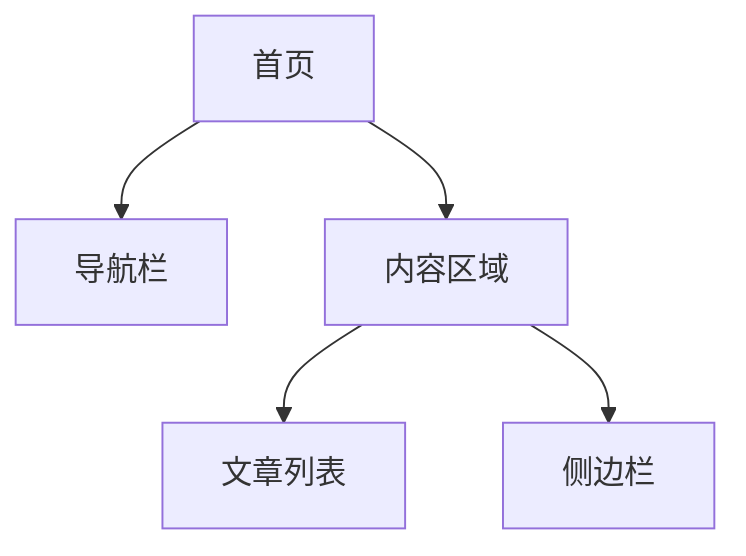
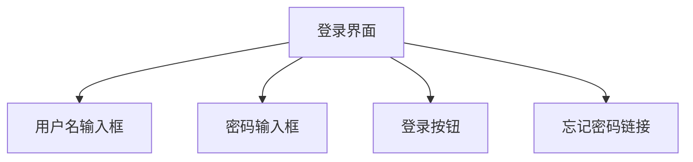

# 用户界面设计

用户界面设计（User Interface Design，简称 UI 设计）是信息系统开发中至关重要的一部分。它关注的是如何设计出直观、易用且美观的界面，以便用户能够高效地与系统进行交互。无论是网站、移动应用还是桌面软件，良好的用户界面设计都能显著提升用户体验。

## 什么是用户界面设计？

用户界面设计是指通过视觉和交互设计，使用户能够轻松地与系统进行交互的过程。它不仅仅是让界面看起来漂亮，更重要的是确保用户能够快速理解如何使用系统，并高效地完成任务。

:::note
**UI 设计的目标**：  
- 提高用户的操作效率  
- 减少用户的学习成本  
- 增强用户的满意度  
:::

## 用户界面设计的基本原则

以下是用户界面设计中的一些基本原则，这些原则可以帮助你创建出更好的界面：

1. **一致性**：界面中的元素（如按钮、图标、字体等）应保持一致，使用户能够快速识别和操作。
2. **简洁性**：避免不必要的复杂设计，保持界面简洁明了。
3. **反馈**：用户操作后，系统应提供及时的反馈，例如按钮点击后的状态变化。
4. **可见性**：重要的功能和信息应清晰可见，避免用户迷失在界面中。
5. **易用性**：界面应易于学习和使用，即使是新手用户也能快速上手。

## 用户界面设计的步骤

### 1. 需求分析
在设计界面之前，首先要明确用户的需求。了解用户的目标、习惯和痛点，可以帮助你设计出更符合用户期望的界面。

### 2. 线框图设计
线框图（Wireframe）是界面的草图，用于展示界面的布局和结构。它不需要包含详细的视觉设计，但需要明确各个元素的位置和功能。



### 3. 视觉设计
在线框图的基础上，进行视觉设计。选择合适的颜色、字体、图标等元素，使界面既美观又符合品牌形象。

### 4. 原型设计
原型是界面的交互模型，用户可以通过点击按钮、输入文本等方式与原型进行交互。原型设计可以帮助你测试界面的可用性。

### 5. 用户测试
通过用户测试，收集用户对界面的反馈，并根据反馈进行优化。用户测试可以帮助你发现设计中存在的问题，并加以改进。

## 实际案例：登录界面设计

让我们通过一个简单的登录界面设计案例，来理解用户界面设计的实际应用。

### 需求分析
用户需要一个简单、直观的登录界面，能够快速输入用户名和密码，并登录系统。

### 线框图设计
登录界面的线框图可以包含以下元素：
- 用户名输入框
- 密码输入框
- 登录按钮
- 忘记密码链接



### 视觉设计
选择简洁的配色方案，使用清晰的字体和图标，确保界面看起来干净且易于操作。

### 原型设计
创建一个可交互的原型，用户可以在输入框中输入文本，并点击登录按钮。

```html
<form>
  <label for="username">用户名:</label>
  <input type="text" id="username" name="username" /><br />
  <label for="password">密码:</label>
  <input type="password" id="password" name="password" /><br />
  <button type="submit">登录</button>
</form>
```

### 用户测试
邀请用户测试登录界面，观察他们是否能够顺利登录，并收集他们的反馈。根据反馈优化界面设计。

## 总结

用户界面设计是信息系统开发中不可或缺的一部分。通过遵循一致性、简洁性、反馈、可见性和易用性等原则，你可以设计出用户友好的界面。从需求分析到用户测试，每一步都至关重要，确保最终的设计能够满足用户的需求。

:::tip
**附加资源**：  
- [《Don't Make Me Think》 by Steve Krug](https://www.amazon.com/Dont-Make-Think-Revisited-Usability/dp/0321965515)  
- [Material Design Guidelines](https://material.io/design)  
:::

:::caution
**练习**：  
尝试为一个简单的注册页面设计线框图和原型，并进行用户测试。根据测试结果优化设计。
:::