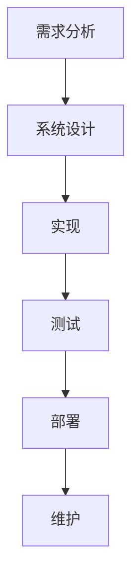
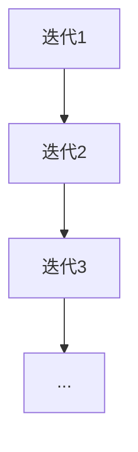
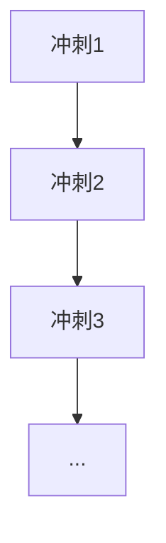
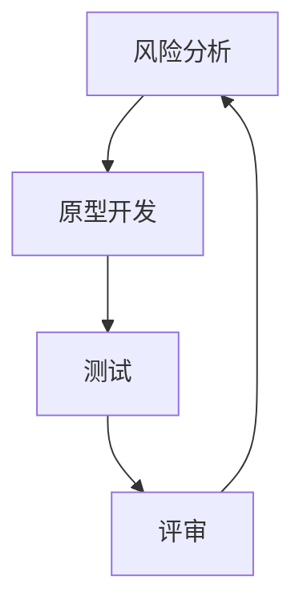

# 信息系统开发模型

信息系统开发模型是用于指导信息系统开发过程的结构化框架。它们帮助开发团队规划、设计、实施和维护信息系统，以确保项目按时、按预算完成，并满足用户需求。本文将介绍几种常见的信息系统开发模型，并通过实际案例展示它们的应用。

## 1. 什么是信息系统开发模型？

信息系统开发模型是一种方法论，用于指导信息系统的开发过程。它定义了开发过程中各个阶段的活动、任务和交付物。通过使用开发模型，团队可以更好地管理项目风险、提高开发效率，并确保最终产品符合预期。

## 2. 常见的信息系统开发模型

以下是几种常见的信息系统开发模型：

### 2.1 瀑布模型（Waterfall Model）

瀑布模型是最早的系统开发模型之一。它将开发过程分为几个线性阶段，每个阶段必须在进入下一个阶段之前完成。典型的阶段包括需求分析、系统设计、实现、测试、部署和维护。

**优点**：
- 结构清晰，易于理解和管理。
- 每个阶段都有明确的交付物。

**缺点**：
- 难以应对需求变更。
- 测试阶段较晚，可能导致问题发现较晚。

**适用场景**：适用于需求明确且稳定的项目。

### 2.2 迭代模型（Iterative Model）

迭代模型将开发过程分为多个迭代周期。每个迭代周期都包含需求分析、设计、实现和测试等阶段。通过多次迭代，系统逐步完善。

**优点**：
- 可以逐步完善系统功能。
- 更容易应对需求变更。

**缺点**：
- 需要更多的管理和协调。
- 可能导致项目进度难以控制。

**适用场景**：适用于需求不明确或可能变化的项目。

### 2.3 敏捷模型（Agile Model）

敏捷模型是一种灵活的开发方法，强调快速响应变化和持续交付。开发团队通过短周期的迭代（称为“冲刺”）来逐步交付可用的软件。

**优点**：
- 高度灵活，能够快速响应变化。
- 持续交付，用户可以尽早看到成果。

**缺点**：
- 需要高度协作的团队。
- 对需求变更的管理要求较高。

**适用场景**：适用于需求变化频繁或需要快速交付的项目。

### 2.4 螺旋模型（Spiral Model）

螺旋模型结合了瀑布模型和迭代模型的优点。它将开发过程分为多个螺旋周期，每个周期都包括风险分析、原型开发、测试和评审。

**优点**：
- 强调风险管理。
- 适用于大型复杂项目。

**缺点**：
- 需要较高的管理成本。
- 可能延长开发周期。

**适用场景**：适用于高风险或复杂的大型项目。

## 3. 实际案例

### 3.1 瀑布模型案例：企业资源规划（ERP）系统

某公司需要开发一个ERP系统来管理其财务、人力资源和供应链。由于需求明确且稳定，开发团队选择了瀑布模型。经过需求分析、系统设计、实现、测试和部署，ERP系统成功上线并运行良好。

### 3.2 敏捷模型案例：移动应用开发

一家初创公司计划开发一款移动应用，但需求尚不明确。开发团队选择了敏捷模型，通过多次冲刺逐步完善应用功能。每次冲刺结束后，团队都会根据用户反馈进行调整，最终成功发布了一款受欢迎的应用。

## 4. 总结

信息系统开发模型是信息系统开发过程中的重要工具。不同的开发模型适用于不同的项目类型和需求。选择合适的开发模型可以帮助团队更好地管理项目风险、提高开发效率，并确保最终产品符合预期。

## 5. 附加资源与练习

- **资源**：
  - [《敏捷软件开发：原则、模式与实践》](https://example.com)
  - [《软件工程：实践者的研究方法》](https://example.com)

- **练习**：
  1. 选择一个你熟悉的项目，尝试为其设计一个开发模型。
  2. 比较瀑布模型和敏捷模型的优缺点，并讨论它们在不同场景下的适用性。

:::tip
**提示**：在选择开发模型时，务必考虑项目的需求、团队的能力和项目的风险。
:::