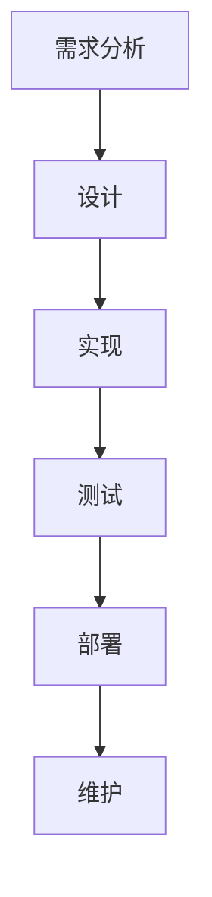

## 介绍

软件工程与信息系统是现代技术领域中的两个重要概念。软件工程是一门应用系统化、规范化和量化的方法来开发、运行和维护软件的学科。而信息系统则是指通过计算机硬件、软件、网络和数据资源来收集、处理、存储和分发信息的系统。两者的结合使得我们能够构建高效、可靠且易于维护的软件系统，从而支持各种业务需求。

## 软件工程的核心概念

### 1. 软件开发生命周期（SDLC）

软件开发生命周期（SDLC）是软件工程中的一个核心概念，它描述了从需求分析到软件维护的整个过程。SDLC通常包括以下几个阶段：

- **需求分析**：明确软件的功能需求和非功能需求。
- **设计**：根据需求设计软件的架构和模块。
- **实现**：编写代码，实现设计的功能。
- **测试**：验证软件是否满足需求，并修复发现的缺陷。
- **部署**：将软件部署到生产环境中。
- **维护**：在软件发布后，持续修复问题并更新功能。



### 2. 敏捷开发

敏捷开发是一种迭代式的软件开发方法，强调快速交付可用的软件，并通过持续的反馈和改进来适应变化。敏捷开发的核心原则包括：

- **个体和互动**：优先于流程和工具。
- **可工作的软件**：优先于详尽的文档。
- **客户合作**：优先于合同谈判。
- **响应变化**：优先于遵循计划。

:::tip
敏捷开发特别适合需求变化频繁的项目，因为它能够快速适应变化并交付价值。
:::

## 信息系统的核心概念

### 1. 信息系统的组成

信息系统通常由以下几个部分组成：

- **硬件**：计算机、服务器、网络设备等。
- **软件**：操作系统、数据库管理系统、应用程序等。
- **数据**：存储在系统中的信息。
- **人员**：使用和管理系统的人员。
- **流程**：系统操作和管理的流程。

### 2. 信息系统的类型

根据用途和规模，信息系统可以分为以下几种类型：

- **事务处理系统（TPS）**：用于处理日常事务，如订单处理、库存管理等。
- **管理信息系统（MIS）**：为管理层提供决策支持信息。
- **决策支持系统（DSS）**：帮助管理者进行复杂的决策。
- **专家系统（ES）**：模拟人类专家的决策过程。

## 实际案例

### 案例：在线购物系统

假设我们要开发一个在线购物系统，以下是该系统的主要功能和开发步骤：

1. **需求分析**：确定系统需要支持用户注册、商品浏览、购物车管理、订单处理等功能。
2. **设计**：设计系统的数据库结构、用户界面和业务流程。
3. **实现**：编写代码实现各个功能模块。
4. **测试**：测试系统的功能、性能和安全性。
5. **部署**：将系统部署到服务器上，供用户访问。
6. **维护**：根据用户反馈和市场需求，持续改进系统。

```python
# 示例代码：购物车管理
class ShoppingCart:
    def __init__(self):
        self.items = []

    def add_item(self, item):
        self.items.append(item)

    def remove_item(self, item):
        self.items.remove(item)

    def get_total(self):
        return sum(item.price for item in self.items)

# 使用示例
cart = ShoppingCart()
cart.add_item(Item("Book", 20))
cart.add_item(Item("Pen", 5))
print("Total:", cart.get_total())  # 输出: Total: 25
```

## 总结

软件工程与信息系统是构建现代软件系统的基石。通过理解软件工程的核心概念和信息系统的组成，我们可以更好地设计和开发高效、可靠的软件系统。无论是开发一个简单的应用程序，还是构建一个复杂的企业级信息系统，掌握这些基础知识都是至关重要的。

## 附加资源与练习

- **资源**：
  - [《软件工程：实践者的研究方法》](https://example.com)
  - [《信息系统导论》](https://example.com)
- **练习**：
  - 设计一个简单的学生管理系统，包括学生信息的录入、查询和删除功能。
  - 尝试使用敏捷开发方法开发一个小型项目，记录每个迭代的进展和反馈。

:::caution
在实际开发中，务必注意代码的可维护性和可扩展性，避免过度复杂的设计。
:::