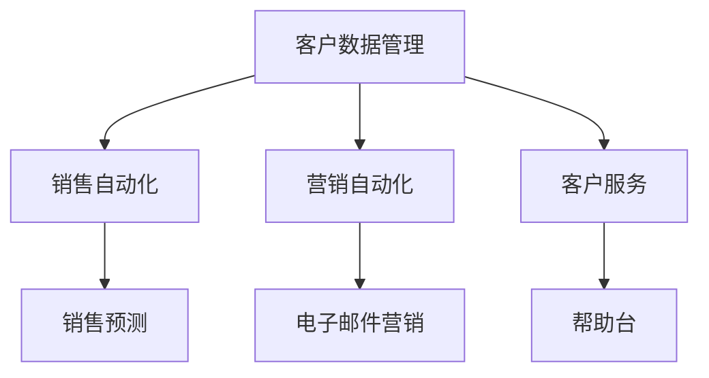

# 客户关系管理(CRM)

## 什么是客户关系管理(CRM)？

客户关系管理（Customer Relationship Management，简称 CRM）是一种用于管理与客户互动的策略、技术和工具。它的核心目标是帮助企业更好地了解客户需求，提升客户满意度，从而增加销售额和客户忠诚度。CRM 系统通常包括客户数据管理、销售自动化、营销自动化和客户服务等功能。

:::note
CRM 不仅仅是软件，它更是一种以客户为中心的业务策略。
:::

## CRM 的核心功能

1. **客户数据管理**：集中存储和管理客户的基本信息、交易记录、沟通历史等。
2. **销售自动化**：自动化销售流程，如线索管理、机会跟踪和销售预测。
3. **营销自动化**：通过电子邮件、社交媒体等渠道自动化营销活动。
4. **客户服务**：提供客户支持工具，如帮助台、知识库和聊天机器人。

## CRM 的实际应用场景

### 案例：电商平台的 CRM 系统

假设你经营一家电商平台，CRM 系统可以帮助你：

1. **收集客户数据**：记录客户的购买历史、浏览行为和偏好。
2. **个性化营销**：根据客户行为发送个性化的促销邮件。
3. **提升客户服务**：通过聊天机器人快速响应客户问题。

### 代码示例：简单的客户数据管理

以下是一个使用 Python 实现的简单客户数据管理示例：

```python
class Customer:
    def __init__(self, name, email, phone):
        self.name = name
        self.email = email
        self.phone = phone

    def __str__(self):
        return f"Customer(name={self.name}, email={self.email}, phone={self.phone})"

# 创建客户实例
customer1 = Customer("Alice", "alice@example.com", "123-456-7890")
print(customer1)
```

**输出：**
```
Customer(name=Alice, email=alice@example.com, phone=123-456-7890)
```

## CRM 系统的架构

一个典型的 CRM 系统通常包括以下组件：



## 总结

客户关系管理(CRM)是企业信息系统中不可或缺的一部分。它通过集中管理客户数据、自动化销售和营销流程，以及提升客户服务质量，帮助企业实现更高的客户满意度和业务增长。

:::tip
如果你想进一步学习 CRM，可以尝试以下练习：
1. 使用 Python 实现一个简单的 CRM 系统。
2. 研究开源 CRM 系统（如 Odoo 或 SuiteCRM）的架构和功能。
:::

## 附加资源

- [CRM 系统入门指南](https://example.com/crm-guide)
- [开源 CRM 系统推荐](https://example.com/open-source-crm)