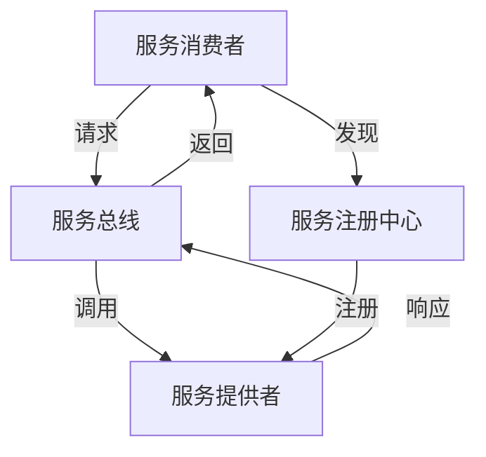

# 服务导向架构(SOA)

## 介绍

服务导向架构（Service-Oriented Architecture，简称 SOA）是一种软件设计模式，通过将应用程序的功能分解为可重用的服务，来构建灵活、可扩展的企业信息系统。SOA 的核心思想是将复杂的系统拆分为多个独立的服务，这些服务可以通过标准化的接口进行通信和交互。

SOA 的主要目标是提高系统的灵活性、可维护性和可扩展性，同时降低系统的耦合度。它广泛应用于企业级应用开发中，尤其是在需要集成多个异构系统的场景中。

## SOA 的核心原则

SOA 的设计遵循以下几个核心原则：

1. **服务可重用性**：服务是独立的、可重用的组件，可以在不同的应用程序中被多次调用。
2. **松耦合**：服务之间通过标准化的接口进行通信，彼此之间没有直接的依赖关系。
3. **服务自治**：每个服务都是独立的，可以独立开发、部署和维护。
4. **基于标准**：服务之间的通信通常基于标准协议（如 HTTP、SOAP、REST 等）。
5. **可组合性**：服务可以通过组合的方式构建更复杂的业务流程。

## SOA 的基本架构

SOA 的架构通常包括以下几个关键组件：

- **服务提供者**：提供具体功能的服务。
- **服务消费者**：调用服务的客户端或应用程序。
- **服务注册中心**：用于存储和发现服务的目录。
- **服务总线**：用于处理服务之间的通信和消息传递。

以下是一个简单的 SOA 架构图：



## SOA 的实际应用场景

### 案例：电子商务系统

假设我们正在开发一个电子商务系统，该系统需要处理订单、库存管理和支付等功能。使用 SOA，我们可以将这些功能拆分为独立的服务：

1. **订单服务**：负责处理订单的创建、修改和查询。
2. **库存服务**：负责管理商品的库存信息。
3. **支付服务**：负责处理支付请求和交易记录。

每个服务都可以独立开发和部署，并通过标准化的接口进行通信。例如，当用户下单时，订单服务会调用库存服务来检查库存，并调用支付服务来处理支付。

### 代码示例

以下是一个简单的 RESTful 服务示例，展示如何使用 SOA 实现订单服务：

```python
from flask import Flask, request, jsonify

app = Flask(__name__)

# 订单服务
@app.route('/order', methods=['POST'])
def create_order():
    data = request.json
    # 调用库存服务检查库存
    inventory_response = check_inventory(data['product_id'], data['quantity'])
    if inventory_response['status'] == 'success':
        # 调用支付服务处理支付
        payment_response = process_payment(data['payment_details'])
        if payment_response['status'] == 'success':
            return jsonify({'status': 'success', 'order_id': 12345})
        else:
            return jsonify({'status': 'failure', 'message': 'Payment failed'})
    else:
        return jsonify({'status': 'failure', 'message': 'Out of stock'})

def check_inventory(product_id, quantity):
    # 模拟调用库存服务
    return {'status': 'success'}

def process_payment(payment_details):
    # 模拟调用支付服务
    return {'status': 'success'}

if __name__ == '__main__':
    app.run(debug=True)
```

:::note
在这个示例中，订单服务通过 REST API 与其他服务进行通信。这种松耦合的设计使得每个服务可以独立开发和维护。
:::

## SOA 的优势与挑战

### 优势

- **灵活性**：服务可以独立更新和替换，而不会影响整个系统。
- **可扩展性**：可以根据需求增加或减少服务的实例。
- **可重用性**：服务可以在多个应用程序中重复使用，减少开发成本。
- **易于集成**：通过标准化的接口，SOA 可以轻松集成异构系统。

### 挑战

- **复杂性**：SOA 的设计和实现可能比传统的单体架构更复杂。
- **性能开销**：服务之间的通信可能会引入额外的延迟。
- **治理难度**：随着服务数量的增加，管理和监控服务的难度也会增加。

## 总结

服务导向架构（SOA）是一种强大的设计模式，特别适用于构建复杂的企业信息系统。通过将系统功能分解为独立的服务，SOA 提供了更高的灵活性、可扩展性和可维护性。然而，SOA 的实施也面临一些挑战，如复杂性和性能开销。因此，在设计 SOA 系统时，需要权衡这些因素，并选择合适的工具和技术。

## 附加资源与练习

### 资源

- [SOA 设计模式](https://www.oreilly.com/library/view/soa-design-patterns/9780133858587/)
- [RESTful Web Services](https://www.oreilly.com/library/view/restful-web-services/9780596529260/)

### 练习

1. 尝试将上述订单服务的代码扩展为完整的电子商务系统，包括库存服务和支付服务。
2. 研究并实现一个简单的服务注册中心，用于存储和发现服务。
3. 探索如何在 SOA 中使用消息队列（如 RabbitMQ 或 Kafka）来实现异步通信。

:::tip
通过实践这些练习，你将更深入地理解 SOA 的设计原则和实现方法。
:::