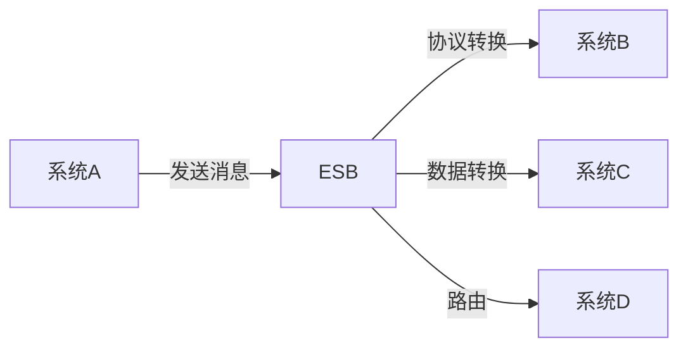

## 什么是企业服务总线(ESB)?

企业服务总线（Enterprise Service Bus，简称 ESB）是一种用于集成企业应用程序的架构模式。它充当不同系统之间的“中间人”，负责消息传递、数据转换、路由和协议转换等任务。ESB 的核心目标是简化企业系统的集成，降低系统之间的耦合度，从而提高灵活性和可扩展性。

:::note
ESB 并不是一个具体的软件，而是一种架构模式。常见的 ESB 实现包括 Apache Camel、MuleSoft、IBM Integration Bus 等。
:::

## ESB 的核心功能

ESB 的主要功能可以概括为以下几点：

1. **消息传递**：ESB 负责在不同系统之间传递消息，确保消息能够安全、可靠地到达目的地。
2. **协议转换**：不同系统可能使用不同的通信协议（如 HTTP、JMS、FTP 等），ESB 可以将这些协议进行转换，使系统之间能够无缝通信。
3. **数据转换**：ESB 可以将数据从一种格式转换为另一种格式（如 XML 到 JSON），以适应不同系统的需求。
4. **路由**：ESB 可以根据消息的内容或目的地，将消息路由到正确的系统或服务。
5. **监控与管理**：ESB 通常提供监控和管理功能，帮助管理员跟踪消息的流动情况，及时发现和解决问题。

## ESB 的工作原理

为了更好地理解 ESB 的工作原理，我们可以通过一个简单的流程图来说明：



在这个流程中：

1. **系统A** 发送一条消息到 ESB。
2. ESB 根据消息的内容和目的地，进行协议转换、数据转换和路由。
3. 最终，消息被传递到 **系统B**、**系统C** 或 **系统D**。

## 代码示例：使用 Apache Camel 实现简单的 ESB

以下是一个使用 Apache Camel 实现简单 ESB 的代码示例。假设我们需要将 HTTP 请求转换为 JMS 消息，并将其发送到消息队列中。

```java
import org.apache.camel.builder.RouteBuilder;
import org.apache.camel.CamelContext;
import org.apache.camel.impl.DefaultCamelContext;

public class SimpleESB {
    public static void main(String[] args) throws Exception {
        CamelContext context = new DefaultCamelContext();
        context.addRoutes(new RouteBuilder() {
            @Override
            public void configure() {
                from("jetty:http://localhost:8080/myService")
                    .convertBodyTo(String.class)
                    .to("jms:queue:myQueue");
            }
        });
        context.start();
        Thread.sleep(5000); // 保持运行
        context.stop();
    }
}
```

### 输入
- 发送一个 HTTP 请求到 `http://localhost:8080/myService`，请求体为 `Hello, ESB!`。

### 输出
- 消息 `Hello, ESB!` 被发送到 JMS 队列 `myQueue` 中。

:::tip
在实际应用中，ESB 的配置可能会更加复杂，涉及多个系统、多种协议和数据格式的转换。
:::

## 实际案例：电商平台的订单处理系统

假设我们有一个电商平台，订单处理系统需要与库存系统、支付系统和物流系统进行集成。以下是 ESB 在这种场景中的应用：

1. **订单系统** 接收到一个新订单后，将订单信息发送到 ESB。
2. ESB 将订单信息转换为库存系统所需的格式，并发送到 **库存系统** 进行库存检查。
3. 库存系统返回库存状态后，ESB 将订单信息发送到 **支付系统** 进行支付处理。
4. 支付系统返回支付结果后，ESB 将订单信息发送到 **物流系统** 进行发货处理。

通过 ESB，订单处理系统无需直接与其他系统进行通信，所有集成工作都由 ESB 完成，大大降低了系统的复杂性。

## 总结

企业服务总线（ESB）是企业信息系统集成的重要工具，它通过消息传递、协议转换、数据转换和路由等功能，简化了系统之间的集成工作。ESB 不仅提高了系统的灵活性和可扩展性，还降低了系统之间的耦合度。

对于初学者来说，理解 ESB 的基本概念和工作原理是掌握企业信息系统集成的关键。通过实际案例和代码示例，我们可以更好地理解 ESB 在实际应用中的作用。

## 附加资源与练习

- **资源**：
  - [Apache Camel 官方文档](https://camel.apache.org/manual/latest/index.html)
  - [MuleSoft 官方文档](https://docs.mulesoft.com/)
  - [IBM Integration Bus 官方文档](https://www.ibm.com/docs/en/integration-bus)

- **练习**：
  1. 使用 Apache Camel 实现一个简单的 ESB，将 HTTP 请求转换为 FTP 文件上传。
  2. 设计一个电商平台的订单处理系统，使用 ESB 集成库存、支付和物流系统。

:::caution
在实际项目中，ESB 的配置和维护可能会比较复杂，建议在开发环境中进行充分测试后再部署到生产环境。
:::