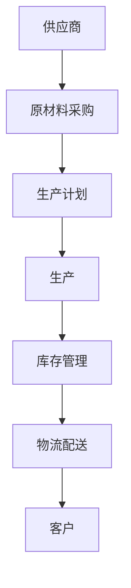

# 供应链管理(SCM)

## 介绍

供应链管理（Supply Chain Management，简称 SCM）是指对从原材料采购到最终产品交付给客户的整个流程进行规划、协调和控制的过程。SCM 的目标是优化供应链的各个环节，以提高效率、降低成本并提升客户满意度。

供应链管理涉及多个环节，包括供应商管理、生产计划、库存管理、物流配送等。通过有效的 SCM，企业可以更好地应对市场需求变化，减少资源浪费，并提高整体竞争力。

## 供应链管理的核心组成部分

### 1. 供应商管理
供应商管理是 SCM 的基础，涉及选择合适的供应商、评估供应商的表现以及建立长期合作关系。通过有效的供应商管理，企业可以确保原材料的质量和供应的稳定性。

### 2. 生产计划
生产计划是 SCM 的核心环节之一，涉及根据市场需求和库存情况制定生产计划。生产计划的目标是确保生产资源的合理利用，避免生产过剩或不足。

### 3. 库存管理
库存管理是 SCM 的重要组成部分，涉及对原材料、半成品和成品的库存进行监控和管理。通过有效的库存管理，企业可以减少库存成本，同时确保产品的及时供应。

### 4. 物流配送
物流配送是 SCM 的最后一个环节，涉及将产品从生产地运输到客户手中。物流配送的目标是确保产品能够及时、安全地送达客户手中。

## 实际案例

### 案例：电商平台的供应链管理
假设你是一家电商平台的供应链经理，你需要确保从供应商采购商品到将商品交付给客户的整个流程顺利进行。以下是一个简化的供应链管理流程：

1. **供应商管理**：选择可靠的供应商，确保商品的质量和供应的稳定性。
2. **生产计划**：根据市场需求和库存情况制定采购计划，避免库存积压或短缺。
3. **库存管理**：实时监控库存水平，确保商品的及时补货。
4. **物流配送**：与物流公司合作，确保商品能够及时送达客户手中。

:::tip
在实际操作中，供应链管理通常需要借助企业信息系统（如 ERP 系统）来实现自动化和优化。
:::

## 代码示例：简单的库存管理系统

以下是一个简单的 Python 代码示例，用于模拟库存管理系统的基本功能：

```python
class Inventory:
    def __init__(self):
        self.stock = {}

    def add_item(self, item, quantity):
        if item in self.stock:
            self.stock[item] += quantity
        else:
            self.stock[item] = quantity

    def remove_item(self, item, quantity):
        if item in self.stock and self.stock[item] >= quantity:
            self.stock[item] -= quantity
        else:
            print(f"Not enough stock for {item}")

    def check_stock(self, item):
        return self.stock.get(item, 0)

# 示例使用
inventory = Inventory()
inventory.add_item("widget", 100)
inventory.remove_item("widget", 20)
print(inventory.check_stock("widget"))  # 输出: 80
```

:::note
这个简单的库存管理系统展示了如何添加、移除和检查库存。在实际应用中，库存管理系统通常会更加复杂，并与其他系统（如采购系统和销售系统）集成。
:::

## 供应链管理中的图表

以下是一个使用 Mermaid 绘制的供应链管理流程图：



:::caution
在实际的供应链管理中，每个环节都可能涉及多个子流程和决策点。因此，供应链管理需要综合考虑多个因素，以确保整个流程的顺利进行。
:::

## 总结

供应链管理是企业信息系统中至关重要的一部分，它涵盖了从原材料采购到产品交付给客户的整个流程。通过有效的供应链管理，企业可以提高效率、降低成本并提升客户满意度。

对于初学者来说，理解供应链管理的基本概念和核心组成部分是学习企业信息系统的重要一步。通过实际案例和代码示例，你可以更好地理解供应链管理的实际应用。

## 附加资源与练习

### 附加资源
- [供应链管理基础](https://www.example.com/scm-basics)
- [企业信息系统与供应链管理](https://www.example.com/erp-scm)

### 练习
1. 尝试扩展上述库存管理系统的功能，例如添加库存预警功能。
2. 研究一个实际企业的供应链管理案例，并分析其成功或失败的原因。
