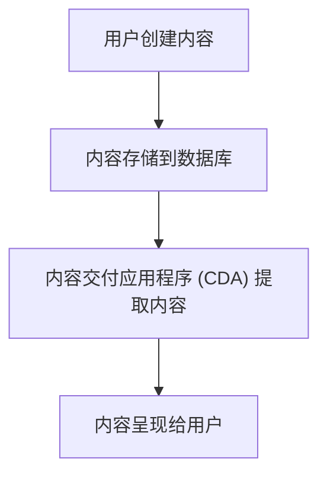

## 什么是内容管理系统 (CMS)？

内容管理系统（Content Management System，简称 CMS）是一种用于创建、管理和发布数字内容的软件工具。它允许用户无需编写代码即可轻松管理网站内容，包括文本、图片、视频等。CMS 通常用于企业网站、博客、电子商务平台等场景。

CMS 的核心功能包括：
- **内容创建**：通过可视化编辑器或简单的表单创建内容。
- **内容管理**：对内容进行分类、存储、版本控制和权限管理。
- **内容发布**：将内容发布到网站或其他数字渠道。
- **模板和主题**：通过预定义的模板和主题快速构建网站外观。

## CMS 的工作原理

CMS 通常由两个主要部分组成：
1. **内容管理应用程序 (CMA)**：这是用户与 CMS 交互的界面，用于创建、编辑和管理内容。
2. **内容交付应用程序 (CDA)**：这是将内容从数据库提取并呈现给用户的系统。

以下是一个简单的 CMS 工作流程：



## 常见的 CMS 类型

1. **开源 CMS**：如 WordPress、Joomla、Drupal。这些系统免费且拥有庞大的社区支持。
2. **企业级 CMS**：如 Adobe Experience Manager、Sitecore。这些系统功能强大，适合大型企业。
3. **无头 CMS (Headless CMS)**：如 Contentful、Strapi。这些系统专注于内容管理，不限制前端展示方式。

## 实际案例：使用 WordPress 创建博客

WordPress 是最流行的开源 CMS 之一。以下是一个简单的示例，展示如何使用 WordPress 创建一篇博客文章：

1. **安装 WordPress**：通过一键安装工具（如 Softaculous）或手动安装 WordPress。
2. **登录后台**：访问 `yourdomain.com/wp-admin`，使用管理员账号登录。
3. **创建新文章**：在左侧菜单中选择“文章” -> “新建文章”。
4. **编辑内容**：使用可视化编辑器添加标题、正文、图片等内容。
5. **发布文章**：点击“发布”按钮，文章将立即显示在网站上。

:::tip
如果你不熟悉 WordPress，可以尝试使用其在线演示版本（如 [WordPress Sandbox](https://wordpress.org/sandbox/)）进行练习。
:::

## 代码示例：使用 Strapi 创建 API

Strapi 是一个流行的无头 CMS，以下是如何使用 Strapi 创建一个简单的 API：

1. **安装 Strapi**：
   ```bash
   npx create-strapi-app my-project --quickstart
   ```
2. **创建内容类型**：
   - 登录 Strapi 后台。
   - 在“内容类型构建器”中创建一个新的内容类型，例如“文章”。
   - 添加字段，如“标题”（文本）和“内容”（富文本）。
3. **获取 API 数据**：
   - 在 Strapi 中创建几篇文章。
   - 使用以下代码从 API 获取数据：
   ```javascript
   fetch('http://localhost:1337/articles')
     .then(response => response.json())
     .then(data => console.log(data));
   ```

:::note
Strapi 默认运行在 `http://localhost:1337`。确保在运行代码前启动 Strapi 服务器。
:::

## CMS 的实际应用场景

1. **企业网站**：CMS 可以帮助企业快速构建和维护官方网站，发布新闻、产品信息等。
2. **电子商务**：许多电子商务平台（如 Shopify）基于 CMS 构建，方便管理商品和订单。
3. **教育和培训**：CMS 可以用于创建在线课程和学习管理系统（LMS）。
4. **新闻和媒体**：新闻网站使用 CMS 来管理大量文章、图片和视频内容。

## 总结

内容管理系统 (CMS) 是现代数字内容管理的核心工具，它简化了内容创建、管理和发布的过程。无论是个人博客还是企业级网站，CMS 都能提供强大的支持。通过学习 CMS，你可以快速掌握构建和管理网站的基本技能。

## 附加资源

- [WordPress 官方文档](https://wordpress.org/support/)
- [Strapi 官方指南](https://strapi.io/documentation)
- [Drupal 初学者教程](https://www.drupal.org/docs/8)

## 练习

1. 尝试使用 WordPress 创建一个简单的博客网站，并发布一篇文章。
2. 使用 Strapi 创建一个自定义内容类型，并通过 API 获取数据。
3. 研究一个无头 CMS（如 Contentful），并比较其与传统 CMS 的异同。