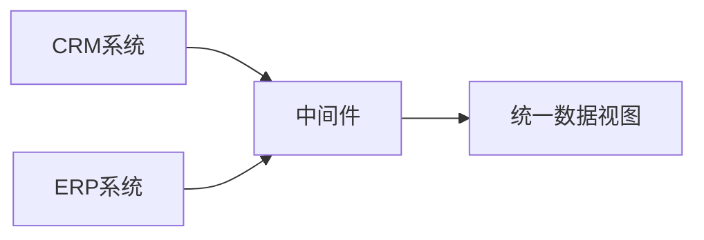
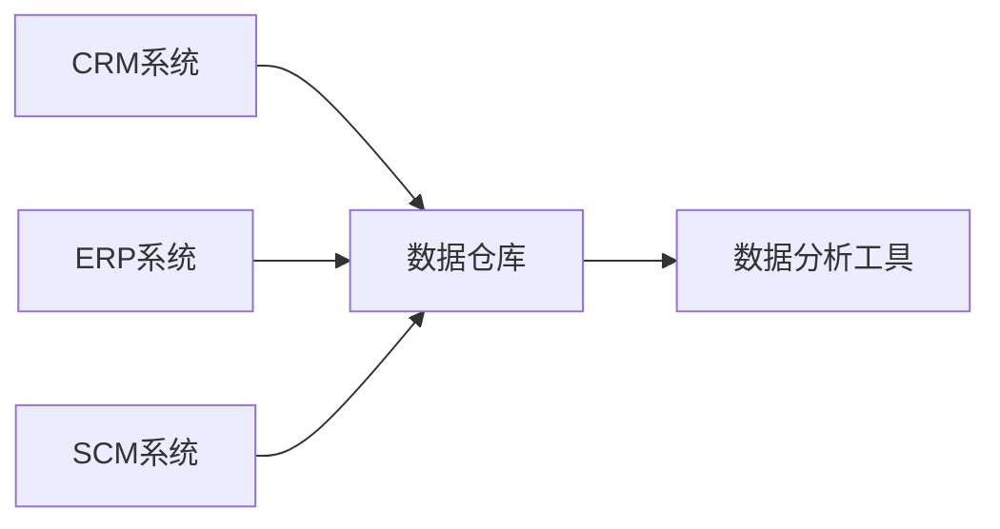

# 企业信息集成

## 介绍

企业信息集成（Enterprise Information Integration, EII）是指将分散在企业内部或外部的不同数据源、应用程序和系统进行整合，以实现数据的统一管理和高效利用。通过信息集成，企业可以打破信息孤岛，提升数据的可用性和一致性，从而支持更高效的决策和业务流程。

在现代企业中，数据通常存储在不同的系统中，例如客户关系管理（CRM）系统、企业资源规划（ERP）系统、供应链管理（SCM）系统等。这些系统可能使用不同的数据库、数据格式和协议。企业信息集成的目标是将这些分散的数据整合到一个统一的视图中，以便企业能够更好地管理和分析数据。

## 企业信息集成的基本概念

### 1. 数据源
数据源是指存储数据的系统或数据库。常见的数据源包括关系型数据库（如 MySQL、PostgreSQL）、NoSQL 数据库（如 MongoDB）、文件系统（如 CSV 文件）以及云存储服务（如 AWS S3）。

### 2. 数据集成
数据集成是指将来自不同数据源的数据进行合并、转换和加载（ETL），以便在统一的平台上进行分析和处理。数据集成通常涉及数据清洗、数据转换和数据加载等步骤。

### 3. 数据同步
数据同步是指确保不同系统中的数据保持一致。例如，当 CRM 系统中的客户信息更新时，ERP 系统中的相应信息也应同步更新。

### 4. 数据接口
数据接口是不同系统之间进行数据交换的桥梁。常见的数据接口包括 REST API、SOAP API 和消息队列（如 Kafka、RabbitMQ）。

## 企业信息集成的实现方法

### 1. 中间件集成
中间件是一种软件层，用于连接不同的应用程序和系统。通过中间件，企业可以实现数据的无缝传输和转换。常见的中间件包括企业服务总线（ESB）和消息队列。



### 2. API 集成
API 集成是通过调用不同系统的 API 来实现数据交换。例如，企业可以通过 REST API 从 CRM 系统中获取客户数据，并将其导入到 ERP 系统中。

```javascript
// 示例：通过 REST API 获取客户数据
fetch('https://api.crm-system.com/customers')
  .then(response => response.json())
  .then(data => console.log(data))
  .catch(error => console.error('Error:', error));
```

### 3. 数据仓库
数据仓库是一个集中存储企业数据的系统，通常用于支持复杂的分析和报告。通过数据仓库，企业可以将来自不同数据源的数据整合到一个统一的平台中。



## 实际应用场景

### 案例 1：客户数据整合
一家企业使用 CRM 系统管理客户信息，使用 ERP 系统管理订单信息。通过企业信息集成，企业可以将 CRM 系统中的客户数据与 ERP 系统中的订单数据进行整合，从而生成客户购买行为的分析报告。

### 案例 2：供应链数据同步
一家制造企业使用 SCM 系统管理供应链数据，使用 ERP 系统管理生产计划。通过企业信息集成，企业可以确保 SCM 系统中的库存数据与 ERP 系统中的生产计划数据保持同步，从而优化生产流程。

## 总结

企业信息集成是现代企业实现数据驱动决策的关键技术。通过整合分散的数据源，企业可以提升数据的可用性和一致性，从而支持更高效的业务流程和决策。无论是通过中间件、API 还是数据仓库，企业信息集成都能帮助企业打破信息孤岛，实现数据的统一管理。

## 附加资源

- [企业信息集成的最佳实践](https://example.com/eii-best-practices)
- [数据仓库设计与实现](https://example.com/data-warehouse-design)
- [REST API 开发指南](https://example.com/rest-api-guide)

## 练习

1. 尝试使用 REST API 从一个模拟的 CRM 系统中获取客户数据，并将其导入到一个模拟的 ERP 系统中。
2. 设计一个简单的中间件系统，用于连接两个不同的数据库（如 MySQL 和 MongoDB），并实现数据的同步。

:::tip
在完成练习时，建议使用 Postman 或类似的工具来测试 API 调用，并使用 Docker 来快速搭建数据库环境。
:::