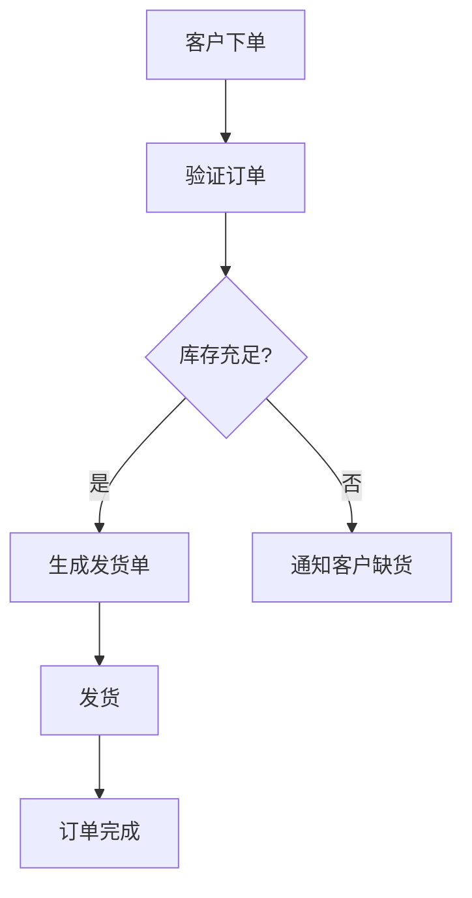

# 业务流程管理

业务流程管理（Business Process Management，简称 BPM）是一种系统化的方法，用于设计、执行、监控和优化企业的业务流程。它帮助企业更高效地完成任务，降低成本，并提高客户满意度。BPM 不仅仅是一个技术工具，更是一种管理理念，旨在通过持续改进流程来实现企业的战略目标。

## 什么是业务流程管理？

业务流程管理（BPM）是一种以流程为中心的管理方法，旨在通过分析、建模、执行、监控和优化业务流程来提高企业的效率和效果。BPM 的核心思想是将企业的各项活动视为一系列相互关联的流程，并通过技术手段对这些流程进行管理和优化。

### 业务流程的组成部分

一个典型的业务流程通常包括以下几个组成部分：

1. **输入**：流程开始时的数据或资源。
2. **活动**：流程中的具体任务或步骤。
3. **输出**：流程结束时的结果或产品。
4. **参与者**：执行流程任务的人员或系统。
5. **规则**：指导流程执行的业务规则或逻辑。

## 业务流程管理的生命周期

BPM 的生命周期通常包括以下几个阶段：

1. **流程设计**：识别和定义业务流程，通常使用流程图或模型来表示。
2. **流程执行**：将设计好的流程部署到系统中，并开始执行。
3. **流程监控**：实时监控流程的执行情况，收集数据并进行分析。
4. **流程优化**：根据监控结果，对流程进行改进和优化。

### 流程设计示例

以下是一个简单的订单处理流程的设计示例：



在这个流程中，客户下单后，系统首先验证订单的有效性，然后检查库存是否充足。如果库存充足，系统会生成发货单并安排发货；如果库存不足，系统会通知客户缺货情况。

## 业务流程管理的实际应用

### 案例：订单处理流程优化

假设一家电商公司发现其订单处理流程存在效率低下的问题。通过 BPM 方法，公司可以对该流程进行分析和优化。

1. **问题识别**：订单处理时间过长，导致客户满意度下降。
2. **流程分析**：通过流程图分析，发现订单验证和库存检查步骤存在冗余。
3. **流程优化**：将订单验证和库存检查合并为一个步骤，减少处理时间。
4. **流程执行**：将优化后的流程部署到系统中，并开始执行。
5. **流程监控**：实时监控订单处理时间，确保优化效果。
6. **持续改进**：根据监控结果，进一步优化流程。

### 代码示例：订单验证与库存检查

以下是一个简单的 Python 代码示例，展示了如何实现订单验证与库存检查的合并：

```python
def process_order(order):
    # 验证订单
    if not validate_order(order):
        return "订单无效"
    
    # 检查库存
    if not check_inventory(order):
        return "库存不足"
    
    # 生成发货单
    generate_shipping_label(order)
    return "订单处理成功"

def validate_order(order):
    # 订单验证逻辑
    return True  # 假设订单总是有效

def check_inventory(order):
    # 库存检查逻辑
    return True  # 假设库存总是充足

def generate_shipping_label(order):
    # 生成发货单逻辑
    print("发货单已生成")

# 示例订单
order = {"product_id": 123, "quantity": 2}
result = process_order(order)
print(result)
```

**输入**：`order = {"product_id": 123, "quantity": 2}`  
**输出**：`订单处理成功`

:::tip
在实际应用中，订单验证和库存检查可能会涉及更复杂的逻辑，例如与数据库交互、调用外部 API 等。
:::

## 总结

业务流程管理（BPM）是企业提高效率、降低成本、提升客户满意度的重要工具。通过系统地设计、执行、监控和优化业务流程，企业可以更好地实现其战略目标。对于初学者来说，理解 BPM 的基本概念和生命周期是掌握这一领域的第一步。

## 附加资源与练习

### 资源

- [业务流程管理入门指南](https://www.example.com/bpm-guide)
- [BPMN 2.0 标准文档](https://www.example.com/bpmn-docs)

### 练习

1. **设计一个简单的请假审批流程**：使用流程图工具（如 Lucidchart 或 Draw.io）设计一个请假审批流程，包括申请、审批和通知等步骤。
2. **编写代码实现请假审批流程**：使用 Python 或其他编程语言，编写代码实现上述请假审批流程。

:::note
通过实践，你将更好地理解业务流程管理的概念，并掌握如何将其应用于实际场景中。
:::