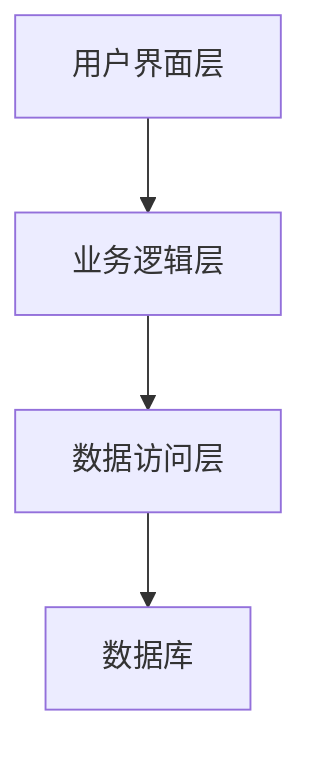
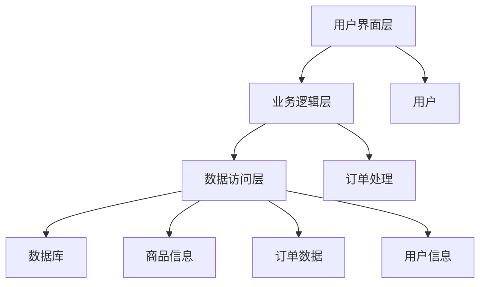

# 企业应用架构

## 介绍

企业应用架构（Enterprise Application Architecture）是指设计和构建企业级信息系统的框架和方法论。它涵盖了从业务需求分析到技术实现的整个过程，旨在确保系统的高效性、可扩展性和可维护性。企业应用架构通常包括多个层次，如用户界面层、业务逻辑层和数据访问层，每个层次都有其特定的职责和功能。

## 企业应用架构的核心层次

企业应用架构通常分为以下几个核心层次：

1. **用户界面层（Presentation Layer）**：负责与用户交互，展示数据和接收用户输入。
2. **业务逻辑层（Business Logic Layer）**：处理业务规则和逻辑，确保数据的正确性和一致性。
3. **数据访问层（Data Access Layer）**：负责与数据库或其他数据存储系统交互，执行数据的读取和写入操作。



## 企业应用架构的设计原则

在设计企业应用架构时，遵循以下原则可以帮助构建高效、可维护的系统：

1. **分层设计（Layered Design）**：将系统划分为多个层次，每个层次专注于特定的功能，降低系统的复杂性。
2. **松耦合（Loose Coupling）**：确保各个层次之间的依赖关系最小化，便于系统的扩展和维护。
3. **高内聚（High Cohesion）**：每个层次或模块内部的组件应紧密相关，专注于完成特定的任务。
4. **可扩展性（Scalability）**：系统应能够随着业务需求的增长而扩展，支持更多的用户和数据。
5. **安全性（Security）**：确保系统的数据和功能受到保护，防止未经授权的访问和攻击。

## 实际案例：在线商城系统

让我们通过一个实际的案例来理解企业应用架构的应用。假设我们要构建一个在线商城系统，以下是该系统的基本架构：

1. **用户界面层**：用户通过网页或移动应用浏览商品、下订单和查看订单状态。
2. **业务逻辑层**：处理用户的订单请求，计算价格，检查库存，并生成订单。
3. **数据访问层**：与数据库交互，存储和检索商品信息、订单数据和用户信息。



### 代码示例：订单处理

以下是一个简单的订单处理代码示例，展示了业务逻辑层如何处理订单请求：

```python
class Order:
    def __init__(self, order_id, user_id, items):
        self.order_id = order_id
        self.user_id = user_id
        self.items = items

    def calculate_total(self):
        total = 0
        for item in self.items:
            total += item['price'] * item['quantity']
        return total

    def place_order(self):
        # 检查库存
        if self.check_stock():
            # 生成订单
            self.generate_order()
            return "Order placed successfully"
        else:
            return "Out of stock"

    def check_stock(self):
        # 模拟库存检查
        return True

    def generate_order(self):
        # 模拟生成订单
        print(f"Order {self.order_id} generated for user {self.user_id}")

# 示例输入
items = [{'name': 'Laptop', 'price': 1000, 'quantity': 1}]
order = Order(order_id=1, user_id=123, items=items)

# 输出
print(order.place_order())
```

:::note
**注意**：以上代码仅为示例，实际应用中需要处理更多的异常情况和业务逻辑。
:::

## 总结

企业应用架构是构建高效、可扩展和可维护的企业信息系统的关键。通过分层设计、松耦合、高内聚等原则，可以确保系统能够满足不断变化的业务需求。通过实际案例和代码示例，我们展示了如何将这些原则应用到具体的系统中。

## 附加资源

- **书籍推荐**：
  - 《企业应用架构模式》 by Martin Fowler
  - 《领域驱动设计》 by Eric Evans
- **在线课程**：
  - [Coursera: Software Architecture](https://www.coursera.org/learn/software-architecture)
  - [edX: Enterprise Architecture](https://www.edx.org/course/enterprise-architecture)

## 练习

1. 设计一个简单的图书馆管理系统，并描述其用户界面层、业务逻辑层和数据访问层的功能。
2. 编写一个简单的代码示例，模拟图书馆管理系统的借书和还书功能。

:::tip
**提示**：在设计系统时，始终考虑系统的可扩展性和可维护性。
:::