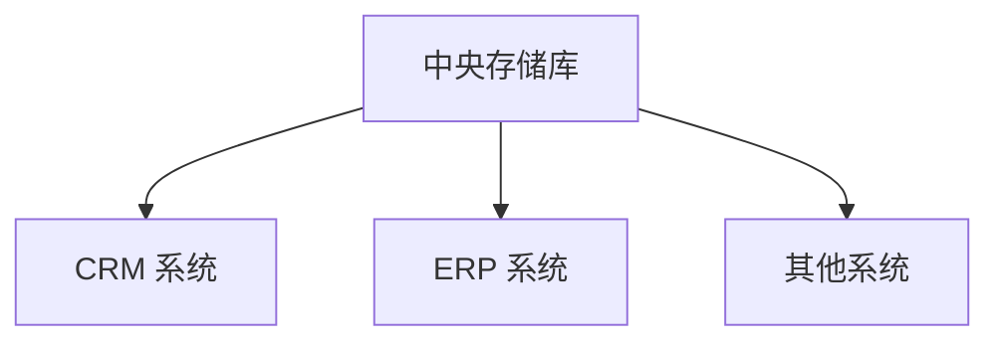

# 主数据管理 (MDM)

## 介绍

主数据管理（Master Data Management，简称 MDM）是企业信息系统中一个重要的概念。它指的是通过统一的管理流程和技术手段，确保企业核心数据（如客户、产品、供应商等）的一致性、准确性和完整性。主数据是企业运营中最重要的数据，通常被多个系统和业务流程共享。

MDM 的目标是消除数据孤岛，减少数据冗余，提高数据质量，从而支持企业做出更明智的决策。

## 为什么需要主数据管理？

在企业中，数据通常分散在不同的系统和部门中。例如，客户数据可能存储在 CRM 系统中，产品数据可能存储在 ERP 系统中。如果没有统一的管理机制，这些数据可能会出现不一致、重复或错误的情况。MDM 通过集中管理和标准化数据，解决了这些问题。

:::tip
MDM 不仅适用于大型企业，中小型企业也可以通过实施 MDM 来提高数据管理效率。
:::

## 主数据管理的核心组件

MDM 通常包括以下几个核心组件：

1. **数据整合**：从多个数据源中提取数据，并将其整合到一个统一的视图中。
2. **数据清洗**：识别并纠正数据中的错误、重复和不一致。
3. **数据标准化**：将数据转换为统一的格式和标准。
4. **数据分发**：将清洗和标准化后的数据分发到各个系统和业务流程中。

## 主数据管理的实现步骤

### 1. 数据识别
首先，需要识别哪些数据是主数据。常见的主数据类型包括客户、产品、供应商等。

### 2. 数据整合
将分散在不同系统中的数据整合到一个中央存储库中。例如，使用 ETL（Extract, Transform, Load）工具从多个数据源中提取数据。

```sql
-- 示例：从 CRM 和 ERP 系统中提取客户数据
SELECT customer_id, customer_name, email FROM crm.customers
UNION
SELECT customer_id, customer_name, email FROM erp.customers;
```

### 3. 数据清洗
清洗数据以消除重复、错误和不一致。例如，使用去重算法和正则表达式来清理数据。

```python
# 示例：使用 Python 清洗客户数据
import pandas as pd

# 假设我们有一个包含重复客户数据的 DataFrame
data = {
    'customer_id': [1, 2, 2, 3],
    'customer_name': ['Alice', 'Bob', 'Bob', 'Charlie'],
    'email': ['alice@example.com', 'bob@example.com', 'bob@example.com', 'charlie@example.com']
}

df = pd.DataFrame(data)

# 去除重复数据
df_cleaned = df.drop_duplicates()

print(df_cleaned)
```

**输出：**
```
   customer_id customer_name               email
0            1         Alice  alice@example.com
1            2           Bob    bob@example.com
3            3       Charlie  charlie@example.com
```

### 4. 数据标准化
将数据转换为统一的格式。例如，将日期格式统一为 `YYYY-MM-DD`，或将电话号码格式统一为国际标准格式。

```python
# 示例：标准化电话号码
import re

def standardize_phone_number(phone):
    # 去除所有非数字字符
    phone = re.sub(r'\D', '', phone)
    # 假设我们使用国际标准格式 +1-XXX-XXX-XXXX
    return f"+1-{phone[:3]}-{phone[3:6]}-{phone[6:]}"

phone_numbers = ['123-456-7890', '(123) 456-7890', '123.456.7890']
standardized_numbers = [standardize_phone_number(phone) for phone in phone_numbers]

print(standardized_numbers)
```

**输出：**
```
['+1-123-456-7890', '+1-123-456-7890', '+1-123-456-7890']
```

### 5. 数据分发
将清洗和标准化后的数据分发到各个系统和业务流程中。例如，将客户数据同步到 CRM 和 ERP 系统中。



## 实际案例

### 案例：零售行业的主数据管理

一家大型零售企业拥有多个销售渠道（线上、线下），每个渠道都有自己的客户和产品数据。由于数据分散，企业经常遇到以下问题：

- 客户在不同渠道注册时，系统无法识别是否为同一客户。
- 产品信息在不同渠道中不一致，导致客户体验差。

通过实施 MDM，企业将所有渠道的客户和产品数据整合到一个中央存储库中，并进行清洗和标准化。最终，企业能够：

- 识别并合并重复的客户记录。
- 确保产品信息在所有渠道中一致。
- 提供更好的客户体验和更高效的运营。

## 总结

主数据管理 (MDM) 是企业信息系统中不可或缺的一部分。它通过整合、清洗、标准化和分发数据，确保企业核心数据的一致性和准确性。对于初学者来说，理解 MDM 的基本概念和实现步骤是掌握企业信息系统的重要一步。

## 附加资源与练习

### 附加资源
- [MDM 入门指南](https://example.com/mdm-guide)
- [数据清洗与标准化最佳实践](https://example.com/data-cleaning)

### 练习
1. 尝试使用 Python 或 SQL 清洗和标准化一组客户数据。
2. 设计一个简单的 MDM 系统架构图，展示数据从多个系统整合到中央存储库的过程。

:::caution
在实施 MDM 时，务必确保数据安全和隐私保护，遵守相关法律法规。
:::