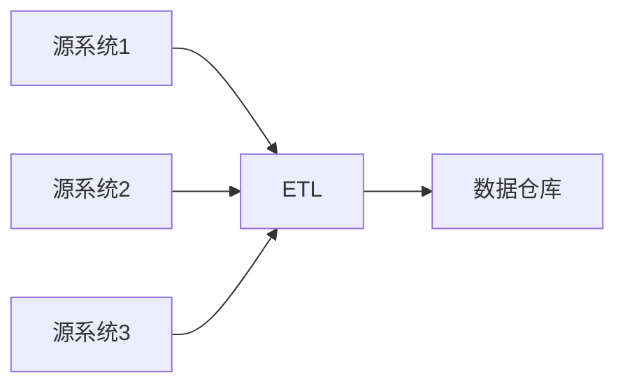
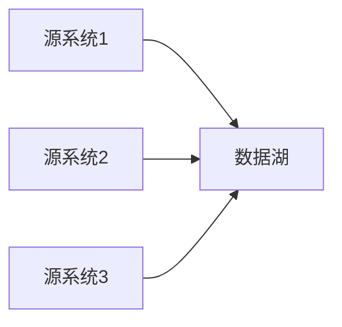
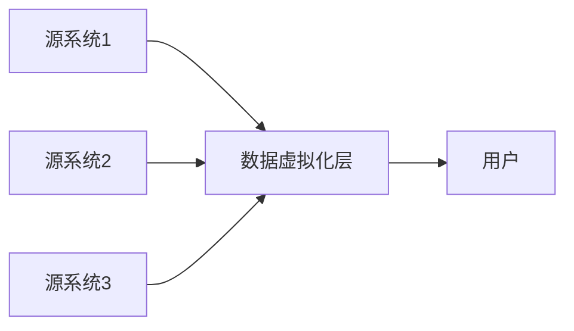
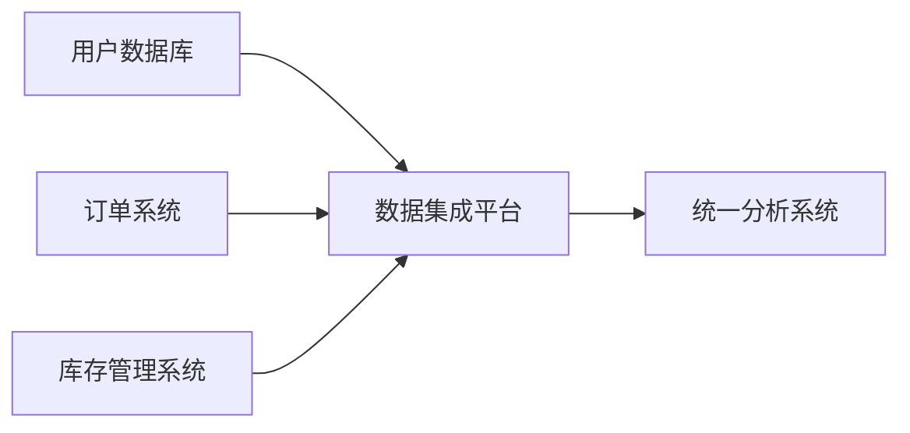
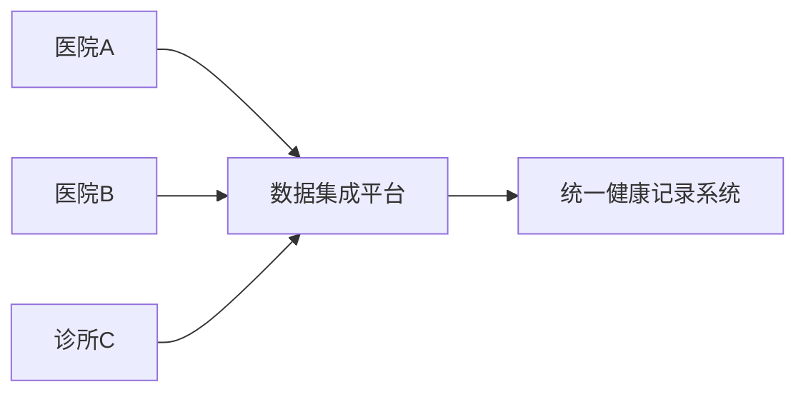

# 数据集成概述

## 什么是数据集成？

数据集成（Data Integration）是指将来自不同来源、格式和结构的数据整合到一个统一的系统中，以便进行分析、处理和存储。在现代企业中，数据通常分散在多个系统中，例如数据库、云存储、API 等。数据集成的目标是通过统一的方式访问和管理这些数据，从而提高数据的可用性和价值。

:::note
数据集成不仅仅是简单的数据复制，它还包括数据清洗、转换和同步等过程。
:::

## 为什么需要数据集成？

1. **数据孤岛问题**：企业中的不同部门可能使用不同的系统来存储数据，导致数据分散且难以共享。
2. **提高数据质量**：通过数据清洗和转换，可以消除数据中的错误和不一致性。
3. **支持决策**：集成的数据可以为企业提供全面的视图，帮助做出更明智的决策。
4. **自动化流程**：数据集成可以自动化数据流动，减少人工干预，提高效率。

## 数据集成的常见方法

### 1. 数据仓库（Data Warehouse）

数据仓库是一种集中存储数据的系统，通常用于存储历史数据以支持分析和报告。数据仓库通过ETL（Extract, Transform, Load）过程从多个源系统中提取数据，进行转换后加载到数据仓库中。

### 2. 数据湖（Data Lake）

数据湖是一种存储大量原始数据的系统，数据可以以任何格式存储。与数据仓库不同，数据湖不需要预先定义数据结构，适合存储非结构化数据。

### 3. 数据虚拟化（Data Virtualization）

数据虚拟化是一种在不移动数据的情况下访问和集成数据的技术。它通过虚拟层将多个数据源的数据整合在一起，用户可以通过统一的接口访问这些数据。

## 数据集成的实际应用场景

### 案例1：电商平台的数据集成

假设一个电商平台有多个数据源，包括用户数据库、订单系统和库存管理系统。通过数据集成，平台可以将这些数据整合到一个统一的系统中，以便进行用户行为分析、库存管理和订单处理。

### 案例2：医疗行业的数据集成

在医疗行业中，患者的健康数据可能分散在不同的医院系统中。通过数据集成，可以将这些数据整合到一个统一的健康记录系统中，以便医生能够全面了解患者的健康状况。

## 总结

数据集成是现代企业数据管理的重要组成部分。通过数据集成，企业可以打破数据孤岛，提高数据质量，支持更明智的决策，并自动化数据流动。常见的数据集成方法包括数据仓库、数据湖和数据虚拟化。实际应用场景广泛，涵盖电商、医疗等多个行业。

## 附加资源与练习

- **练习1**：尝试使用Python编写一个简单的ETL脚本，从一个CSV文件中提取数据，进行简单的转换后加载到SQLite数据库中。
- **练习2**：研究一个开源的数据集成工具（如Apache NiFi），并尝试将其用于一个小型数据集成的项目中。

:::tip
如果你对数据集成感兴趣，可以进一步学习ETL工具、数据仓库设计以及数据虚拟化技术。
:::