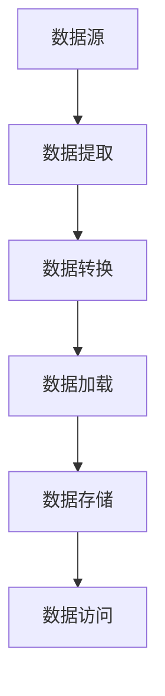

# 数据集成架构

数据集成架构是现代数据管理中的关键组成部分，它定义了如何将来自不同来源的数据整合到一个统一的系统中，以便进行分析、处理和存储。无论是企业级应用还是小型项目，数据集成架构都扮演着至关重要的角色。

## 什么是数据集成架构？

数据集成架构是指用于将多个数据源的数据整合到一个统一视图中的系统设计和实现方式。它通常包括数据提取、转换、加载（ETL）过程，以及数据存储和访问的机制。数据集成架构的目标是确保数据的一致性、完整性和可用性。

:::note
数据集成架构的核心是解决数据孤岛问题，即将分散在不同系统中的数据整合到一个统一的平台中。
:::

## 数据集成架构的核心组件

数据集成架构通常由以下几个核心组件组成：

1. **数据源**：数据源是数据的原始来源，可以是数据库、API、文件系统等。
2. **数据提取**：从数据源中提取数据的过程。
3. **数据转换**：将提取的数据转换为目标系统所需的格式。
4. **数据加载**：将转换后的数据加载到目标系统中。
5. **数据存储**：存储整合后的数据，通常是一个数据仓库或数据湖。
6. **数据访问**：提供对整合后数据的访问接口，如API或查询工具。



## 数据集成架构的类型

根据不同的需求和场景，数据集成架构可以分为以下几种类型：

1. **集中式数据集成**：所有数据都集中存储在一个中央数据仓库中。
2. **分布式数据集成**：数据分布在多个系统中，通过中间件进行集成。
3. **混合数据集成**：结合集中式和分布式的优点，适用于复杂的数据环境。

:::tip
选择合适的数据集成架构类型取决于您的业务需求、数据量和系统复杂性。
:::

## 实际案例：ETL 数据集成

让我们通过一个简单的ETL（Extract, Transform, Load）示例来理解数据集成架构的实际应用。

### 数据提取

假设我们有一个CSV文件 `sales.csv`，其中包含销售数据：

```csv
id,product,quantity,price
1,Apple,10,1.5
2,Banana,5,0.75
3,Orange,8,1.2
```

我们可以使用Python的 `pandas` 库来提取这些数据：

```python
import pandas as pd

# 提取数据
data = pd.read_csv('sales.csv')
print(data)
```

**输出：**

```
   id product  quantity  price
0   1   Apple        10    1.5
1   2  Banana         5   0.75
2   3  Orange         8    1.2
```

### 数据转换

接下来，我们需要将数据转换为目标系统所需的格式。例如，我们可以将价格转换为美元：

```python
# 转换数据
data['price'] = data['price'] * 1.1  # 假设汇率为1.1
print(data)
```

**输出：**

```
   id product  quantity  price
0   1   Apple        10   1.65
1   2  Banana         5   0.825
2   3  Orange         8   1.32
```

### 数据加载

最后，我们将转换后的数据加载到目标系统中。假设目标系统是一个SQL数据库：

```python
from sqlalchemy import create_engine

# 创建数据库连接
engine = create_engine('sqlite:///sales.db')

# 加载数据
data.to_sql('sales', engine, if_exists='replace', index=False)
```

:::caution
在实际应用中，确保数据加载过程中的错误处理和日志记录是非常重要的。
:::

## 总结

数据集成架构是现代数据管理的基础，它通过将分散的数据整合到一个统一的平台中，帮助企业更好地利用数据资源。本文介绍了数据集成架构的基本概念、核心组件以及一个简单的ETL示例，希望能帮助您理解这一重要主题。

## 附加资源与练习

- **资源**：
  - [数据集成架构设计指南](https://example.com/data-integration-guide)
  - [ETL工具比较](https://example.com/etl-tools-comparison)

- **练习**：
  1. 尝试使用不同的数据源（如API或数据库）进行数据提取。
  2. 设计一个简单的数据转换流程，将数据转换为JSON格式。
  3. 将转换后的数据加载到一个NoSQL数据库中。

:::warning
在练习过程中，请确保您理解每一步的操作，并注意数据的安全性和完整性。
:::