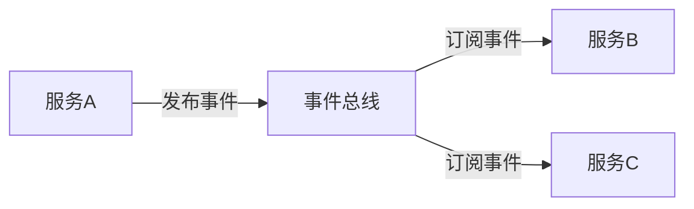
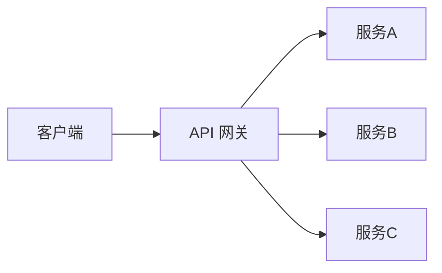
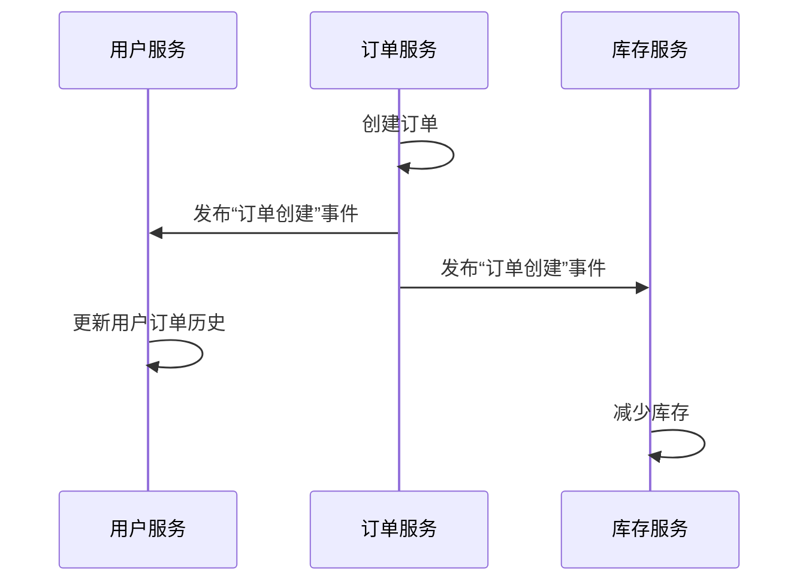

# 微服务数据集成

在现代软件开发中，微服务架构因其灵活性和可扩展性而广受欢迎。然而，随着服务数量的增加，数据集成成为了一个关键挑战。本文将介绍微服务数据集成的基本概念、常见挑战以及解决方案，并通过实际案例帮助你更好地理解这一主题。

## 什么是微服务数据集成？

微服务数据集成是指在微服务架构中，将多个独立服务的数据进行整合和同步的过程。每个微服务通常拥有自己的数据库，这意味着数据分布在不同的服务中。为了确保数据的一致性和可用性，必须对这些分散的数据进行有效的集成。

:::note
微服务数据集成的核心目标是确保数据在不同服务之间的一致性，同时保持服务的独立性。
:::

## 微服务数据集成的挑战

在微服务架构中，数据集成面临以下主要挑战：

1. **数据一致性**：由于每个服务都有自己的数据库，如何确保跨服务的数据一致性是一个难题。
2. **数据冗余**：为了避免频繁的服务间调用，某些数据可能会被复制到多个服务中，导致数据冗余。
3. **事务管理**：传统的分布式事务管理在微服务架构中难以实现，因为每个服务都是独立的。
4. **性能问题**：频繁的服务间通信可能导致性能瓶颈。

## 微服务数据集成的解决方案

### 1. 事件驱动架构（Event-Driven Architecture）

事件驱动架构通过发布和订阅事件来实现服务间的数据同步。当一个服务的数据发生变化时，它会发布一个事件，其他服务可以订阅这些事件并更新自己的数据。



#### 代码示例

以下是一个简单的事件发布和订阅的代码示例：

```javascript
// 服务A：发布事件
const eventBus = require('event-bus');

eventBus.publish('userUpdated', { userId: 1, name: 'John Doe' });

// 服务B：订阅事件
eventBus.subscribe('userUpdated', (data) => {
    console.log('User updated:', data);
});
```

### 2. API 网关（API Gateway）

API 网关作为微服务架构的入口点，可以集中处理请求路由、负载均衡和数据聚合。通过 API 网关，客户端可以一次性获取多个服务的数据，从而减少服务间通信的开销。



#### 代码示例

以下是一个简单的 API 网关实现示例：

```javascript
const express = require('express');
const app = express();

app.get('/user/:id', async (req, res) => {
    const userId = req.params.id;
    const userInfo = await fetchUserInfo(userId);
    const userOrders = await fetchUserOrders(userId);
    res.json({ userInfo, userOrders });
});

app.listen(3000, () => {
    console.log('API Gateway running on port 3000');
});
```

### 3. 数据复制与缓存

在某些情况下，为了提高性能，可以将某些数据复制到多个服务中，并使用缓存来减少数据库查询的次数。这种方法可以显著减少服务间通信的延迟。

:::caution
数据复制和缓存可能会导致数据一致性问题，因此需要谨慎使用。
:::

## 实际案例：电商平台的订单处理系统

假设我们有一个电商平台，其中包含以下微服务：

- **用户服务**：管理用户信息。
- **订单服务**：管理订单信息。
- **库存服务**：管理商品库存。

当用户下单时，订单服务需要与用户服务和库存服务进行交互。通过事件驱动架构，订单服务可以发布一个“订单创建”事件，用户服务和库存服务可以订阅该事件并更新各自的数据。



## 总结

微服务数据集成是微服务架构中的一个关键挑战，但通过事件驱动架构、API 网关和数据复制等解决方案，可以有效地解决这些问题。理解这些概念并掌握相关技术，将帮助你在微服务架构中构建高效、可靠的数据集成系统。

## 附加资源与练习

- **练习**：尝试在一个简单的微服务项目中实现事件驱动架构，并观察数据如何在不同服务之间同步。
- **资源**：
  - [微服务架构模式](https://microservices.io/)
  - [事件驱动架构指南](https://www.oreilly.com/library/view/event-driven-architecture/9781492057888/)

通过不断实践和学习，你将能够更好地掌握微服务数据集成的技巧，并应用于实际项目中。