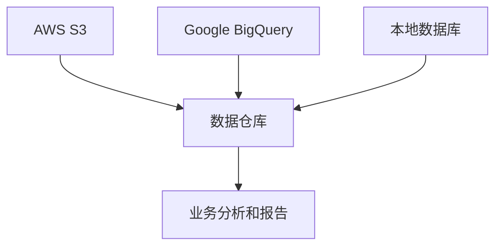

# 云数据集成

## 介绍

云数据集成是指将来自不同云服务或本地系统的数据整合到一个统一平台的过程。随着企业越来越多地采用多云和混合云架构，云数据集成变得至关重要。它帮助企业实现数据的一致性、可用性和可访问性，从而支持更好的决策和业务运营。

## 为什么需要云数据集成？

在现代企业中，数据通常分散在多个云服务（如 AWS、Azure、Google Cloud）和本地系统中。这些数据源可能使用不同的格式、协议和存储方式。云数据集成通过以下方式解决这些问题：

1. **数据一致性**：确保所有系统中的数据保持一致。
2. **数据可用性**：使数据能够在需要时被访问和使用。
3. **数据可访问性**：简化数据访问，减少数据孤岛。

## 云数据集成的工作原理

云数据集成通常涉及以下几个步骤：

1. **数据提取**：从不同的数据源中提取数据。
2. **数据转换**：将数据转换为统一的格式。
3. **数据加载**：将转换后的数据加载到目标系统中。

### 代码示例：简单的数据提取和转换

以下是一个使用 Python 的简单示例，展示如何从两个不同的数据源提取数据并将其转换为统一的格式。

```python
import pandas as pd

# 从 CSV 文件提取数据
data1 = pd.read_csv('data_source1.csv')
data2 = pd.read_csv('data_source2.csv')

# 数据转换：将数据转换为统一的格式
data1['source'] = 'Source1'
data2['source'] = 'Source2'

# 合并数据
combined_data = pd.concat([data1, data2])

# 输出合并后的数据
print(combined_data)
```

**输入：**
- `data_source1.csv` 和 `data_source2.csv` 是两个不同的数据源文件。

**输出：**
- `combined_data` 是一个包含两个数据源数据的统一 DataFrame。

## 实际案例：电商平台的云数据集成

假设一个电商平台使用多个云服务来管理其数据：

1. **AWS S3**：存储用户行为日志。
2. **Google BigQuery**：存储销售数据。
3. **本地数据库**：存储库存数据。

通过云数据集成，该平台可以将这些数据整合到一个统一的数据仓库中，从而支持全面的业务分析和报告。



## 总结

云数据集成是现代数据架构中不可或缺的一部分。它帮助企业整合分散的数据源，确保数据的一致性、可用性和可访问性。通过本文的介绍和示例，你应该对云数据集成的概念有了初步的了解。

## 附加资源

- [AWS 数据集成服务](https://aws.amazon.com/data-integration/)
- [Google Cloud 数据集成](https://cloud.google.com/data-integration)
- [Azure 数据工厂](https://azure.microsoft.com/en-us/services/data-factory/)

## 练习

1. 尝试使用 Python 从两个不同的数据源（如 CSV 文件和 API）提取数据，并将其整合到一个统一的 DataFrame 中。
2. 研究一个云数据集成工具（如 AWS Glue 或 Google Cloud Dataflow），并尝试创建一个简单的数据集成管道。

:::tip
如果你在练习中遇到问题，可以参考工具的官方文档或社区论坛获取帮助。
:::