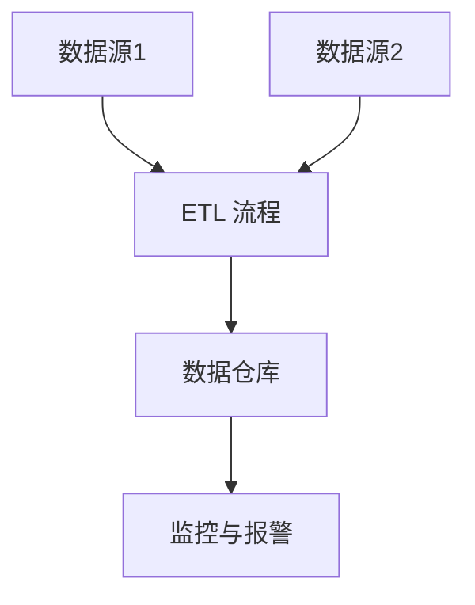
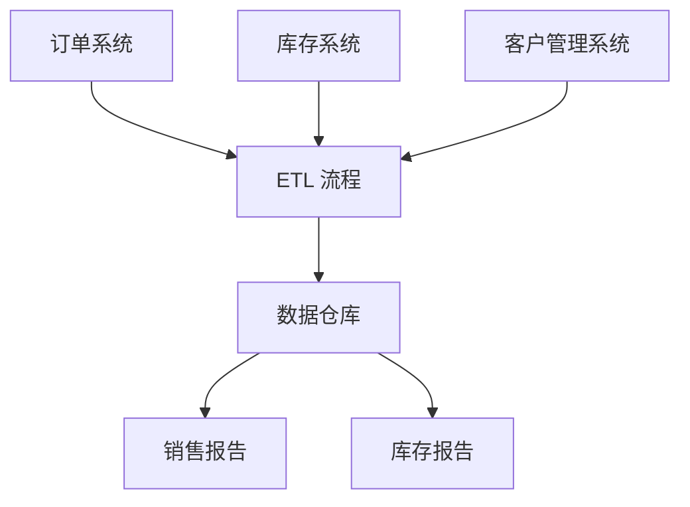

# 数据集成最佳实践

## 介绍

数据集成是指将来自不同来源的数据整合到一个统一的视图中，以便进行分析、报告或其他操作。在现代企业中，数据通常分散在多个系统、数据库和应用程序中。数据集成的最佳实践可以帮助我们高效、可靠地整合这些数据，从而为企业提供更全面的洞察力。

## 数据集成的基本概念

在开始讨论最佳实践之前，我们需要了解一些基本概念：

1. **数据源**：数据的来源，可以是数据库、API、文件等。
2. **ETL（Extract, Transform, Load）**：数据集成的一种常见方法，包括从数据源提取数据、对数据进行转换，然后将数据加载到目标系统中。
3. **数据仓库**：用于存储集成后的数据，通常用于分析和报告。
4. **中间件**：用于连接不同系统的软件，帮助实现数据的传输和转换。

## 数据集成的最佳实践

### 1. 明确业务需求

在开始数据集成项目之前，首先要明确业务需求。了解数据的用途、目标用户以及需要解决的问题，可以帮助你选择合适的技术和工具。

:::tip
**提示**：与业务团队密切合作，确保数据集成项目能够满足他们的需求。
:::

### 2. 选择合适的数据集成工具

市场上有许多数据集成工具，如 Apache NiFi、Talend、Informatica 等。选择适合你业务需求的工具非常重要。

```python
# 示例：使用 Python 的 Pandas 库进行简单的数据集成
import pandas as pd

# 从 CSV 文件中提取数据
data1 = pd.read_csv('data1.csv')
data2 = pd.read_csv('data2.csv')

# 合并数据
merged_data = pd.merge(data1, data2, on='id')

# 输出合并后的数据
print(merged_data.head())
```

### 3. 数据清洗与转换

在数据集成过程中，数据清洗和转换是必不可少的步骤。确保数据的一致性和准确性，可以提高数据质量。

```python
# 示例：数据清洗与转换
# 删除缺失值
cleaned_data = merged_data.dropna()

# 转换数据类型
cleaned_data['date'] = pd.to_datetime(cleaned_data['date'])

# 输出清洗后的数据
print(cleaned_data.head())
```

### 4. 数据验证与测试

在数据集成完成后，进行数据验证和测试是非常重要的。确保数据的完整性和准确性，可以避免后续分析中的错误。

```python
# 示例：数据验证
# 检查数据是否包含重复值
duplicates = cleaned_data.duplicated().sum()
print(f"重复值数量: {duplicates}")

# 检查数据是否包含空值
null_values = cleaned_data.isnull().sum()
print(f"空值数量:\n{null_values}")
```

### 5. 自动化与监控

自动化数据集成流程可以减少人为错误，并提高效率。同时，监控数据集成过程，可以及时发现和解决问题。



### 6. 安全性考虑

在数据集成过程中，确保数据的安全性非常重要。使用加密、访问控制等措施，可以保护数据不被未经授权的访问。

:::caution
**注意**：确保在数据传输和存储过程中使用加密技术，以防止数据泄露。
:::

## 实际案例

### 案例：电商平台的数据集成

假设我们有一个电商平台，数据分散在多个系统中，包括订单系统、库存系统和客户管理系统。我们需要将这些数据集成到一个数据仓库中，以便进行销售分析和库存管理。

1. **数据源**：
   - 订单系统：存储订单信息。
   - 库存系统：存储库存信息。
   - 客户管理系统：存储客户信息。

2. **ETL 流程**：
   - 从订单系统中提取订单数据。
   - 从库存系统中提取库存数据。
   - 从客户管理系统中提取客户数据。
   - 对数据进行清洗和转换。
   - 将数据加载到数据仓库中。

3. **数据仓库**：
   - 存储集成后的数据，用于生成销售报告和库存报告。



## 总结

数据集成是现代企业中不可或缺的一部分。通过遵循最佳实践，如明确业务需求、选择合适工具、数据清洗与转换、数据验证与测试、自动化与监控以及安全性考虑，可以确保数据集成项目的成功。

## 附加资源与练习

- **资源**：
  - [Apache NiFi 官方文档](https://nifi.apache.org/docs.html)
  - [Pandas 官方文档](https://pandas.pydata.org/docs/)
  - [Talend 数据集成工具](https://www.talend.com/)

- **练习**：
  - 使用 Pandas 库将两个 CSV 文件中的数据集成到一个 DataFrame 中，并进行数据清洗和转换。
  - 尝试使用 Apache NiFi 或 Talend 创建一个简单的 ETL 流程，将数据从一个数据库传输到另一个数据库。

通过不断实践和学习，你将能够掌握数据集成的最佳实践，并在实际项目中应用这些知识。