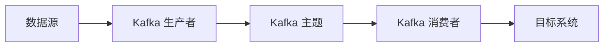

# 实时数据集成

## 介绍

实时数据集成是指将来自不同数据源的数据实时地整合到一个统一的系统中，以便进行分析、处理或展示。与传统的批处理数据集成不同，实时数据集成能够在数据生成的同时进行处理，从而提供更及时的信息和洞察。

实时数据集成在现代数据架构中扮演着至关重要的角色，尤其是在需要快速响应和决策的场景中，如金融交易、物联网设备监控和实时推荐系统。

## 实时数据集成的核心概念

### 1. 数据源
实时数据集成通常涉及多个数据源，这些数据源可能是数据库、API、消息队列、传感器数据等。每个数据源都可能以不同的格式和协议提供数据。

### 2. 数据流
数据流是实时数据集成的核心。数据流是指数据从源系统流向目标系统的过程。在实时数据集成中，数据流通常是连续的，而不是像批处理那样一次性传输大量数据。

### 3. 数据处理
在数据流中，数据通常需要经过一系列的处理步骤，如过滤、转换、聚合等。这些处理步骤可以在数据流经的中间件中完成。

### 4. 数据存储
处理后的数据通常会被存储到目标系统中，如数据仓库、数据湖或实时分析引擎中，以便进一步的分析和查询。

## 实时数据集成的实现

### 使用 Apache Kafka 进行实时数据集成

Apache Kafka 是一个广泛使用的分布式流处理平台，非常适合用于实时数据集成。以下是一个简单的 Kafka 示例，展示如何从一个数据源读取数据并将其写入另一个数据源。

#### 示例代码

```java
// 生产者代码：向 Kafka 主题发送数据
Properties props = new Properties();
props.put("bootstrap.servers", "localhost:9092");
props.put("key.serializer", "org.apache.kafka.common.serialization.StringSerializer");
props.put("value.serializer", "org.apache.kafka.common.serialization.StringSerializer");

Producer<String, String> producer = new KafkaProducer<>(props);
producer.send(new ProducerRecord<>("input-topic", "key", "value"));
producer.close();

// 消费者代码：从 Kafka 主题读取数据
Properties props = new Properties();
props.put("bootstrap.servers", "localhost:9092");
props.put("group.id", "test");
props.put("key.deserializer", "org.apache.kafka.common.serialization.StringDeserializer");
props.put("value.deserializer", "org.apache.kafka.common.serialization.StringDeserializer");

Consumer<String, String> consumer = new KafkaConsumer<>(props);
consumer.subscribe(Arrays.asList("input-topic"));

while (true) {
    ConsumerRecords<String, String> records = consumer.poll(Duration.ofMillis(100));
    for (ConsumerRecord<String, String> record : records) {
        System.out.printf("offset = %d, key = %s, value = %s%n", record.offset(), record.key(), record.value());
    }
}
```

#### 输入和输出
- **输入**：生产者向 `input-topic` 主题发送一条消息，消息内容为 `key=key, value=value`。
- **输出**：消费者从 `input-topic` 主题读取消息，并打印出消息的偏移量、键和值。

### 使用 Mermaid 绘制数据流图

以下是一个简单的数据流图，展示了数据从源系统通过 Kafka 流向目标系统的过程。



## 实际案例

### 案例：实时推荐系统

假设你正在开发一个电商网站的实时推荐系统。用户的浏览行为数据（如点击、添加到购物车等）会实时发送到 Kafka 主题中。推荐系统从 Kafka 主题中读取这些数据，并实时生成个性化推荐结果。

#### 数据流
1. 用户浏览行为数据通过前端发送到 Kafka 主题。
2. 推荐系统从 Kafka 主题中读取数据。
3. 推荐系统根据用户行为数据生成推荐结果，并将结果存储到数据库中。
4. 前端从数据库中获取推荐结果并展示给用户。

## 总结

实时数据集成是现代数据架构中不可或缺的一部分，它能够帮助企业在数据生成的同时进行处理和分析，从而提供更及时的洞察和决策支持。通过使用像 Apache Kafka 这样的工具，你可以轻松地实现实时数据集成，并将其应用到各种实际场景中。

## 附加资源与练习

- **资源**：
  - [Apache Kafka 官方文档](https://kafka.apache.org/documentation/)
  - [实时数据集成的最佳实践](https://www.confluent.io/blog/real-time-data-integration-best-practices/)

- **练习**：
  - 尝试使用 Kafka 实现一个简单的实时数据集成系统，从一个数据源读取数据并将其写入另一个数据源。
  - 扩展上述案例，实现一个简单的实时推荐系统，模拟用户行为数据并生成推荐结果。
