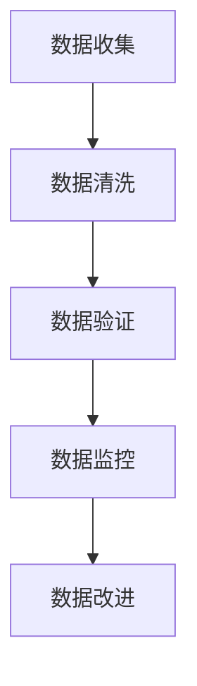

## 什么是数据质量管理？

数据质量管理（Data Quality Management, DQM）是指通过一系列技术、流程和策略，确保数据的准确性、完整性、一致性、及时性和可靠性。高质量的数据是数据分析、决策支持和业务运营的基础。如果数据质量不佳，可能会导致错误的决策、低效的流程，甚至业务损失。

### 数据质量管理的核心维度

数据质量管理通常围绕以下几个核心维度展开：

1. **准确性（Accuracy）**：数据是否真实反映了现实世界的情况。
2. **完整性（Completeness）**：数据是否完整，是否存在缺失值。
3. **一致性（Consistency）**：数据在不同系统或数据集之间是否一致。
4. **及时性（Timeliness）**：数据是否在需要时可用，是否及时更新。
5. **唯一性（Uniqueness）**：数据是否重复，是否存在冗余记录。
6. **有效性（Validity）**：数据是否符合预定义的规则和标准。

## 数据质量管理的重要性

数据质量管理在现代企业中至关重要，原因如下：

- **提高决策质量**：高质量的数据能够帮助管理层做出更准确的决策。
- **提升运营效率**：减少因数据错误导致的返工和资源浪费。
- **增强客户信任**：准确的数据有助于提供更好的客户服务，增强客户信任。
- **合规性**：许多行业对数据质量有严格的合规要求，确保数据质量有助于满足这些要求。

## 数据质量管理的步骤

### 1. 数据质量评估

在开始数据质量管理之前，首先需要评估现有数据的质量。这通常包括以下步骤：

- **数据收集**：从各个数据源收集数据。
- **数据清洗**：识别并处理数据中的错误、缺失值和重复记录。
- **数据验证**：检查数据是否符合预定义的规则和标准。

```python
# 示例：数据清洗
import pandas as pd

# 假设我们有一个包含缺失值的数据集
data = {'Name': ['Alice', 'Bob', None, 'David'], 'Age': [24, None, 22, 28]}
df = pd.DataFrame(data)

# 填充缺失值
df['Name'].fillna('Unknown', inplace=True)
df['Age'].fillna(df['Age'].mean(), inplace=True)

print(df)
```

**输出：**
```
     Name   Age
0   Alice  24.0
1     Bob  24.666667
2  Unknown  22.0
3   David  28.0
```

### 2. 数据质量监控

数据质量监控是一个持续的过程，旨在确保数据在整个生命周期中保持高质量。常见的监控方法包括：

- **自动化监控工具**：使用工具定期检查数据质量。
- **数据质量报告**：生成定期报告，展示数据质量的趋势和问题。

```python
# 示例：数据质量监控
def check_data_quality(df):
    missing_values = df.isnull().sum()
    duplicates = df.duplicated().sum()
    return missing_values, duplicates

missing_values, duplicates = check_data_quality(df)
print(f"Missing Values: {missing_values}")
print(f"Duplicates: {duplicates}")
```

**输出：**
```
Missing Values: Name    0
Age     0
dtype: int64
Duplicates: 0
```

### 3. 数据质量改进

一旦发现数据质量问题，就需要采取措施进行改进。常见的改进方法包括：

- **数据清洗**：修复或删除错误数据。
- **数据标准化**：确保数据符合预定义的格式和标准。
- **数据集成**：整合来自不同数据源的数据，确保一致性。

## 实际案例：电商平台的数据质量管理

假设我们有一个电商平台，需要管理用户订单数据。以下是数据质量管理在该场景中的应用：

1. **数据收集**：从订单系统、支付系统和物流系统收集数据。
2. **数据清洗**：处理订单数据中的缺失值、重复记录和错误数据。
3. **数据验证**：确保订单金额、支付状态和物流状态的一致性。
4. **数据监控**：定期检查订单数据的质量，生成报告。
5. **数据改进**：根据监控结果，修复数据问题，优化数据流程。



## 总结

数据质量管理是确保数据准确、完整、一致和及时的关键过程。通过数据质量评估、监控和改进，企业可以提高决策质量、提升运营效率并增强客户信任。对于初学者来说，理解数据质量管理的基本概念和步骤是迈向数据驱动决策的第一步。

## 附加资源与练习

- **资源**：
  - [数据质量管理最佳实践](https://example.com/data-quality-best-practices)
  - [数据清洗工具推荐](https://example.com/data-cleaning-tools)

- **练习**：
  1. 使用 Python 和 Pandas 对一个包含缺失值和重复记录的数据集进行清洗。
  2. 设计一个数据质量监控系统，定期检查数据质量并生成报告。
  3. 分析一个实际数据集，识别其中的数据质量问题，并提出改进方案。

:::tip
数据质量管理是一个持续的过程，需要定期评估和改进。通过不断优化数据质量，企业可以更好地利用数据驱动业务增长。
:::