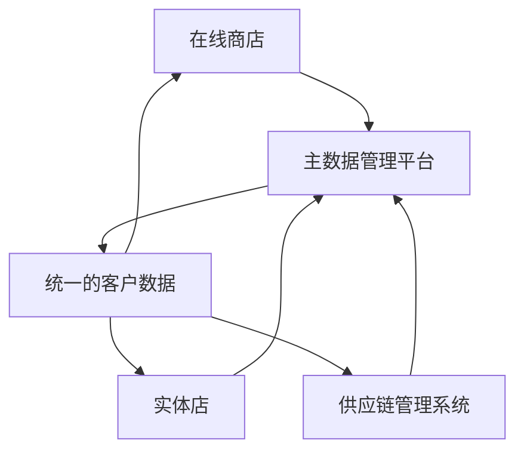

# 主数据管理平台

## 介绍

主数据管理（Master Data Management, MDM）是一种用于管理企业核心数据的方法和技术。主数据是指企业中最重要的、共享的数据，例如客户、产品、供应商等。主数据管理平台（MDM Platform）则是实现这一目标的工具，它帮助企业统一、清理和维护这些关键数据，确保数据的一致性和准确性。

主数据管理平台的核心目标是消除数据孤岛，提供单一、可信的数据源，从而支持企业更好地进行决策和运营。

## 主数据管理平台的核心功能

主数据管理平台通常具备以下核心功能：

1. **数据整合**：从多个数据源中提取数据，并将其整合到一个统一的视图中。
2. **数据清洗**：清理重复、不完整或不准确的数据。
3. **数据匹配**：识别并合并重复的记录。
4. **数据治理**：定义数据的所有权、访问权限和使用规则。
5. **数据分发**：将主数据分发到各个业务系统中，确保数据的一致性。

## 主数据管理平台的工作原理

主数据管理平台的工作原理可以分为以下几个步骤：

1. **数据采集**：从多个数据源（如CRM、ERP等）中提取数据。
2. **数据清洗与匹配**：清理数据并识别重复记录。
3. **数据存储**：将清洗后的数据存储在主数据仓库中。
4. **数据分发**：将主数据分发到各个业务系统中。

以下是一个简单的代码示例，展示如何从两个数据源中提取数据并进行匹配：

```python
# 示例：从两个数据源中提取客户数据
source1 = [
    {"id": 1, "name": "John Doe", "email": "john@example.com"},
    {"id": 2, "name": "Jane Smith", "email": "jane@example.com"}
]

source2 = [
    {"id": 1, "name": "John Doe", "phone": "123-456-7890"},
    {"id": 3, "name": "Alice Johnson", "email": "alice@example.com"}
]

# 数据匹配：基于ID合并记录
merged_data = {}
for record in source1 + source2:
    if record["id"] not in merged_data:
        merged_data[record["id"]] = record
    else:
        merged_data[record["id"]].update(record)

print(merged_data)
```

**输出：**
```python
{
    1: {"id": 1, "name": "John Doe", "email": "john@example.com", "phone": "123-456-7890"},
    2: {"id": 2, "name": "Jane Smith", "email": "jane@example.com"},
    3: {"id": 3, "name": "Alice Johnson", "email": "alice@example.com"}
}
```

:::tip
在实际的主数据管理平台中，数据匹配和合并的逻辑会更加复杂，通常需要处理更多的字段和规则。
:::

## 主数据管理平台的实际应用

### 案例：零售行业的主数据管理

假设一家零售企业拥有多个业务系统，包括在线商店、实体店和供应链管理系统。每个系统都有自己的客户数据，但这些数据可能存在不一致或重复。通过使用主数据管理平台，企业可以：

1. **统一客户数据**：将来自不同系统的客户数据整合到一个统一的视图中。
2. **清理重复数据**：识别并合并重复的客户记录。
3. **分发一致数据**：将统一的客户数据分发到各个业务系统中，确保所有系统使用相同的客户信息。

以下是一个简单的流程图，展示了主数据管理平台在零售行业中的应用：



:::note
主数据管理平台不仅适用于零售行业，还广泛应用于金融、医疗、制造等多个领域。
:::

## 总结

主数据管理平台是企业数据管理的重要工具，它帮助企业统一、清理和维护核心数据，确保数据的一致性和准确性。通过消除数据孤岛，主数据管理平台支持企业更好地进行决策和运营。

## 附加资源与练习

- **资源**：
  - [主数据管理：概念与实践](https://example.com/mdm-concepts)
  - [数据治理与主数据管理](https://example.com/data-governance)
- **练习**：
  - 尝试使用Python编写一个简单的数据匹配脚本，从两个数据源中提取数据并合并重复记录。
  - 研究一个开源的主数据管理工具（如Talend MDM），并尝试搭建一个简单的MDM环境。

:::caution
在实际项目中，主数据管理平台的实施需要充分考虑企业的业务需求和数据治理策略。
:::