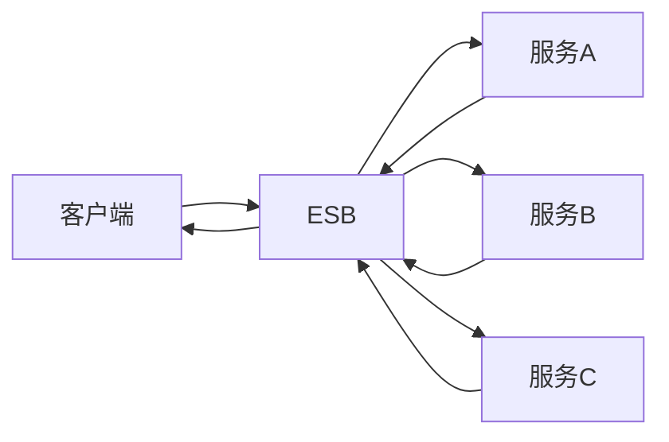

## 什么是企业服务总线（ESB）？

企业服务总线（Enterprise Service Bus，简称 ESB）是一种用于集成企业应用程序的中间件架构。它通过提供统一的通信层，使得不同的应用程序和服务能够以松耦合的方式相互通信。ESB 的核心目标是简化企业内部的系统集成，降低复杂性，并提高灵活性和可扩展性。

ESB 通常提供以下功能：
- **消息路由**：将消息从一个服务传递到另一个服务。
- **协议转换**：支持不同协议（如 HTTP、SOAP、JMS 等）之间的转换。
- **数据格式转换**：将数据从一种格式转换为另一种格式（如 JSON 到 XML）。
- **服务编排**：协调多个服务以完成复杂的业务流程。
- **错误处理**：提供机制来处理和恢复通信中的错误。

## ESB 的工作原理

ESB 的核心思想是通过一个中央总线来连接所有服务。每个服务只需要与 ESB 通信，而不需要直接与其他服务交互。这种设计使得系统更加灵活，因为服务的添加、删除或修改不会影响其他服务。

以下是一个简单的 ESB 工作流程：

1. **服务注册**：服务将其接口注册到 ESB。
2. **消息发送**：客户端发送消息到 ESB。
3. **消息路由**：ESB 根据配置将消息路由到目标服务。
4. **协议转换**：如果需要，ESB 会将消息从一种协议转换为另一种协议。
5. **数据格式转换**：如果需要，ESB 会将消息从一种数据格式转换为另一种格式。
6. **消息传递**：ESB 将消息传递给目标服务。
7. **响应返回**：目标服务处理消息并返回响应，ESB 将响应返回给客户端。



## 实际案例：订单处理系统

假设我们有一个订单处理系统，包含以下服务：
- **订单服务**：处理订单创建和查询。
- **库存服务**：管理库存信息。
- **支付服务**：处理支付请求。

在没有 ESB 的情况下，订单服务需要直接与库存服务和支付服务通信。这种紧耦合的设计会导致系统难以维护和扩展。

引入 ESB 后，订单服务只需要将消息发送到 ESB，ESB 负责将消息路由到库存服务和支付服务。这样，订单服务不需要知道库存服务和支付服务的具体实现细节，系统的灵活性和可维护性大大提高。

### 代码示例

以下是一个简单的 ESB 配置示例，使用 Apache Camel 实现消息路由：

```java
from("direct:orderService")
    .routeId("OrderProcessingRoute")
    .to("bean:inventoryService?method=checkStock")
    .to("bean:paymentService?method=processPayment")
    .to("bean:orderService?method=confirmOrder");
```

在这个示例中，`direct:orderService` 是订单服务的入口点。ESB 将消息路由到 `inventoryService` 检查库存，然后路由到 `paymentService` 处理支付，最后路由到 `orderService` 确认订单。

## 总结

企业服务总线（ESB）是一种强大的中间件架构，能够简化企业应用程序的集成。通过提供统一的通信层，ESB 使得不同服务能够以松耦合的方式相互通信，从而提高系统的灵活性和可维护性。

在实际应用中，ESB 可以用于各种场景，如订单处理系统、客户关系管理系统等。通过合理配置和使用 ESB，企业可以显著降低系统集成的复杂性，并提高业务处理的效率。

## 附加资源

- [Apache Camel 官方文档](https://camel.apache.org/)
- [MuleSoft ESB 入门指南](https://docs.mulesoft.com/)
- [企业集成模式](https://www.enterpriseintegrationpatterns.com/)

## 练习

1. 尝试使用 Apache Camel 或 MuleSoft 实现一个简单的 ESB 路由。
2. 设计一个包含多个服务的业务流程，并使用 ESB 进行服务编排。
3. 研究 ESB 中的错误处理机制，并实现一个错误恢复流程。