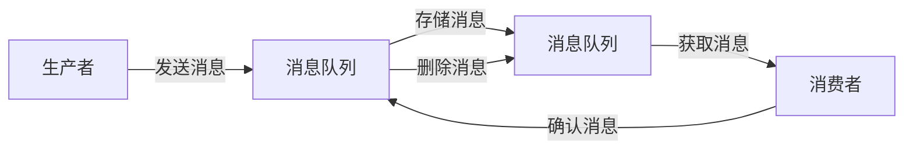

## 什么是消息队列中间件？

消息队列中间件（Message Queue Middleware）是一种用于在分布式系统中传递消息的软件基础设施。它允许应用程序通过发送和接收消息来进行通信，从而实现系统之间的解耦和异步处理。消息队列中间件通常用于处理高并发、高吞吐量的场景，例如订单处理、日志收集和实时通知等。

消息队列的核心思想是：生产者（Producer）将消息发送到队列中，消费者（Consumer）从队列中获取消息并进行处理。这种模式使得生产者和消费者可以独立运行，无需直接通信，从而提高了系统的可扩展性和可靠性。

## 消息队列的基本概念

### 1. 生产者（Producer）
生产者是消息的发送者，负责将消息发布到消息队列中。例如，一个电商网站的用户下单后，订单系统可以作为生产者，将订单信息发送到消息队列中。

### 2. 消费者（Consumer）
消费者是消息的接收者，负责从消息队列中获取消息并进行处理。例如，库存系统可以作为消费者，从消息队列中获取订单信息并更新库存。

### 3. 消息队列（Queue）
消息队列是存储消息的容器，通常遵循先进先出（FIFO）的原则。消息在队列中等待被消费者处理。

### 4. 消息（Message）
消息是生产者发送给消费者的数据单元。消息可以包含任何类型的数据，例如文本、JSON、XML等。

### 5. 中间件（Middleware）
中间件是位于生产者和消费者之间的软件层，负责管理消息的传递、存储和路由。

## 消息队列的工作原理

消息队列的工作流程通常包括以下几个步骤：

1. **生产者发送消息**：生产者将消息发送到消息队列中。
2. **消息存储**：消息队列将消息存储在队列中，等待消费者处理。
3. **消费者获取消息**：消费者从消息队列中获取消息并进行处理。
4. **消息确认**：消费者处理完消息后，向消息队列发送确认信号，表示消息已被成功处理。
5. **消息删除**：消息队列在收到确认信号后，将消息从队列中删除。



## 消息队列的优势

### 1. 系统解耦
消息队列允许生产者和消费者独立运行，无需直接通信。这种解耦方式使得系统更容易扩展和维护。

### 2. 异步处理
生产者可以立即发送消息并继续执行其他任务，而无需等待消费者处理消息。这种异步处理方式提高了系统的响应速度和吞吐量。

### 3. 负载均衡
多个消费者可以从同一个消息队列中获取消息，从而实现负载均衡。这种方式可以有效地处理高并发场景。

### 4. 可靠性
消息队列通常提供持久化存储和消息确认机制，确保消息不会丢失，并且能够被消费者成功处理。

## 实际应用场景

### 1. 订单处理系统
在电商网站中，用户下单后，订单系统将订单信息发送到消息队列中。库存系统、支付系统和物流系统分别从消息队列中获取订单信息并进行处理。这种方式使得各个系统可以独立运行，提高了系统的可扩展性和可靠性。

### 2. 日志收集
在分布式系统中，各个服务将日志信息发送到消息队列中。日志收集系统从消息队列中获取日志信息并进行存储和分析。这种方式可以有效地处理大量的日志数据。

### 3. 实时通知
在社交网络中，用户发布动态后，系统将动态信息发送到消息队列中。通知系统从消息队列中获取动态信息并发送给关注该用户的用户。这种方式可以实现实时通知功能。

## 代码示例

以下是一个简单的 Python 示例，使用 RabbitMQ 作为消息队列中间件。

### 生产者代码

```python
import pika

# 连接到 RabbitMQ 服务器
connection = pika.BlockingConnection(pika.ConnectionParameters('localhost'))
channel = connection.channel()

# 声明一个队列
channel.queue_declare(queue='hello')

# 发送消息
channel.basic_publish(exchange='',
                      routing_key='hello',
                      body='Hello, World!')
print(" [x] Sent 'Hello, World!'")

# 关闭连接
connection.close()
```

### 消费者代码

```python
import pika

# 连接到 RabbitMQ 服务器
connection = pika.BlockingConnection(pika.ConnectionParameters('localhost'))
channel = connection.channel()

# 声明一个队列
channel.queue_declare(queue='hello')

# 定义回调函数
def callback(ch, method, properties, body):
    print(" [x] Received %r" % body)

# 监听队列
channel.basic_consume(queue='hello',
                      auto_ack=True,
                      on_message_callback=callback)

print(' [*] Waiting for messages. To exit press CTRL+C')
channel.start_consuming()
```

### 运行结果

1. 运行生产者代码后，消息 "Hello, World!" 将被发送到消息队列中。
2. 运行消费者代码后，消费者将从消息队列中获取消息并打印出来。

## 总结

消息队列中间件是分布式系统中非常重要的组件，它通过解耦生产者和消费者、实现异步处理和负载均衡，提高了系统的可扩展性和可靠性。通过本文的学习，你应该对消息队列的基本概念、工作原理和实际应用场景有了初步的了解。

## 附加资源

- [RabbitMQ 官方文档](https://www.rabbitmq.com/documentation.html)
- [Kafka 官方文档](https://kafka.apache.org/documentation/)
- [消息队列设计模式](https://www.oreilly.com/library/view/designing-data-intensive-applications/9781491903063/)

## 练习

1. 尝试使用 RabbitMQ 或 Kafka 实现一个简单的消息队列系统。
2. 设计一个订单处理系统，使用消息队列实现订单系统、库存系统和支付系统的解耦。
3. 研究消息队列的持久化机制，并尝试在代码中实现消息的持久化存储。

:::tip
如果你在练习中遇到问题，可以参考官方文档或社区论坛，获取更多的帮助和指导。
:::