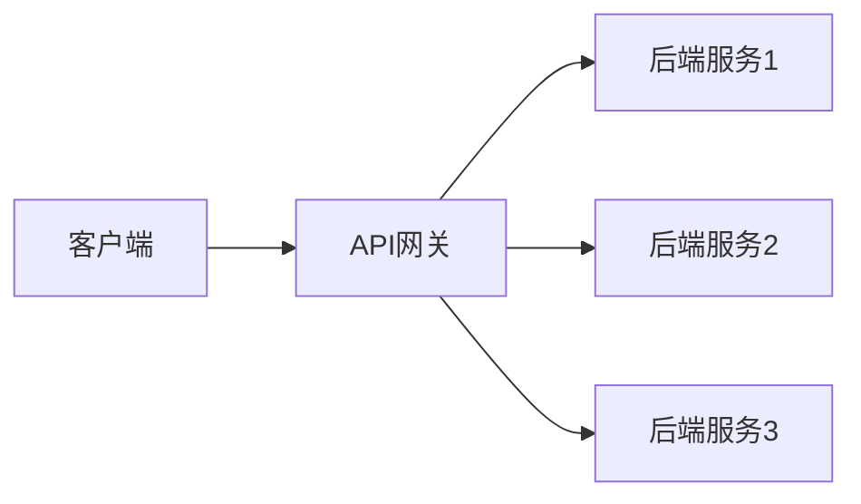
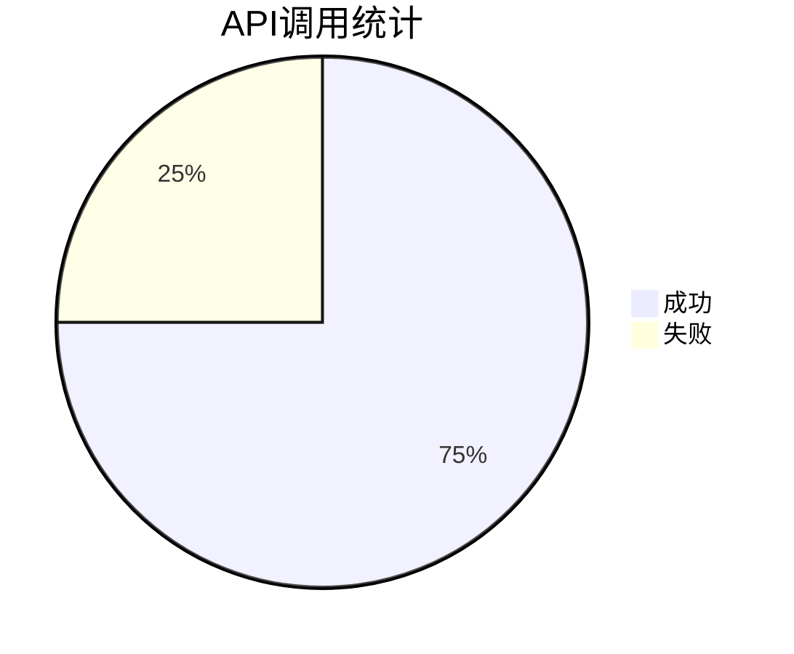

# API管理平台

## 介绍

在现代应用开发中，API（应用程序编程接口）是连接不同系统和服务的关键组件。API管理平台是一种工具或服务，用于帮助开发者创建、发布、监控和保护API。它提供了一系列功能，使得API的管理更加高效和安全。

API管理平台通常包括以下核心功能：

- **API创建与发布**：帮助开发者快速创建和发布API。
- **API监控与分析**：提供实时监控和分析工具，帮助开发者了解API的使用情况。
- **API安全**：提供身份验证、授权和流量控制等安全功能。
- **API文档**：自动生成API文档，方便开发者使用。

## API管理平台的核心组件

### 1. API网关

API网关是API管理平台的核心组件之一。它充当客户端和后端服务之间的中介，负责请求的路由、负载均衡、安全性和监控。



### 2. API文档生成

API管理平台通常提供自动生成API文档的功能。这些文档可以帮助开发者快速了解API的使用方法。

```json
{
  "openapi": "3.0.0",
  "info": {
    "title": "Sample API",
    "version": "1.0.0"
  },
  "paths": {
    "/users": {
      "get": {
        "summary": "获取用户列表",
        "responses": {
          "200": {
            "description": "成功"
          }
        }
      }
    }
  }
}
```

### 3. API监控与分析

API管理平台提供实时监控和分析工具，帮助开发者了解API的使用情况。例如，可以监控API的调用次数、响应时间和错误率。



## 实际案例

### 案例1：电商平台的API管理

假设你正在开发一个电商平台，需要管理多个API，如用户管理、商品管理和订单管理。使用API管理平台可以帮助你：

- 统一管理所有API的发布和版本控制。
- 监控API的性能和错误率，及时发现和解决问题。
- 提供安全的访问控制，防止未经授权的访问。

### 案例2：微服务架构中的API管理

在微服务架构中，每个服务可能都有自己的API。API管理平台可以帮助你：

- 集中管理所有服务的API。
- 提供统一的API网关，简化客户端与服务的交互。
- 提供详细的API使用分析，帮助优化服务性能。

## 总结

API管理平台是现代应用开发中不可或缺的工具。它不仅简化了API的创建和管理，还提供了强大的监控和安全功能。通过使用API管理平台，开发者可以更高效地构建和维护复杂的应用系统。

## 附加资源与练习

- **资源**：
  - [API管理平台官方文档](https://example.com/api-management-docs)
  - [API设计最佳实践](https://example.com/api-design-best-practices)

- **练习**：
  - 尝试使用一个开源的API管理平台（如Kong或Apigee）创建一个简单的API，并发布到API网关。
  - 使用API管理平台的监控工具，分析API的使用情况，并尝试优化API的性能。

:::tip
如果你对API管理平台有任何疑问，欢迎在评论区留言，我们会尽快回复你！
:::