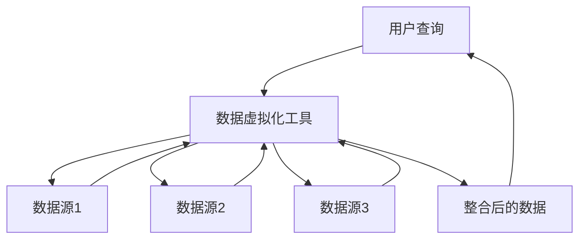

## 什么是数据虚拟化技术？

数据虚拟化技术是一种允许用户在不移动或复制数据的情况下，从多个数据源中访问和整合数据的技术。它通过创建一个虚拟的数据层，将分散在不同系统中的数据整合为一个统一的视图，从而简化数据访问和分析。

与传统的ETL（Extract, Transform, Load）过程不同，数据虚拟化不需要将数据从源系统中提取并存储到数据仓库中。相反，它通过实时查询和整合数据源中的数据，提供了一种更灵活、更高效的数据访问方式。

## 数据虚拟化的工作原理

数据虚拟化技术的核心在于**虚拟数据层**。这个虚拟层充当了一个中间层，负责从多个数据源中获取数据，并将其整合为一个统一的视图。以下是数据虚拟化的基本工作流程：

1. **数据源连接**：数据虚拟化工具连接到多个数据源，如关系型数据库、NoSQL数据库、云存储、API等。
2. **虚拟数据层**：在虚拟数据层中，数据虚拟化工具创建了一个虚拟的表或视图，这些表或视图并不实际存储数据，而是通过查询实时从数据源中获取数据。
3. **查询处理**：当用户发起查询时，数据虚拟化工具会将查询分解为多个子查询，分别发送到相应的数据源中。
4. **数据整合**：数据虚拟化工具将从各个数据源中获取的数据进行整合，并返回给用户。



## 数据虚拟化的优势

1. **实时数据访问**：数据虚拟化允许用户实时访问数据，而不需要等待ETL过程完成。
2. **减少数据冗余**：由于数据不需要复制或移动，数据虚拟化减少了数据冗余和存储成本。
3. **灵活性**：数据虚拟化可以轻松地集成新的数据源，并且可以快速适应业务需求的变化。
4. **简化数据管理**：通过提供一个统一的数据视图，数据虚拟化简化了数据管理和分析过程。

## 实际应用案例

### 案例1：跨部门数据整合

假设一家公司有多个部门，每个部门使用不同的数据库系统。销售部门使用MySQL，财务部门使用Oracle，而人力资源部门使用MongoDB。为了进行跨部门的业务分析，公司可以使用数据虚拟化技术，创建一个虚拟的数据层，将这三个数据库中的数据整合为一个统一的视图。这样，分析师可以直接从虚拟层中查询数据，而不需要分别访问每个数据库。

### 案例2：实时数据分析

一家电商公司希望实时监控其销售数据，以便快速做出决策。通过数据虚拟化技术，公司可以将来自不同数据源（如订单系统、库存系统、物流系统）的数据整合为一个虚拟视图，并实时查询这些数据。这使得公司能够快速响应市场变化，优化库存管理，并提高客户满意度。

## 代码示例

以下是一个简单的代码示例，展示如何使用Python和Pandas库进行数据虚拟化的模拟操作。假设我们有两个数据源：一个CSV文件和一个SQL数据库。

```python
import pandas as pd
import sqlite3

# 从CSV文件中读取数据
csv_data = pd.read_csv('sales_data.csv')

# 从SQL数据库中读取数据
conn = sqlite3.connect('finance_data.db')
sql_data = pd.read_sql_query("SELECT * FROM financial_records", conn)

# 将两个数据源的数据整合为一个虚拟视图
virtual_view = pd.concat([csv_data, sql_data], ignore_index=True)

# 输出整合后的数据
print(virtual_view.head())
```

**输入：**
- `sales_data.csv`：包含销售数据的CSV文件。
- `financial_records`：包含财务数据的SQL表。

**输出：**
- `virtual_view`：整合后的虚拟视图，包含销售和财务数据。

## 总结

数据虚拟化技术为数据集成和访问提供了一种灵活且高效的解决方案。它通过创建一个虚拟的数据层，允许用户在不移动或复制数据的情况下，实时访问和整合多个数据源中的数据。这种技术特别适用于需要快速响应业务变化、减少数据冗余和简化数据管理的场景。

## 附加资源与练习

- **资源**：
  - [数据虚拟化技术白皮书](https://example.com/data-virtualization-whitepaper)
  - [数据虚拟化工具比较](https://example.com/data-virtualization-tools)

- **练习**：
  1. 尝试使用Python和Pandas库，将两个不同的数据源（如CSV文件和SQL数据库）整合为一个虚拟视图。
  2. 研究一个开源的数据虚拟化工具（如Denodo或Teiid），并尝试在一个简单的项目中应用它。

:::tip
如果你对数据虚拟化技术有任何疑问，欢迎在评论区留言，我们会尽快为你解答！
:::