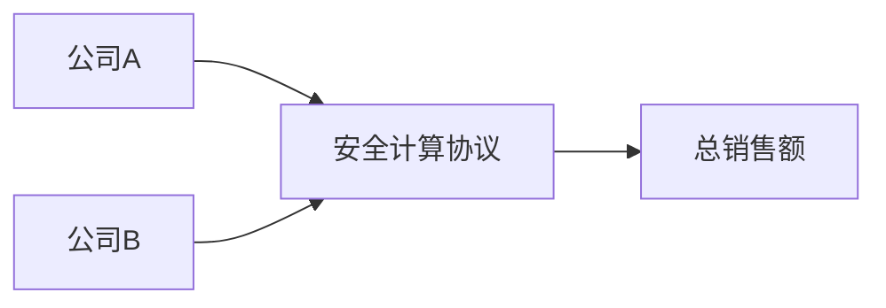

# 隐私计算方法

隐私计算方法（Privacy-Preserving Computation）是一种在不泄露原始数据的前提下，对数据进行计算和分析的技术。随着数据隐私保护的重要性日益增加，隐私计算方法成为了数据科学和人工智能领域的关键技术之一。本文将带你了解隐私计算方法的基本概念、常见技术及其实际应用。

## 什么是隐私计算方法？

隐私计算方法的核心目标是在保护数据隐私的同时，允许对数据进行有效的计算和分析。传统的数据处理方法通常需要将数据集中存储和处理，这可能会导致数据泄露的风险。而隐私计算方法通过加密、分布式计算等技术，确保数据在计算过程中不会被泄露。

:::note
隐私计算方法的主要应用场景包括：
- 医疗数据分析
- 金融风险评估
- 跨机构数据共享
- 个性化推荐系统
:::

## 常见的隐私计算技术

### 1. 同态加密（Homomorphic Encryption）

同态加密是一种允许在加密数据上直接进行计算的技术。计算的结果仍然是加密的，只有拥有解密密钥的用户才能解密并查看结果。

#### 示例：同态加密的基本原理

假设我们有两个加密的数字 `E(a)` 和 `E(b)`，我们可以直接在加密数据上进行加法运算：

```python
E(a) + E(b) = E(a + b)
```

即使我们不知道 `a` 和 `b` 的具体值，我们仍然可以计算出它们的和。

### 2. 安全多方计算（Secure Multi-Party Computation, SMPC）

安全多方计算允许多个参与方在不泄露各自数据的情况下，共同计算一个函数的结果。每个参与方只能看到自己的输入和最终的输出，而无法获取其他参与方的数据。

#### 示例：安全多方计算的实际应用

假设两家公司希望计算它们的总销售额，但不想泄露各自的销售额数据。通过安全多方计算，它们可以在不共享数据的情况下计算出总销售额。



### 3. 差分隐私（Differential Privacy）

差分隐私是一种通过添加噪声来保护个体数据隐私的技术。它确保在发布统计数据时，个体的数据不会被识别出来。

#### 示例：差分隐私的应用

假设我们有一个包含用户年龄的数据库，我们希望发布平均年龄，但不想泄露任何个体的年龄信息。通过差分隐私，我们可以在计算平均年龄时添加一定的噪声，从而保护个体隐私。

```python
import numpy as np

# 原始数据
ages = [25, 30, 35, 40, 45]

# 添加噪声
noise = np.random.laplace(0, 1)  # 拉普拉斯噪声
average_age = np.mean(ages) + noise

print("差分隐私下的平均年龄:", average_age)
```

## 实际案例

### 案例1：医疗数据分析

在医疗领域，隐私计算方法可以用于分析患者的健康数据，而无需泄露患者的个人信息。例如，医院可以使用同态加密技术对患者的病历数据进行加密，然后在不解密的情况下进行分析。

### 案例2：金融风险评估

银行和金融机构可以使用安全多方计算技术来评估客户的信用风险，而无需共享客户的敏感信息。这有助于保护客户的隐私，同时提高风险评估的准确性。

## 总结

隐私计算方法是一种强大的技术，能够在保护数据隐私的同时，允许对数据进行有效的计算和分析。通过同态加密、安全多方计算和差分隐私等技术，我们可以在不泄露原始数据的情况下，完成复杂的计算任务。

:::tip
如果你想进一步学习隐私计算方法，可以参考以下资源：
- [《差分隐私：理论与实践》](https://www.cis.upenn.edu/~aaroth/Papers/privacybook.pdf)
- [同态加密入门指南](https://eprint.iacr.org/2010/520.pdf)
- [安全多方计算教程](https://www.cs.cornell.edu/courses/cs4830/2010fa/lecnotes.pdf)
:::

## 练习

1. 尝试使用 Python 实现一个简单的差分隐私算法，计算一组数据的平均值。
2. 研究同态加密的开源库（如 [PySyft](https://github.com/OpenMined/PySyft)），并尝试在加密数据上进行加法运算。
3. 思考并讨论在哪些实际场景中可以使用安全多方计算技术。

通过本文的学习，你应该对隐私计算方法有了初步的了解。希望你能继续深入学习，并在实际项目中应用这些技术！