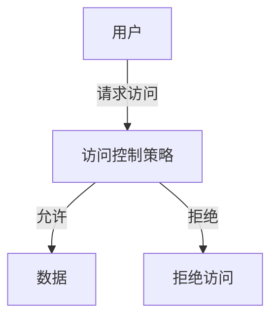

## 介绍

在当今数字化时代，数据安全与隐私保护变得尤为重要。无论是个人用户还是企业，都需要确保敏感信息不被未经授权的人员访问或泄露。数据安全最佳实践是一系列方法和策略，旨在保护数据的机密性、完整性和可用性。本文将介绍一些关键的数据安全最佳实践，帮助初学者理解如何有效地保护数据。

## 数据安全的基本原则

数据安全的核心原则可以概括为以下三点：

1. **机密性**：确保数据只能被授权的人员访问。
2. **完整性**：确保数据在传输和存储过程中不被篡改。
3. **可用性**：确保数据在需要时可以被授权人员访问。

## 数据安全最佳实践

### 1. 使用强密码

强密码是保护数据的第一道防线。一个强密码应包含大小写字母、数字和特殊字符，并且长度至少为12个字符。

```python
# 示例：生成一个强密码
import random
import string

def generate_strong_password(length=12):
    characters = string.ascii_letters + string.digits + string.punctuation
    return ''.join(random.choice(characters) for i in range(length))

print(generate_strong_password())
```

**输出示例**：
```
A1b2C3d4E5f6!
```

:::tip
建议使用密码管理器来生成和存储强密码，避免重复使用相同的密码。
:::

### 2. 加密敏感数据

加密是将数据转换为不可读格式的过程，只有拥有解密密钥的人才能访问原始数据。常见的加密算法包括AES和RSA。

```python
# 示例：使用AES加密数据
from Crypto.Cipher import AES
from Crypto.Random import get_random_bytes

key = get_random_bytes(16)  # 生成16字节的密钥
cipher = AES.new(key, AES.MODE_EAX)
data = b"敏感数据"
nonce = cipher.nonce
ciphertext, tag = cipher.encrypt_and_digest(data)

print(f"加密后的数据: {ciphertext}")
```

**输出示例**：
```
加密后的数据: b'\x93\x1a\x0b\x8e...'
```

:::caution
确保密钥的安全存储，密钥泄露将导致加密失效。
:::

### 3. 定期备份数据

定期备份数据是防止数据丢失的重要措施。备份应存储在安全的位置，并定期测试恢复过程以确保备份的有效性。

```bash
# 示例：使用rsync进行数据备份
rsync -avz /path/to/source /path/to/backup
```

:::warning
备份数据也应加密存储，以防止备份数据被未经授权的人员访问。
:::

### 4. 实施访问控制

访问控制是确保只有授权人员可以访问特定数据的关键措施。常见的访问控制模型包括基于角色的访问控制（RBAC）和基于属性的访问控制（ABAC）。



:::note
定期审查和更新访问控制策略，确保其符合当前的安全需求。
:::

### 5. 使用多因素认证（MFA）

多因素认证要求用户提供两种或更多种验证方式（如密码和短信验证码），以增加安全性。

```python
# 示例：模拟MFA验证
def mfa_verification(password, sms_code):
    if password == "correct_password" and sms_code == "123456":
        return True
    return False

print(mfa_verification("correct_password", "123456"))
```

**输出示例**：
```
True
```

:::tip
MFA可以显著降低账户被未经授权访问的风险。
:::

## 实际案例

### 案例1：某电商平台的数据泄露事件

某电商平台因未对用户密码进行加密存储，导致数百万用户的密码被泄露。攻击者利用这些密码尝试登录其他网站，造成更大的损失。

**教训**：始终对敏感数据进行加密存储，并定期更新安全措施。

### 案例2：某医院的数据备份失败

某医院因未定期测试备份数据的恢复过程，导致在数据丢失时无法恢复重要患者信息。

**教训**：定期测试备份数据的恢复过程，确保备份的有效性。

## 总结

数据安全是保护敏感信息免受未经授权访问和泄露的关键。通过实施强密码策略、加密敏感数据、定期备份、实施访问控制和使用多因素认证，可以显著提高数据的安全性。

## 附加资源

- [OWASP 数据安全指南](https://owasp.org/www-project-data-security/)
- [NIST 数据安全标准](https://www.nist.gov/cybersecurity)
- [密码管理器推荐](https://www.lastpass.com/)

## 练习

1. 编写一个Python脚本，生成一个包含大小写字母、数字和特殊字符的强密码。
2. 使用AES加密一段文本，并尝试解密。
3. 设计一个简单的访问控制模型，模拟用户请求访问数据的过程。

通过以上练习，你将更好地理解数据安全最佳实践的实际应用。