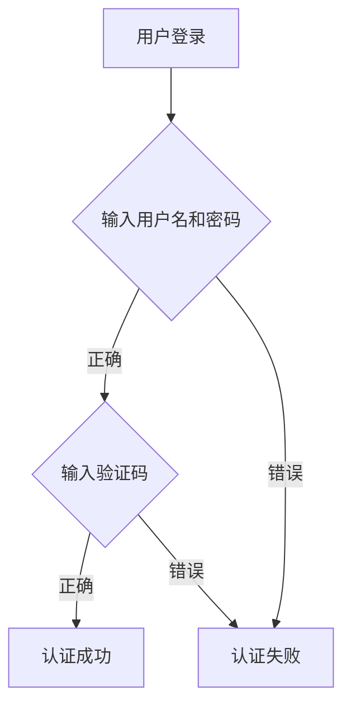

## 什么是身份认证机制？

身份认证机制是验证用户身份的过程，确保用户是他们所声称的那个人。它是数据安全和隐私保护的重要组成部分，用于防止未经授权的访问。身份认证通常与授权机制结合使用，以确保用户只能访问他们被允许的资源。

:::note
身份认证（Authentication）与授权（Authorization）是两个不同的概念：
- **身份认证**：验证用户是谁。
- **授权**：确定用户有权访问哪些资源。
:::

## 常见的身份认证方法

以下是几种常见的身份认证方法：

### 1. 用户名和密码
这是最常见的身份认证方式。用户输入用户名和密码，系统验证这些信息是否与存储的记录匹配。

```python
def authenticate(username, password):
    # 假设数据库中存储的用户名和密码
    stored_username = "user123"
    stored_password = "password123"
    
    if username == stored_username and password == stored_password:
        return True
    return False

# 示例输入
username = "user123"
password = "password123"

# 验证
if authenticate(username, password):
    print("认证成功！")
else:
    print("认证失败！")
```

**输出：**
```
认证成功！
```

### 2. 多因素认证（MFA）
多因素认证要求用户提供两种或更多种不同的认证因素。常见的因素包括：
- 知识因素（如密码）
- 拥有因素（如手机或硬件令牌）
- 生物特征因素（如指纹或面部识别）



### 3. OAuth 和 OpenID Connect
OAuth 是一种授权框架，而 OpenID Connect 是基于 OAuth 的身份认证协议。它们允许用户使用第三方服务（如 Google 或 Facebook）进行身份认证。

```python
from oauthlib.oauth2 import WebApplicationClient

# 假设使用 Google 作为第三方认证服务
client = WebApplicationClient("your-client-id")

# 生成认证 URL
auth_url = client.prepare_request_uri(
    "https://accounts.google.com/o/oauth2/auth",
    redirect_uri="https://your-site.com/callback",
    scope=["openid", "email"],
)

print(f"请访问以下 URL 进行认证: {auth_url}")
```

**输出：**
```
请访问以下 URL 进行认证: https://accounts.google.com/o/oauth2/auth?response_type=code&client_id=your-client-id&redirect_uri=https%3A%2F%2Fyour-site.com%2Fcallback&scope=openid+email
```

## 实际案例

### 案例 1：银行应用
银行应用通常使用多因素认证来保护用户的账户。用户在输入用户名和密码后，还需要输入通过短信发送的一次性验证码。

### 案例 2：社交媒体登录
许多网站允许用户使用社交媒体账户（如 Facebook 或 Google）登录。这是通过 OAuth 和 OpenID Connect 实现的，用户无需创建新的账户即可快速登录。

## 总结

身份认证机制是保护数据安全和隐私的关键技术。通过用户名和密码、多因素认证以及 OAuth 等方法，可以有效验证用户身份，防止未经授权的访问。理解这些机制的原理和应用场景，对于构建安全的系统至关重要。

## 附加资源与练习

- **练习 1**：尝试实现一个简单的用户名和密码认证系统，并添加多因素认证功能。
- **练习 2**：研究如何使用 OAuth 和 OpenID Connect 实现第三方登录功能。

:::tip
了解更多关于身份认证的最佳实践，可以参考 [OWASP 身份认证指南](https://owasp.org/www-project-cheat-sheets/cheatsheets/Authentication_Cheat_Sheet.html)。
:::