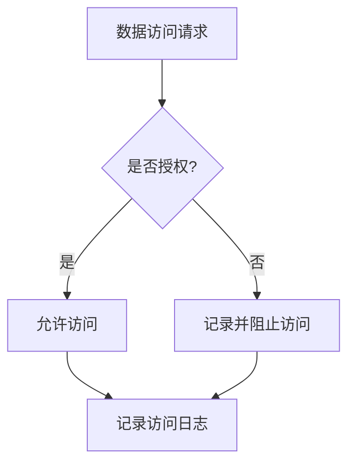

# 数据泄露防护

数据泄露是指未经授权的访问、披露或传输敏感数据的行为。数据泄露可能导致严重的后果，包括财务损失、声誉损害以及法律问题。因此，数据泄露防护是数据安全与隐私保护中至关重要的一环。

## 什么是数据泄露防护？

数据泄露防护（Data Leakage Prevention, DLP）是一系列技术和策略的组合，旨在防止敏感数据被未经授权的访问、使用或传输。DLP 系统通常通过监控、检测和阻止数据泄露行为来保护数据安全。

### 数据泄露的常见原因

1. **内部威胁**：员工无意或有意泄露数据。
2. **外部攻击**：黑客通过漏洞或恶意软件获取数据。
3. **配置错误**：错误的系统配置导致数据暴露。
4. **第三方风险**：与第三方共享数据时未采取足够的保护措施。

## 数据泄露防护的核心措施

### 1. 数据分类与标记

数据分类是数据泄露防护的第一步。通过将数据分为不同的敏感级别（如公开、内部、机密），可以更好地控制数据的访问和使用。

```python
# 示例：数据分类
data = {
    "name": "John Doe",
    "email": "john.doe@example.com",
    "ssn": "123-45-6789",  # 敏感数据
    "department": "Engineering"
}

# 标记敏感数据
data["sensitivity"] = "Confidential"
```

### 2. 访问控制

访问控制确保只有授权用户才能访问敏感数据。常见的访问控制方法包括角色基础访问控制（RBAC）和属性基础访问控制（ABAC）。

```python
# 示例：基于角色的访问控制
def can_access_data(user_role, data_sensitivity):
    if user_role == "Admin" or data_sensitivity == "Public":
        return True
    return False

# 检查用户是否有权访问数据
user_role = "Employee"
data_sensitivity = "Confidential"
print(can_access_data(user_role, data_sensitivity))  # 输出: False
```

### 3. 数据加密

数据加密是保护数据在传输和存储过程中不被泄露的重要手段。常见的加密算法包括 AES（高级加密标准）和 RSA（非对称加密算法）。

```python
# 示例：使用 AES 加密数据
from Crypto.Cipher import AES
from Crypto.Random import get_random_bytes

key = get_random_bytes(16)  # 生成 128 位密钥
cipher = AES.new(key, AES.MODE_EAX)
data = b"Sensitive Data"
ciphertext, tag = cipher.encrypt_and_digest(data)

print("加密后的数据:", ciphertext)
```

### 4. 监控与审计

实时监控和审计数据访问行为可以帮助及时发现和阻止数据泄露。常见的监控工具包括 SIEM（安全信息与事件管理）系统。



## 实际案例

### 案例 1：内部员工泄露客户数据

某公司的一名员工无意中将包含客户敏感信息的 Excel 文件发送给了外部合作伙伴。由于文件未加密且未标记为敏感数据，导致客户信息泄露。

**防护措施**：
- 对敏感数据进行分类和标记。
- 实施访问控制，限制员工访问敏感数据。
- 使用 DLP 系统监控和阻止未经授权的数据传输。

### 案例 2：黑客攻击导致数据泄露

某电商网站因未及时修补漏洞，导致黑客通过 SQL 注入攻击获取了用户的信用卡信息。

**防护措施**：
- 定期进行安全审计和漏洞扫描。
- 对数据库中的敏感数据进行加密。
- 实施 Web 应用防火墙（WAF）防止 SQL 注入攻击。

## 总结

数据泄露防护是保护敏感数据不被未经授权访问、使用或传输的关键措施。通过数据分类、访问控制、加密和监控等手段，可以有效降低数据泄露的风险。

:::tip 提示
在实际应用中，数据泄露防护需要结合技术手段和管理策略，确保数据安全的全方位保护。
:::

## 附加资源与练习

### 资源
- [OWASP 数据泄露防护指南](https://owasp.org/www-project-data-leakage-prevention/)
- [NIST 数据安全标准](https://www.nist.gov/cybersecurity)

### 练习
1. 编写一个 Python 脚本，对敏感数据进行分类和标记。
2. 设计一个简单的访问控制系统，限制不同角色的用户访问不同级别的数据。
3. 使用 AES 加密算法加密一段敏感数据，并尝试解密。

通过以上学习和练习，你将掌握数据泄露防护的基本概念和实际应用，为进一步学习数据安全打下坚实基础。