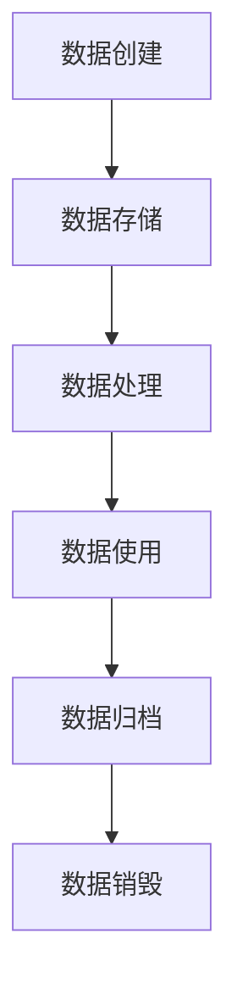

# 数据生命周期管理

数据生命周期管理（Data Lifecycle Management, DLM）是指从数据的创建到最终销毁的整个过程中，对数据进行有效管理和控制的一系列策略和实践。通过数据生命周期管理，组织可以确保数据的质量、安全性、合规性和可用性，同时优化存储成本。

## 数据生命周期的阶段

数据生命周期通常分为以下几个阶段：

1. **数据创建**：数据通过系统、传感器、用户输入等方式生成。
2. **数据存储**：数据被存储到数据库、数据仓库或其他存储系统中。
3. **数据处理**：数据被清洗、转换、分析或用于生成报告。
4. **数据使用**：数据被用于支持决策、自动化流程或提供洞察。
5. **数据归档**：不再频繁使用的数据被移动到低成本存储中。
6. **数据销毁**：数据被安全地删除或销毁，以符合隐私法规或减少存储成本。



## 数据生命周期管理的重要性

数据生命周期管理的重要性体现在以下几个方面：

- **数据质量**：通过管理数据的生命周期，可以确保数据在整个过程中保持高质量。
- **合规性**：许多法规要求组织对数据进行特定的管理，例如 GDPR 要求数据在不再需要时被删除。
- **成本优化**：通过归档和销毁不再需要的数据，可以减少存储成本。
- **安全性**：确保数据在存储、传输和销毁过程中的安全性，防止数据泄露。

## 实际案例：电商平台的数据生命周期管理

假设我们有一个电商平台，以下是其数据生命周期管理的示例：

1. **数据创建**：用户在平台上注册、浏览商品、下单等行为生成数据。
2. **数据存储**：用户数据、订单数据等被存储到关系型数据库中。
3. **数据处理**：数据被清洗和转换，用于生成销售报告和用户行为分析。
4. **数据使用**：销售报告用于制定营销策略，用户行为分析用于个性化推荐。
5. **数据归档**：超过一年的订单数据被移动到归档存储中。
6. **数据销毁**：超过五年的用户数据被安全删除，以符合 GDPR 要求。

:::tip
在实际应用中，数据生命周期管理通常需要结合自动化工具和策略来实现。例如，可以使用 ETL 工具进行数据处理，使用数据归档工具进行数据归档。
:::

## 代码示例：数据归档

以下是一个简单的 Python 脚本示例，用于将超过一年的订单数据从主数据库移动到归档数据库：

```python
import datetime
import sqlite3

# 连接到主数据库和归档数据库
main_db = sqlite3.connect('main.db')
archive_db = sqlite3.connect('archive.db')

# 获取当前日期
current_date = datetime.datetime.now()

# 查询超过一年的订单数据
cursor = main_db.cursor()
cursor.execute("SELECT * FROM orders WHERE order_date < ?", (current_date - datetime.timedelta(days=365),))
old_orders = cursor.fetchall()

# 将数据插入到归档数据库
archive_cursor = archive_db.cursor()
for order in old_orders:
    archive_cursor.execute("INSERT INTO orders VALUES (?, ?, ?, ?)", order)

# 提交更改并关闭连接
archive_db.commit()
main_db.commit()
main_db.close()
archive_db.close()
```

:::note
在实际生产环境中，数据归档通常需要更复杂的逻辑和工具，例如使用数据库的分区功能或专门的归档工具。
:::

## 总结

数据生命周期管理是确保数据质量、合规性、安全性和成本优化的重要策略。通过理解数据生命周期的各个阶段，并结合实际应用场景，初学者可以更好地掌握这一概念。

## 附加资源与练习

- **资源**：
  - [数据生命周期管理指南](https://www.example.com/data-lifecycle-management-guide)
  - [GDPR 数据保护法规](https://www.example.com/gdpr)
- **练习**：
  - 尝试编写一个脚本，模拟数据从创建到销毁的整个生命周期。
  - 研究一个开源的数据生命周期管理工具，并尝试将其应用到你的项目中。

通过本文的学习，你应该对数据生命周期管理有了初步的了解。继续探索和实践，你将能够更好地应用这一概念到实际项目中。