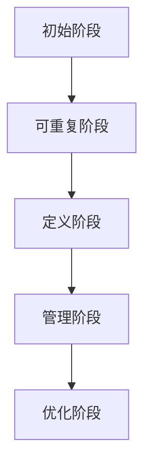

# 数据管理成熟度模型

数据管理成熟度模型（Data Management Maturity Model, DMM）是一种评估和改进组织数据管理能力的框架。它帮助组织识别当前数据管理的水平，并为未来的改进提供方向。对于初学者来说，理解 DMM 是掌握数据治理和质量管理的重要一步。

## 什么是数据管理成熟度模型？

数据管理成熟度模型（DMM）是一种结构化框架，用于评估组织在数据管理方面的成熟度。它通常分为多个阶段，每个阶段代表组织在数据管理能力上的不同水平。通过 DMM，组织可以识别当前的数据管理问题，并制定改进计划。

DMM 的核心目标是帮助组织：
- 评估当前的数据管理能力。
- 识别改进的机会。
- 制定数据治理和数据质量提升的策略。

## DMM 的核心阶段

DMM 通常分为五个成熟度阶段，每个阶段代表组织在数据管理上的不同水平：

1. **初始阶段（Ad-hoc）**：数据管理过程缺乏标准化，依赖个人经验和临时解决方案。
2. **可重复阶段（Repeatable）**：开始建立基本的数据管理流程，但仍缺乏一致性。
3. **定义阶段（Defined）**：数据管理流程被正式定义和记录，组织开始标准化操作。
4. **管理阶段（Managed）**：数据管理流程被监控和优化，组织能够主动管理数据质量。
5. **优化阶段（Optimized）**：数据管理流程持续改进，组织能够预测和预防数据问题。

以下是一个简单的 Mermaid 图表，展示 DMM 的五个阶段：



## 实际应用场景

### 案例：零售行业的数据管理

假设一家零售公司希望提升其数据管理能力，以更好地支持业务决策。以下是他们如何使用 DMM 的步骤：

1. **初始阶段**：公司依赖手动处理销售数据，数据质量参差不齐。
2. **可重复阶段**：公司开始使用电子表格工具，并建立基本的数据收集流程。
3. **定义阶段**：公司引入数据管理软件，并制定数据录入和验证的标准流程。
4. **管理阶段**：公司监控数据质量，定期生成数据报告，并优化数据收集流程。
5. **优化阶段**：公司使用数据分析工具预测销售趋势，并自动修复数据质量问题。

通过 DMM，该公司逐步提升了数据管理能力，最终实现了数据驱动的业务决策。

## 代码示例：数据质量检查

以下是一个简单的 Python 代码示例，展示如何在数据管理中进行基本的数据质量检查：

```python
import pandas as pd

# 示例数据
data = {
    'Product': ['A', 'B', 'C', 'D', 'E'],
    'Sales': [100, 150, None, 200, 250],  # 包含缺失值
    'Price': [10.5, 20.0, 15.0, 25.0, 30.0]
}

# 创建 DataFrame
df = pd.DataFrame(data)

# 检查缺失值
missing_values = df.isnull().sum()
print("缺失值统计：")
print(missing_values)

# 填充缺失值
df['Sales'].fillna(df['Sales'].mean(), inplace=True)
print("\n填充缺失值后的数据：")
print(df)
```

**输出：**
```
缺失值统计：
Product    0
Sales      1
Price      0
dtype: int64

填充缺失值后的数据：
  Product  Sales  Price
0       A  100.0   10.5
1       B  150.0   20.0
2       C  175.0   15.0
3       D  200.0   25.0
4       E  250.0   30.0
```

:::tip
在实际应用中，数据质量检查通常包括缺失值、重复值、异常值等多个方面。通过自动化工具和脚本，可以显著提高数据管理的效率。
:::

## 总结

数据管理成熟度模型（DMM）是评估和改进组织数据管理能力的重要工具。通过理解 DMM 的五个阶段，组织可以逐步提升数据治理和数据质量水平。无论是零售行业还是其他领域，DMM 都能为数据驱动的决策提供坚实的基础。

## 附加资源与练习

- **推荐阅读**：
  - 《数据治理：从理论到实践》
  - 《数据质量管理：原则与实践》
- **练习**：
  - 尝试使用 Python 或 Excel 对一组数据进行质量检查，并记录发现的问题。
  - 为一个小型项目设计一个简单的数据管理流程，并评估其成熟度阶段。

通过学习和实践，你将逐步掌握数据管理成熟度模型的核心概念，并能够将其应用到实际工作中。