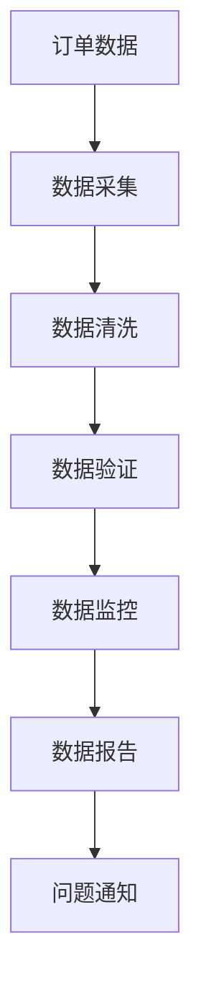

# 数据质量工具与平台

## 介绍

数据质量是指数据的准确性、完整性、一致性、及时性和唯一性等特性。高质量的数据是数据分析、机器学习和业务决策的基础。然而，现实中的数据往往存在各种问题，如缺失值、重复数据、格式错误等。为了确保数据的质量，我们需要使用专门的数据质量工具与平台。

数据质量工具与平台可以帮助我们自动化地检测、清洗和监控数据质量。它们通常提供以下功能：

- **数据清洗**：自动或半自动地修复数据中的错误。
- **数据验证**：检查数据是否符合预定义的规则或标准。
- **数据监控**：实时监控数据质量，及时发现并解决问题。
- **数据报告**：生成数据质量报告，帮助用户了解数据的健康状况。

## 数据质量工具的分类

数据质量工具可以根据其功能和用途分为以下几类：

1. **数据清洗工具**：如 OpenRefine、Trifacta 等，用于清理和转换数据。
2. **数据验证工具**：如 Great Expectations、Deequ 等，用于验证数据的准确性和一致性。
3. **数据监控工具**：如 Apache Griffin、DataDog 等，用于实时监控数据质量。
4. **数据治理平台**：如 Collibra、Alation 等，提供全面的数据管理和治理功能。

## 数据质量工具的使用示例

### 示例 1：使用 OpenRefine 进行数据清洗

OpenRefine 是一个开源的数据清洗工具，特别适合处理结构化数据。以下是一个简单的示例，展示如何使用 OpenRefine 清洗数据。

1. **导入数据**：将 CSV 文件导入 OpenRefine。
2. **删除重复行**：选择“Facet” -> “Text facet” -> “Remove duplicates”。
3. **标准化数据**：选择“Edit cells” -> “Common transforms” -> “Trim leading and trailing whitespace”。

```plaintext
输入数据：
Name, Age, Email
John Doe, 25, john.doe@example.com
Jane Doe, 30, jane.doe@example.com
John Doe, 25, john.doe@example.com

输出数据：
Name, Age, Email
John Doe, 25, john.doe@example.com
Jane Doe, 30, jane.doe@example.com
```

### 示例 2：使用 Great Expectations 进行数据验证

Great Expectations 是一个开源的数据验证工具，可以帮助我们定义和验证数据质量规则。以下是一个简单的示例，展示如何使用 Great Expectations 验证数据。

1. **安装 Great Expectations**：`pip install great_expectations`
2. **创建期望**：定义一个期望，确保“Age”列的值在 0 到 100 之间。

```python
import great_expectations as ge

# 加载数据
df = ge.read_csv("data.csv")

# 定义期望
df.expect_column_values_to_be_between("Age", 0, 100)

# 验证数据
validation_result = df.validate()
print(validation_result)
```

```plaintext
输入数据：
Name, Age, Email
John Doe, 25, john.doe@example.com
Jane Doe, 30, jane.doe@example.com
Alice, 150, alice@example.com

输出结果：
{
  "success": False,
  "result": {
    "unexpected_count": 1,
    "unexpected_percent": 33.33,
    "unexpected_list": [
      {"Name": "Alice", "Age": 150, "Email": "alice@example.com"}
    ]
  }
}
```

## 实际案例

### 案例 1：电商平台的数据质量监控

某电商平台每天处理数百万条订单数据。为了确保订单数据的准确性，他们使用 Apache Griffin 进行实时数据质量监控。Apache Griffin 可以监控订单数据的完整性、一致性和及时性，并在发现问题时及时通知相关人员。



### 案例 2：金融行业的数据治理

某银行使用 Collibra 进行数据治理。Collibra 帮助他们管理数据资产、定义数据标准、监控数据质量，并确保数据的安全性和合规性。通过 Collibra，银行能够更好地利用数据，提高业务决策的准确性。

## 总结

数据质量工具与平台是确保数据准确性和一致性的关键。通过使用这些工具，我们可以自动化地检测、清洗和监控数据质量，从而提高数据分析的可靠性和业务决策的准确性。

## 附加资源与练习

- **资源**：
  - [OpenRefine 官方文档](https://openrefine.org/documentation.html)
  - [Great Expectations 官方文档](https://docs.greatexpectations.io/en/latest/)
  - [Apache Griffin 官方文档](https://griffin.apache.org/docs/latest/)
  - [Collibra 官方文档](https://www.collibra.com/)

- **练习**：
  1. 使用 OpenRefine 清洗一个包含重复数据和格式错误的 CSV 文件。
  2. 使用 Great Expectations 验证一个数据集，确保所有数值列的值都在合理范围内。
  3. 设计一个简单的数据监控流程，使用 Apache Griffin 监控一个模拟的订单数据集。
