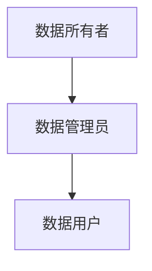

# 数据治理最佳实践

## 介绍

数据治理是指通过一系列策略、流程和工具来管理和保护组织中的数据资产，以确保数据的质量、安全性和合规性。对于初学者来说，理解数据治理的基本概念和最佳实践是迈向数据管理领域的重要一步。本文将逐步讲解数据治理的核心原则，并通过实际案例展示如何应用这些原则。

## 数据治理的核心原则

### 1. 数据所有权

数据所有权是指明确谁对数据负责。每个数据集都应该有一个明确的所有者，负责数据的准确性、完整性和安全性。

### 2. 数据质量

数据质量是数据治理的核心。高质量的数据应具备以下特征：

- **准确性**：数据应准确反映现实世界的情况。
- **完整性**：数据应包含所有必要的信息。
- **一致性**：数据应在不同系统和应用中保持一致。
- **及时性**：数据应及时更新，以反映最新的情况。

:::tip
确保数据质量的一个简单方法是定期进行数据清洗和验证。
:::

### 3. 数据安全

数据安全是保护数据免受未经授权的访问、修改或泄露。常见的数据安全措施包括：

- **访问控制**：限制对敏感数据的访问。
- **加密**：对数据进行加密，以防止数据泄露。
- **审计**：定期审计数据访问和修改记录。

### 4. 数据合规性

数据合规性是指确保数据的使用和处理符合相关法律法规和行业标准。例如，GDPR（通用数据保护条例）要求组织在处理个人数据时必须遵守特定的规则。

## 实际案例

### 案例：电商平台的数据治理

假设你在一家电商平台工作，负责管理用户数据。以下是如何应用数据治理最佳实践的示例：

1. **数据所有权**：明确每个数据集的所有者。例如，用户数据的所有者是客户服务部门。
2. **数据质量**：定期清洗用户数据，删除重复记录，并验证用户信息的准确性。
3. **数据安全**：实施访问控制，确保只有授权人员可以访问用户数据。对敏感信息进行加密。
4. **数据合规性**：确保用户数据的处理符合GDPR要求，例如在收集用户数据时获得明确的同意。

:::note
在实际操作中，可以使用工具如Apache Atlas来管理数据资产和元数据。
:::

## 总结

数据治理是确保数据高质量、安全和合规的关键。通过明确数据所有权、确保数据质量、保护数据安全和遵守数据合规性，组织可以更好地管理和利用其数据资产。

## 附加资源

- [数据治理框架](https://www.datagovernance.com/framework)
- [数据质量管理工具](https://www.talend.com/resources/data-quality-management/)
- [GDPR合规指南](https://gdpr-info.eu/)

## 练习

1. 为你的组织或项目设计一个简单的数据治理框架。
2. 选择一个数据集，进行数据清洗和验证，确保其质量。
3. 研究你所在行业的合规要求，并制定相应的数据合规策略。

通过以上步骤，你将能够更好地理解和应用数据治理的最佳实践。