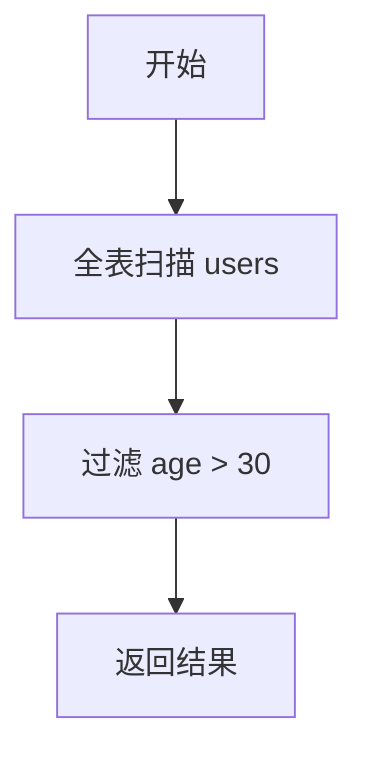

# SQL执行计划

在SQL查询优化中，**执行计划**是一个非常重要的工具。它可以帮助我们理解数据库是如何执行SQL语句的，从而找到性能瓶颈并进行优化。本文将详细介绍SQL执行计划的概念、如何查看执行计划，以及如何利用执行计划优化查询。

## 什么是SQL执行计划？

SQL执行计划是数据库管理系统（DBMS）在执行SQL查询时生成的一个详细步骤说明。它描述了数据库引擎如何访问数据、使用索引、连接表以及执行其他操作。通过分析执行计划，我们可以了解查询的执行路径，从而判断是否存在性能问题。

:::note
执行计划并不是SQL语句本身，而是数据库引擎对SQL语句的解释和执行步骤。
:::

## 如何查看SQL执行计划？

不同的数据库管理系统提供了不同的方式来查看执行计划。以下是一些常见数据库的查看方法：

### 1. MySQL

在MySQL中，可以使用 `EXPLAIN` 关键字来查看执行计划。例如：

```sql
EXPLAIN SELECT * FROM users WHERE age > 30;
```

执行上述语句后，MySQL会返回一个表格，展示查询的执行计划。

### 2. PostgreSQL

在PostgreSQL中，同样可以使用 `EXPLAIN` 关键字：

```sql
EXPLAIN SELECT * FROM users WHERE age > 30;
```

PostgreSQL会返回一个详细的执行计划，包括每个步骤的成本估算。

### 3. SQL Server

在SQL Server中，可以使用 `SET SHOWPLAN_TEXT ON` 或 `SET SHOWPLAN_ALL ON` 来查看执行计划：

```sql
SET SHOWPLAN_TEXT ON;
GO
SELECT * FROM users WHERE age > 30;
GO
```

## 执行计划的组成部分

执行计划通常包含以下几个关键部分：

1. **操作类型（Operation Type）**：表示数据库引擎执行的操作，例如表扫描、索引扫描、连接操作等。
2. **访问路径（Access Path）**：描述数据库引擎如何访问数据，例如通过索引、全表扫描等。
3. **成本估算（Cost Estimation）**：表示执行该操作的成本，通常以时间或资源消耗为单位。
4. **行数估算（Row Estimation）**：表示该操作预计返回的行数。

:::tip
执行计划中的成本估算和行数估算可以帮助我们判断查询的性能瓶颈。
:::

## 执行计划的实际应用

### 案例1：全表扫描 vs 索引扫描

假设我们有一个 `users` 表，其中包含 `id`、`name` 和 `age` 列。我们想要查询年龄大于30的用户：

```sql
SELECT * FROM users WHERE age > 30;
```

如果 `age` 列上没有索引，数据库引擎可能会选择全表扫描（Full Table Scan），这意味着它会逐行检查表中的每一行数据。这种情况下，查询的性能可能会较差。

如果我们在 `age` 列上创建索引：

```sql
CREATE INDEX idx_age ON users(age);
```

再次执行相同的查询，数据库引擎可能会选择索引扫描（Index Scan），从而大大提高查询性能。

### 案例2：连接操作的优化

假设我们有两个表：`orders` 和 `customers`，我们想要查询所有订单及其对应的客户信息：

```sql
SELECT o.order_id, c.customer_name
FROM orders o
JOIN customers c ON o.customer_id = c.customer_id;
```

如果 `customer_id` 列上没有索引，数据库引擎可能会选择嵌套循环连接（Nested Loop Join），这在数据量较大时可能会导致性能问题。通过在 `customer_id` 列上创建索引，可以优化连接操作的性能。

## 使用Mermaid绘制执行计划图

我们可以使用Mermaid来绘制执行计划的流程图。以下是一个简单的执行计划图示例：



在这个图中，我们可以看到数据库引擎首先执行全表扫描，然后过滤出符合条件的行，最后返回结果。

## 总结

SQL执行计划是优化SQL查询性能的重要工具。通过查看和分析执行计划，我们可以了解数据库引擎如何执行查询，并找到性能瓶颈。在实际应用中，合理使用索引、优化连接操作等技巧可以显著提高查询性能。

:::caution
虽然执行计划可以帮助我们优化查询，但过度依赖执行计划可能会导致其他问题。例如，频繁创建索引可能会增加写操作的开销。因此，在优化查询时，需要综合考虑各种因素。
:::

## 附加资源与练习

1. **练习1**：在MySQL或PostgreSQL中，尝试对一个复杂查询使用 `EXPLAIN` 关键字，并分析其执行计划。
2. **练习2**：在一个包含大量数据的表中，创建索引并观察执行计划的变化。
3. **资源**：阅读数据库官方文档中关于执行计划的章节，深入了解不同数据库的执行计划细节。

通过不断实践和学习，你将能够更好地理解和利用SQL执行计划来优化你的查询。