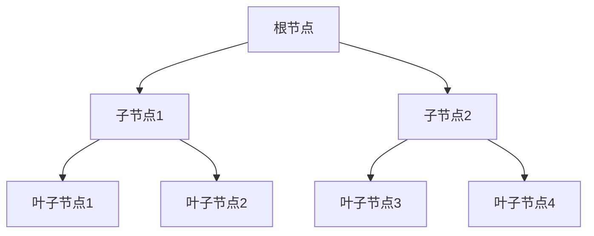

# SQL索引

## 介绍

在数据库中，索引是一种用于加速数据检索的数据结构。想象一下，如果你在一本书中查找某个特定的主题，你会先查看目录，而不是逐页翻阅。索引在数据库中扮演了类似的角色，它帮助数据库快速定位数据，而不需要扫描整个表。

### 为什么需要索引？

当表中的数据量很大时，查询操作可能会变得非常缓慢。索引通过创建指向数据的指针，使得查询可以更快地找到所需的数据。然而，索引并非没有代价，它们会占用额外的存储空间，并且在插入、更新和删除数据时可能会降低性能。

## 索引的类型

在SQL中，常见的索引类型包括：

1. **单列索引**：基于表中的单个列创建的索引。
2. **复合索引**：基于表中的多个列创建的索引。
3. **唯一索引**：确保索引列中的值是唯一的。
4. **主键索引**：一种特殊的唯一索引，用于标识表中的每一行。

## 创建索引

### 单列索引

假设我们有一个名为 `employees` 的表，其中包含 `id`, `name`, 和 `salary` 列。我们可以为 `name` 列创建一个单列索引：

```sql
CREATE INDEX idx_name ON employees(name);
```

### 复合索引

如果我们经常根据 `name` 和 `salary` 列进行查询，可以创建一个复合索引：

```sql
CREATE INDEX idx_name_salary ON employees(name, salary);
```

### 唯一索引

如果我们希望确保 `email` 列中的值是唯一的，可以创建一个唯一索引：

```sql
CREATE UNIQUE INDEX idx_email ON employees(email);
```

## 索引的工作原理

索引通常使用B树（Balanced Tree）或哈希表等数据结构来实现。B树索引是最常见的索引类型，它允许快速查找、插入和删除操作。



在上面的B树结构中，根节点指向子节点，子节点再指向叶子节点。叶子节点包含实际的数据指针，指向表中的数据行。

## 实际案例

### 案例1：加速查询

假设我们有一个包含100万条记录的 `orders` 表，我们经常需要根据 `customer_id` 查询订单：

```sql
SELECT * FROM orders WHERE customer_id = 12345;
```

如果没有索引，数据库需要扫描整个表来找到匹配的记录。如果我们为 `customer_id` 列创建索引：

```sql
CREATE INDEX idx_customer_id ON orders(customer_id);
```

查询速度将显著提高，因为数据库可以直接定位到 `customer_id = 12345` 的记录。

### 案例2：复合索引的应用

假设我们有一个 `products` 表，我们经常需要根据 `category` 和 `price` 查询产品：

```sql
SELECT * FROM products WHERE category = 'Electronics' AND price < 1000;
```

我们可以创建一个复合索引来加速这个查询：

```sql
CREATE INDEX idx_category_price ON products(category, price);
```

## 索引的优缺点

### 优点

- **加速查询**：索引可以显著提高查询速度，特别是在大数据集上。
- **唯一性约束**：唯一索引可以确保数据的唯一性。

### 缺点

- **占用存储空间**：索引需要额外的存储空间。
- **影响写操作性能**：插入、更新和删除操作可能会变慢，因为索引也需要更新。

## 总结

SQL索引是数据库优化的重要工具，它通过创建指向数据的指针来加速查询操作。然而，索引并非没有代价，它们会占用额外的存储空间，并且在写操作时可能会降低性能。因此，在设计数据库时，需要根据实际需求合理使用索引。

## 附加资源

- [SQL索引官方文档](https://www.sql.org/docs/)
- [数据库索引优化指南](https://www.databaseoptimization.com/)

## 练习

1. 在一个包含大量数据的表中，尝试创建一个单列索引，并比较查询性能。
2. 创建一个复合索引，并测试其在多条件查询中的效果。
3. 尝试删除一个索引，观察对查询性能的影响。

:::tip
在实际应用中，建议定期监控和优化索引，以确保数据库性能的最佳状态。
:::