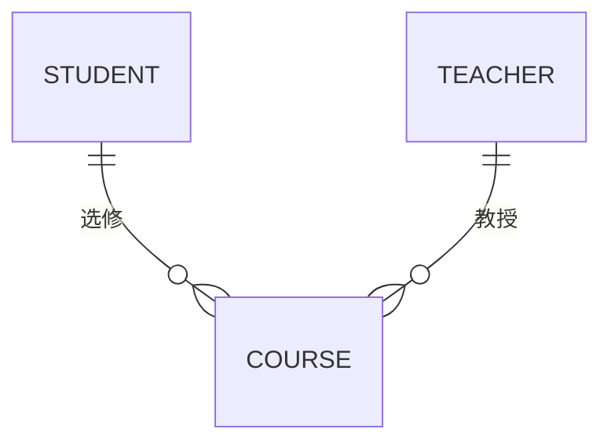
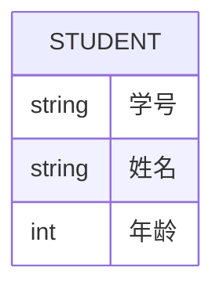
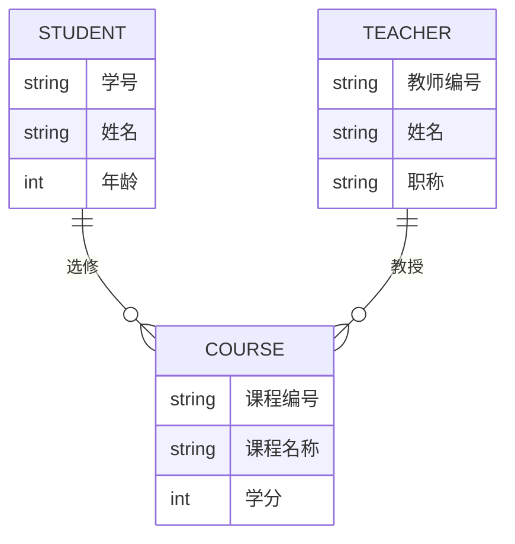

## 介绍

实体关系模型（Entity-Relationship Model，简称ER模型）是数据库设计中的一种重要工具。它通过图形化的方式描述现实世界中的实体及其之间的关系，帮助开发者在设计数据库时清晰地理解数据结构。ER模型是关系数据库理论的基础，广泛应用于数据库设计、系统分析和软件开发中。

## ER模型的基本组成部分

ER模型主要由以下三个部分组成：

1. **实体（Entity）**：表示现实世界中的一个对象或概念。例如，学生、课程、教师等。
2. **属性（Attribute）**：描述实体的特征或性质。例如，学生的姓名、学号、年龄等。
3. **关系（Relationship）**：表示实体之间的联系。例如，学生选修课程，教师教授课程等。

### 实体

实体是现实世界中可以独立存在的对象或概念。在ER模型中，实体通常用矩形表示。例如：

在上面的例子中，`STUDENT` 和 `TEACHER` 是两个实体。

### 属性

属性是实体的特征或性质。在ER模型中，属性通常用椭圆形表示，并与实体相连。例如：

在这个例子中，`学号`、`姓名` 和 `年龄` 是 `STUDENT` 实体的属性。

### 关系

关系表示实体之间的联系。在ER模型中，关系通常用菱形表示，并与相关的实体相连。例如：

在这个例子中，`选修` 和 `教授` 是两个关系，分别表示学生与课程、教师与课程之间的联系。

## ER模型的类型

ER模型可以分为以下几种类型：

1. **一对一关系（1:1）**：一个实体实例与另一个实体实例之间的一一对应关系。例如，一个学生只能有一个学号，一个学号只能对应一个学生。
2. **一对多关系（1:N）**：一个实体实例可以与多个另一个实体实例相关联。例如，一个教师可以教授多门课程，但一门课程只能由一个教师教授。
3. **多对多关系（M:N）**：多个实体实例可以与多个另一个实体实例相关联。例如，一个学生可以选修多门课程，一门课程也可以被多个学生选修。

## 实际案例

假设我们要设计一个简单的学生选课系统，包含以下实体和关系：

- **实体**：学生（STUDENT）、课程（COURSE）、教师（TEACHER）
- **属性**：
  - 学生：学号、姓名、年龄
  - 课程：课程编号、课程名称、学分
  - 教师：教师编号、姓名、职称
- **关系**：
  - 学生选修课程（多对多）
  - 教师教授课程（一对多）

我们可以用ER模型来表示这个系统：

## 总结

实体关系模型（ER模型）是数据库设计中的重要工具，它通过图形化的方式描述现实世界中的实体及其之间的关系。ER模型的基本组成部分包括实体、属性和关系。通过ER模型，开发者可以清晰地理解数据结构，从而设计出高效、合理的数据库系统。

## 附加资源

- [数据库系统概念](https://www.db-book.com/)：一本经典的数据库教材，详细介绍了ER模型及其他数据库概念。
- [SQL教程](https://www.w3schools.com/sql/)：学习SQL语言，掌握数据库操作的基础知识。

## 练习

1. 设计一个图书馆管理系统的ER模型，包含以下实体和关系：
   - 实体：图书、读者、借阅记录
   - 属性：图书编号、书名、作者；读者编号、姓名、联系方式；借阅日期、归还日期
   - 关系：读者借阅图书（多对多）

2. 解释一对一、一对多和多对多关系的区别，并举例说明。

:::tip
在完成练习时，建议使用Mermaid语法绘制ER图，以便更好地理解实体之间的关系。
:::