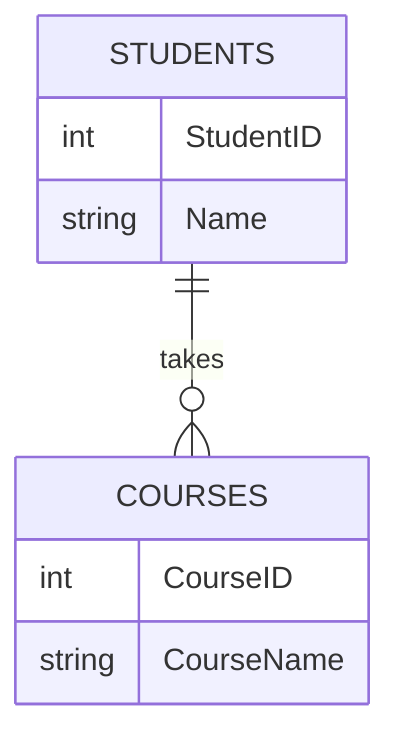

# 模式设计方法论

在关系数据库中，**模式设计方法论**是指用于设计和优化数据库结构的一系列原则和方法。一个好的数据库模式设计不仅能提高数据的存储效率，还能确保数据的完整性、一致性和可维护性。本文将逐步介绍模式设计的基本概念、方法和实际应用。

## 什么是模式设计？

数据库模式（Schema）是数据库的结构定义，它描述了数据库中表的结构、字段的类型、表之间的关系以及约束条件。模式设计方法论则是指导我们如何设计这些结构的系统化方法。

:::note
**模式设计的目标**：
- 减少数据冗余
- 确保数据一致性
- 提高查询性能
- 便于维护和扩展
:::

## 模式设计的基本原则

在设计数据库模式时，通常遵循以下基本原则：

1. **规范化（Normalization）**：通过分解表来减少数据冗余，并确保数据的一致性。
2. **反规范化（Denormalization）**：在特定情况下，为了提高查询性能，可以适度增加冗余。
3. **实体-关系模型（ER Model）**：通过实体和关系来描述数据模型。
4. **约束条件（Constraints）**：定义数据的完整性规则，如主键、外键、唯一性约束等。

## 规范化

规范化是模式设计的核心概念之一。它通过一系列步骤（称为范式）来优化表结构。常见的范式包括：

- **第一范式（1NF）**：确保每个字段都是原子的，不可再分。
- **第二范式（2NF）**：确保每个非主键字段完全依赖于主键。
- **第三范式（3NF）**：确保每个非主键字段不依赖于其他非主键字段。

### 示例：规范化过程

假设我们有一个存储学生信息的表 `Students`，初始设计如下：

```sql
CREATE TABLE Students (
    StudentID INT PRIMARY KEY,
    Name VARCHAR(100),
    Course1 VARCHAR(100),
    Course2 VARCHAR(100),
    Course3 VARCHAR(100)
);
```

这个设计违反了第一范式，因为课程信息不是原子的。我们可以将其规范化为：

```sql
CREATE TABLE Students (
    StudentID INT PRIMARY KEY,
    Name VARCHAR(100)
);

CREATE TABLE Courses (
    CourseID INT PRIMARY KEY,
    StudentID INT,
    CourseName VARCHAR(100),
    FOREIGN KEY (StudentID) REFERENCES Students(StudentID)
);
```

这样，每个学生的课程信息被分解为单独的记录，符合第一范式。

## 反规范化

虽然规范化有助于减少冗余，但在某些情况下，反规范化可以提高查询性能。例如，在需要频繁进行复杂查询的场景中，适度增加冗余可以减少表的连接操作。

### 示例：反规范化

假设我们需要频繁查询学生的总成绩，可以在 `Students` 表中增加一个 `TotalScore` 字段：

```sql
ALTER TABLE Students ADD COLUMN TotalScore INT;
```

这样，查询总成绩时就不需要每次都计算，从而提高了性能。

## 实体-关系模型（ER Model）

实体-关系模型是模式设计的常用工具。它通过图形化的方式描述数据库中的实体、属性和关系。

### 示例：ER 图

以下是一个简单的 ER 图，描述了学生和课程之间的关系：



在这个图中，`STUDENTS` 和 `COURSES` 是两个实体，`takes` 是它们之间的关系。

## 实际案例

假设我们正在设计一个图书馆管理系统。我们需要存储书籍、作者和借阅记录。以下是一个可能的模式设计：

```sql
CREATE TABLE Authors (
    AuthorID INT PRIMARY KEY,
    Name VARCHAR(100)
);

CREATE TABLE Books (
    BookID INT PRIMARY KEY,
    Title VARCHAR(100),
    AuthorID INT,
    FOREIGN KEY (AuthorID) REFERENCES Authors(AuthorID)
);

CREATE TABLE BorrowRecords (
    RecordID INT PRIMARY KEY,
    BookID INT,
    BorrowerID INT,
    BorrowDate DATE,
    ReturnDate DATE,
    FOREIGN KEY (BookID) REFERENCES Books(BookID),
    FOREIGN KEY (BorrowerID) REFERENCES Borrowers(BorrowerID)
);
```

这个设计遵循了规范化的原则，确保了数据的一致性和完整性。

## 总结

模式设计方法论是关系数据库设计中的核心内容。通过规范化、反规范化、实体-关系模型等方法，我们可以设计出高效、可维护的数据库模式。在实际应用中，需要根据具体需求灵活运用这些方法。

:::tip
**附加资源**：
- [数据库系统概念](https://www.db-book.com/)：一本经典的数据库教材，深入讲解了模式设计和规范化。
- [SQL 教程](https://www.w3schools.com/sql/)：适合初学者的 SQL 教程，帮助你更好地理解数据库操作。
:::

:::caution
**练习**：
1. 设计一个电商网站的数据库模式，包括用户、商品和订单。
2. 将你的设计规范化为第三范式。
3. 考虑在哪些情况下可以进行反规范化以提高性能。
:::