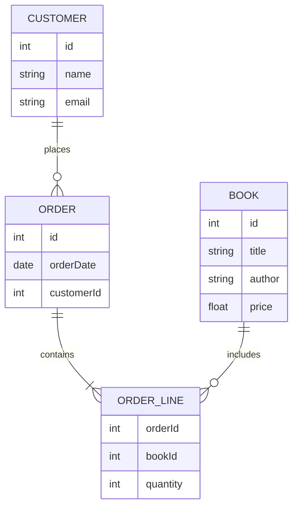

## 介绍

数据库设计是构建任何应用程序的关键步骤之一。一个良好的数据库设计不仅能提高数据存储和检索的效率，还能确保数据的完整性和一致性。本文将带你逐步了解数据库设计的完整流程，并通过实际案例帮助你更好地理解每个步骤。

## 数据库设计流程

数据库设计通常包括以下几个主要步骤：

1. **需求分析**
2. **概念设计**
3. **逻辑设计**
4. **物理设计**
5. **实现与优化**

### 1. 需求分析

在需求分析阶段，我们需要明确数据库的目标和需求。这包括与利益相关者沟通，了解他们需要存储哪些数据，以及如何使用这些数据。

:::tip
**提示**：在需求分析阶段，尽量收集所有可能的需求，避免在后期设计中出现遗漏。
:::

**案例**：假设我们要为一个在线书店设计数据库。我们需要存储书籍信息、用户信息、订单信息等。

### 2. 概念设计

在概念设计阶段，我们将需求转化为一个高层次的概念模型。通常使用实体-关系图（ER图）来表示。



**解释**：在上面的ER图中，我们定义了四个实体：`CUSTOMER`、`ORDER`、`ORDER_LINE`和`BOOK`，并描述了它们之间的关系。

### 3. 逻辑设计

在逻辑设计阶段，我们将概念模型转化为具体的数据库模式。这包括定义表结构、字段类型、主键和外键等。

**案例**：根据上面的ER图，我们可以设计以下表结构：

```sql
CREATE TABLE CUSTOMER (
    id INT PRIMARY KEY,
    name VARCHAR(100),
    email VARCHAR(100)
);

CREATE TABLE BOOK (
    id INT PRIMARY KEY,
    title VARCHAR(100),
    author VARCHAR(100),
    price DECIMAL(10, 2)
);

CREATE TABLE ORDER (
    id INT PRIMARY KEY,
    orderDate DATE,
    customerId INT,
    FOREIGN KEY (customerId) REFERENCES CUSTOMER(id)
);

CREATE TABLE ORDER_LINE (
    orderId INT,
    bookId INT,
    quantity INT,
    PRIMARY KEY (orderId, bookId),
    FOREIGN KEY (orderId) REFERENCES ORDER(id),
    FOREIGN KEY (bookId) REFERENCES BOOK(id)
);
```

**解释**：我们定义了四个表，并为每个表指定了主键和外键，以确保数据的完整性和一致性。

### 4. 物理设计

在物理设计阶段，我们考虑数据库的实际存储和性能优化。这包括选择存储引擎、索引设计、分区策略等。

:::caution
**注意**：物理设计阶段需要根据具体的数据库管理系统（如MySQL、PostgreSQL等）进行调整。
:::

**案例**：在MySQL中，我们可以为`ORDER`表的`orderDate`字段添加索引，以加快查询速度。

```sql
CREATE INDEX idx_orderDate ON ORDER(orderDate);
```

### 5. 实现与优化

在实现阶段，我们将设计好的数据库模式部署到实际的数据库系统中，并进行性能测试和优化。

**案例**：我们可以使用以下SQL语句插入一些测试数据，并执行查询以验证数据库的性能。

```sql
INSERT INTO CUSTOMER (id, name, email) VALUES (1, 'Alice', 'alice@example.com');
INSERT INTO BOOK (id, title, author, price) VALUES (1, 'Database Design', 'John Doe', 29.99);
INSERT INTO ORDER (id, orderDate, customerId) VALUES (1, '2023-10-01', 1);
INSERT INTO ORDER_LINE (orderId, bookId, quantity) VALUES (1, 1, 1);

SELECT * FROM ORDER WHERE orderDate = '2023-10-01';
```

**解释**：我们插入了一些测试数据，并执行了一个简单的查询来验证数据库的功能。

## 总结

数据库设计是一个复杂但至关重要的过程。通过需求分析、概念设计、逻辑设计、物理设计和实现与优化，我们可以构建出高效、可靠的数据库系统。希望本文能帮助你理解数据库设计的基本流程，并为你的项目提供指导。

## 附加资源

- [数据库设计教程](https://www.example.com/database-design-tutorial)
- [SQL基础教程](https://www.example.com/sql-basics)
- [ER图绘制工具](https://www.example.com/er-diagram-tool)

## 练习

1. 为一个在线图书馆设计数据库，包括书籍、借阅者、借阅记录等实体。
2. 使用SQL语句创建上述数据库的表结构，并插入一些测试数据。
3. 为借阅记录表添加索引，以加快查询速度。
