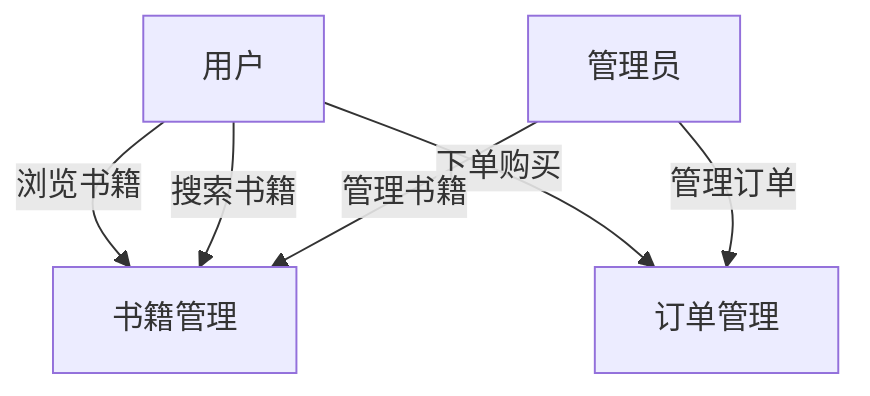

## 介绍

在数据库设计与建模的过程中，**需求分析**是一个至关重要的步骤。它帮助我们理解业务需求，明确系统需要实现的功能，并将这些需求转化为数据库设计的依据。需求分析的目标是确保数据库能够满足业务需求，同时避免冗余和不一致。

需求分析方法通常包括以下几个步骤：
1. **收集需求**：与业务人员沟通，了解他们的需求。
2. **分析需求**：将收集到的需求进行分类和整理。
3. **验证需求**：确保需求的准确性和完整性。
4. **文档化需求**：将需求以文档的形式记录下来，作为后续设计的依据。

接下来，我们将逐步讲解这些步骤，并通过实际案例展示如何应用这些方法。

---

## 1. 收集需求

需求收集是需求分析的第一步。在这一阶段，我们需要与业务人员、系统用户以及其他相关方进行沟通，了解他们的需求和期望。常见的需求收集方法包括：
- **访谈**：与业务人员进行一对一的访谈，了解他们的需求。
- **问卷调查**：通过问卷收集大量用户的需求。
- **观察**：观察用户的工作流程，了解他们的实际需求。

:::tip
在收集需求时，尽量使用开放性问题，鼓励用户详细描述他们的需求。例如：“您希望系统能够实现哪些功能？”而不是“您需要这个功能吗？”
:::

### 示例：需求收集

假设我们正在为一个在线书店设计数据库。通过与业务人员的访谈，我们了解到以下需求：
- 用户需要能够浏览书籍信息。
- 用户需要能够搜索书籍。
- 用户需要能够下单购买书籍。
- 管理员需要能够管理书籍库存。

---

## 2. 分析需求

在收集到需求后，我们需要对这些需求进行分析，将其转化为具体的功能需求和非功能需求。功能需求描述了系统需要实现的功能，而非功能需求则描述了系统的性能、安全性等方面的要求。

### 功能需求分析

以在线书店为例，我们可以将需求分解为以下功能需求：
- **用户管理**：用户注册、登录、个人信息管理。
- **书籍管理**：书籍信息的添加、修改、删除。
- **订单管理**：用户下单、订单查询、订单状态更新。

### 非功能需求分析

非功能需求可能包括：
- **性能需求**：系统需要支持同时处理1000个用户的请求。
- **安全性需求**：用户的密码需要加密存储。

:::caution
在分析需求时，务必确保需求的完整性和一致性。如果发现需求之间存在冲突，需要及时与业务人员沟通，明确优先级。
:::

---

## 3. 验证需求

需求验证是确保需求准确性和完整性的关键步骤。在这一阶段，我们需要与业务人员再次确认需求，确保没有遗漏或误解。

### 示例：需求验证

在在线书店的案例中，我们可以与业务人员确认以下问题：
- 用户是否需要支持多种支付方式？
- 管理员是否需要实时查看库存信息？

通过这些问题，我们可以进一步明确需求，确保数据库设计能够满足业务需求。

---

## 4. 文档化需求

需求文档是后续数据库设计的重要依据。需求文档通常包括以下内容：
- **功能需求**：详细描述系统需要实现的功能。
- **非功能需求**：描述系统的性能、安全性等方面的要求。
- **用例图**：通过用例图展示系统的主要功能。

### 示例：用例图

我们可以使用 Mermaid 绘制用例图，展示在线书店的主要功能：

---

## 实际案例：在线书店的需求分析

让我们通过一个实际案例来展示需求分析的全过程。假设我们正在为一个在线书店设计数据库，以下是需求分析的步骤：

1. **收集需求**：通过与业务人员的访谈，我们了解到用户需要能够浏览、搜索和购买书籍，管理员需要能够管理书籍和订单。
2. **分析需求**：我们将需求分解为用户管理、书籍管理和订单管理等功能需求，并确定了系统的性能和安全需求。
3. **验证需求**：我们与业务人员确认了支付方式和库存管理的需求。
4. **文档化需求**：我们将需求整理成文档，并绘制了用例图。

---

## 总结

需求分析是数据库设计与建模的基础。通过收集、分析、验证和文档化需求，我们可以确保数据库设计能够满足业务需求。在实际项目中，需求分析往往需要反复迭代，以确保需求的准确性和完整性。

---

## 附加资源与练习

### 附加资源
- 《数据库系统概念》：详细介绍了数据库设计与需求分析的相关知识。
- [UML 用例图教程](https://www.uml-diagrams.org/use-case-diagrams.html)：学习如何使用用例图描述系统功能。

### 练习
1. 假设你正在为一个图书馆管理系统设计数据库，请列出至少5个功能需求。
2. 绘制一个用例图，展示图书馆管理系统的主要功能。
