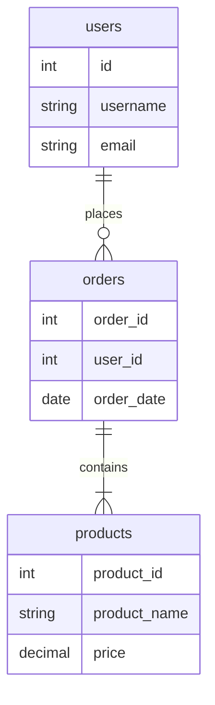

# 建模工具使用

在数据库设计与建模中，建模工具是帮助我们可视化、设计和管理数据库结构的重要工具。它们不仅能够简化复杂的设计过程，还能确保数据库的一致性和完整性。本文将介绍几种常用的建模工具，并通过实际案例展示如何使用这些工具进行数据库设计。

## 什么是建模工具？

建模工具是用于创建、编辑和管理数据库模型的软件。它们通常提供图形化界面，允许用户通过拖放操作来设计数据库表、定义关系、设置约束等。常见的建模工具包括 MySQL Workbench、Microsoft Visio、Lucidchart、DbSchema 等。

## 为什么使用建模工具？

使用建模工具的好处包括：

- **可视化设计**：通过图形化界面，用户可以直观地看到数据库的结构和关系。
- **自动生成代码**：许多工具可以自动生成 SQL 代码，减少手动编写代码的错误。
- **版本控制**：一些工具支持版本控制，方便团队协作和追踪变更。
- **一致性检查**：工具可以帮助检查数据库设计是否符合规范，确保数据的一致性。

## 常用建模工具介绍

### 1. MySQL Workbench

MySQL Workbench 是 MySQL 官方提供的数据库设计工具，支持数据库建模、SQL 开发、数据库管理等功能。

#### 使用步骤

1. **创建新模型**：打开 MySQL Workbench，点击 "File" -> "New Model" 创建一个新的数据库模型。
2. **添加表**：在 "Physical Schemas" 中右键点击 "Tables"，选择 "Create Table" 来添加新表。
3. **定义字段**：在表的设计界面中，添加字段并设置数据类型、主键、外键等属性。
4. **生成 SQL**：完成设计后，点击 "Database" -> "Forward Engineer" 生成 SQL 脚本。

#### 示例

```sql
CREATE TABLE `users` (
  `id` INT NOT NULL AUTO_INCREMENT,
  `username` VARCHAR(50) NOT NULL,
  `email` VARCHAR(100) NOT NULL,
  PRIMARY KEY (`id`)
);
```

### 2. DbSchema

DbSchema 是一个跨平台的数据库设计工具，支持多种数据库系统，如 MySQL、PostgreSQL、Oracle 等。

#### 使用步骤

1. **创建新项目**：打开 DbSchema，点击 "File" -> "New Project" 创建一个新项目。
2. **设计表结构**：在图形化界面中拖放表元素，定义字段和关系。
3. **生成 SQL**：点击 "Schema" -> "Generate SQL" 生成 SQL 脚本。

#### 示例

```sql
CREATE TABLE orders (
  order_id INT PRIMARY KEY,
  user_id INT,
  order_date DATE,
  FOREIGN KEY (user_id) REFERENCES users(id)
);
```

### 3. Lucidchart

Lucidchart 是一个基于云的图形化设计工具，支持数据库建模、流程图设计等。

#### 使用步骤

1. **创建新图表**：登录 Lucidchart，点击 "New Document" 创建一个新图表。
2. **添加表**：从左侧工具栏中拖放 "Table" 元素到画布上，定义字段和关系。
3. **导出 SQL**：完成设计后，点击 "File" -> "Export" -> "SQL" 导出 SQL 脚本。

#### 示例

```sql
CREATE TABLE products (
  product_id INT PRIMARY KEY,
  product_name VARCHAR(100) NOT NULL,
  price DECIMAL(10, 2) NOT NULL
);
```

## 实际案例

假设我们正在设计一个简单的电商系统，包含用户、订单和产品三个表。以下是使用 MySQL Workbench 进行设计的步骤：

1. **创建用户表**：定义 `id`、`username`、`email` 字段。
2. **创建订单表**：定义 `order_id`、`user_id`、`order_date` 字段，并设置 `user_id` 为外键。
3. **创建产品表**：定义 `product_id`、`product_name`、`price` 字段。



## 总结

建模工具是数据库设计与建模过程中不可或缺的工具，它们能够帮助我们更高效、更准确地设计数据库结构。通过本文的介绍，你应该已经了解了如何使用 MySQL Workbench、DbSchema 和 Lucidchart 进行数据库设计。接下来，你可以尝试使用这些工具设计自己的数据库模型，并生成相应的 SQL 脚本。

## 附加资源与练习

- **练习**：尝试使用 MySQL Workbench 设计一个博客系统的数据库模型，包含用户、文章和评论三个表。
- **资源**：
  - [MySQL Workbench 官方文档](https://dev.mysql.com/doc/workbench/en/)
  - [DbSchema 官方教程](https://www.dbschema.com/tutorial.html)
  - [Lucidchart 数据库建模指南](https://www.lucidchart.com/pages/database-diagram)

:::tip
提示：在实际项目中，建议使用版本控制工具（如 Git）来管理数据库模型的变更，以便更好地协作和追踪历史记录。
:::