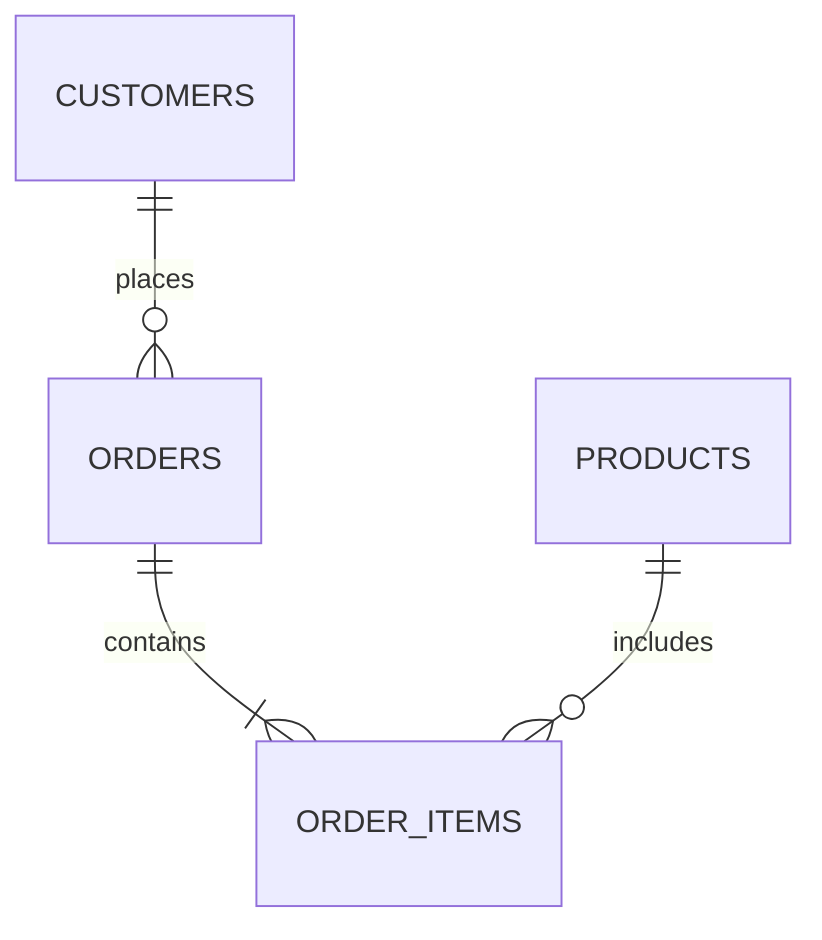

# 数据库文档编写

数据库文档是数据库设计和开发过程中不可或缺的一部分。它不仅帮助开发团队理解数据库的结构和逻辑，还为未来的维护和扩展提供了重要参考。本文将详细介绍如何编写高质量的数据库文档，适合初学者学习和实践。

## 什么是数据库文档？

数据库文档是对数据库结构、表、字段、关系、约束、索引等信息的详细描述。它通常包括以下内容：

- **数据库概述**：数据库的用途、设计目标、版本信息等。
- **表结构**：每个表的名称、字段、数据类型、约束、索引等。
- **关系图**：表之间的关系，如主键、外键等。
- **存储过程和触发器**：描述数据库中的存储过程和触发器的功能和使用方法。
- **数据字典**：详细描述每个字段的含义、取值范围、默认值等。

## 为什么需要数据库文档？

1. **提高可维护性**：清晰的文档可以帮助开发人员快速理解数据库结构，减少维护成本。
2. **促进团队协作**：文档是团队成员之间沟通的桥梁，确保大家对数据库设计有一致的理解。
3. **支持未来扩展**：详细的文档为未来的功能扩展和优化提供了基础。
4. **符合行业标准**：许多行业和项目要求提供完整的数据库文档，以满足合规性和审计要求。

## 如何编写数据库文档？

### 1. 数据库概述

在文档的开头，简要描述数据库的用途、设计目标和版本信息。例如：

```markdown
### 数据库概述

- **数据库名称**：`CustomerDB`
- **用途**：存储客户信息、订单信息和产品信息。
- **设计目标**：支持高效的客户管理和订单处理。
- **版本**：1.0.0
```

### 2. 表结构

为每个表编写详细的描述，包括表名、字段、数据类型、约束和索引。例如：

```markdown
### 表结构

#### 表：`Customers`

| 字段名       | 数据类型     | 约束           | 描述               |
|--------------|--------------|----------------|--------------------|
| `CustomerID` | `INT`        | `PRIMARY KEY`  | 客户唯一标识       |
| `FirstName`  | `VARCHAR(50)`| `NOT NULL`     | 客户的名字         |
| `LastName`   | `VARCHAR(50)`| `NOT NULL`     | 客户的姓氏         |
| `Email`      | `VARCHAR(100)`| `UNIQUE`      | 客户的电子邮件地址 |
```

### 3. 关系图

使用 Mermaid 绘制表之间的关系图。例如：



### 4. 存储过程和触发器

描述数据库中的存储过程和触发器。例如：

```markdown
### 存储过程

#### 存储过程：`sp_GetCustomerOrders`

- **功能**：获取指定客户的所有订单。
- **参数**：
  - `@CustomerID`：客户ID。
- **返回值**：订单列表。

```sql
CREATE PROCEDURE sp_GetCustomerOrders
    @CustomerID INT
AS
BEGIN
    SELECT * FROM Orders WHERE CustomerID = @CustomerID;
END
```

### 5. 数据字典

为每个字段编写详细的数据字典。例如：

```markdown
### 数据字典

#### 表：`Customers`

| 字段名       | 数据类型     | 描述               | 取值范围           | 默认值 |
|--------------|--------------|--------------------|--------------------|--------|
| `CustomerID` | `INT`        | 客户唯一标识       | 1 到 2147483647    | 无     |
| `FirstName`  | `VARCHAR(50)`| 客户的名字         | 任意字符串         | 无     |
| `LastName`   | `VARCHAR(50)`| 客户的姓氏         | 任意字符串         | 无     |
| `Email`      | `VARCHAR(100)`| 客户的电子邮件地址 | 有效的电子邮件格式 | 无     |
```

## 实际案例

假设我们正在开发一个电子商务网站，需要设计一个数据库来存储客户、订单和产品信息。以下是一个简化的数据库文档示例：

```markdown
### 数据库概述

- **数据库名称**：`ECommerceDB`
- **用途**：存储客户信息、订单信息和产品信息。
- **设计目标**：支持高效的客户管理和订单处理。
- **版本**：1.0.0

### 表结构

#### 表：`Customers`

| 字段名       | 数据类型     | 约束           | 描述               |
|--------------|--------------|----------------|--------------------|
| `CustomerID` | `INT`        | `PRIMARY KEY`  | 客户唯一标识       |
| `FirstName`  | `VARCHAR(50)`| `NOT NULL`     | 客户的名字         |
| `LastName`   | `VARCHAR(50)`| `NOT NULL`     | 客户的姓氏         |
| `Email`      | `VARCHAR(100)`| `UNIQUE`      | 客户的电子邮件地址 |

#### 表：`Orders`

| 字段名       | 数据类型     | 约束           | 描述               |
|--------------|--------------|----------------|--------------------|
| `OrderID`    | `INT`        | `PRIMARY KEY`  | 订单唯一标识       |
| `CustomerID` | `INT`        | `FOREIGN KEY`  | 客户ID             |
| `OrderDate`  | `DATETIME`   | `NOT NULL`     | 订单日期           |
| `TotalAmount`| `DECIMAL(10,2)`| `NOT NULL`   | 订单总金额         |

### 关系图


### 存储过程

#### 存储过程：`sp_GetCustomerOrders`

- **功能**：获取指定客户的所有订单。
- **参数**：
  - `@CustomerID`：客户ID。
- **返回值**：订单列表。

```sql
CREATE PROCEDURE sp_GetCustomerOrders
    @CustomerID INT
AS
BEGIN
    SELECT * FROM Orders WHERE CustomerID = @CustomerID;
END
```

### 数据字典

#### 表：`Customers`

| 字段名       | 数据类型     | 描述               | 取值范围           | 默认值 |
|--------------|--------------|--------------------|--------------------|--------|
| `CustomerID` | `INT`        | 客户唯一标识       | 1 到 2147483647    | 无     |
| `FirstName`  | `VARCHAR(50)`| 客户的名字         | 任意字符串         | 无     |
| `LastName`   | `VARCHAR(50)`| 客户的姓氏         | 任意字符串         | 无     |
| `Email`      | `VARCHAR(100)`| 客户的电子邮件地址 | 有效的电子邮件格式 | 无     |
```

## 总结

编写数据库文档是数据库设计和开发过程中的重要环节。通过清晰的文档，开发团队可以更好地理解数据库结构，提高维护效率，并为未来的扩展打下坚实基础。本文介绍了数据库文档的基本内容和编写方法，并通过实际案例展示了如何应用这些知识。

## 附加资源

- [数据库设计最佳实践](https://example.com/database-design-best-practices)
- [SQL 文档编写指南](https://example.com/sql-documentation-guide)
- [Mermaid 图表绘制教程](https://example.com/mermaid-tutorial)

## 练习

1. 为你的项目设计一个简单的数据库，并编写相应的数据库文档。
2. 使用 Mermaid 绘制数据库的关系图。
3. 编写一个存储过程，并描述其功能和参数。

:::tip
在编写数据库文档时，尽量保持简洁和清晰，避免过多的技术术语，确保文档易于理解。
:::