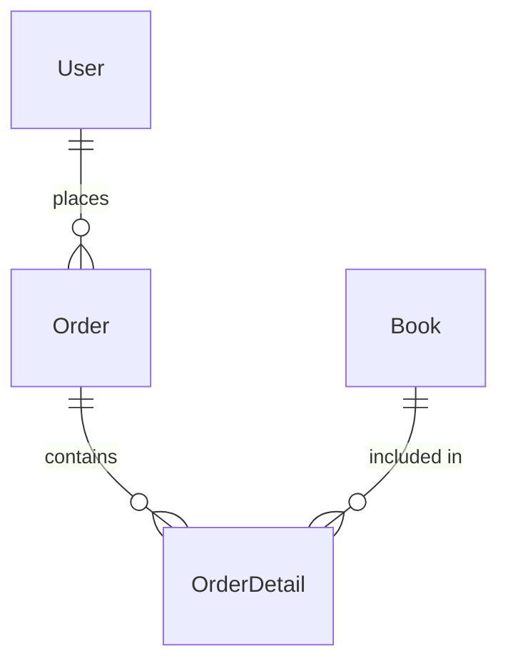

## 介绍

数据库设计是构建高效、可扩展的应用程序的关键步骤。它涉及定义数据的结构、关系以及如何存储和检索数据。一个良好的数据库设计不仅能提高系统的性能，还能确保数据的完整性和一致性。

在本教程中，我们将通过一个实际案例——**在线书店管理系统**，来逐步讲解数据库设计的过程。我们将从需求分析开始，逐步设计出数据库的表结构，并最终展示如何将这些设计应用到实际场景中。

## 需求分析

假设我们要为一个在线书店设计一个数据库。以下是系统的基本需求：

1. **用户管理**：系统需要管理用户信息，包括用户的姓名、电子邮件、地址等。
2. **书籍管理**：系统需要管理书籍信息，包括书名、作者、价格、库存等。
3. **订单管理**：用户可以下订单，订单需要记录用户、书籍、数量、总价等信息。
4. **库存管理**：每次订单生成后，书籍的库存需要相应减少。

## 数据库设计步骤

### 1. 确定实体和属性

首先，我们需要确定系统中的主要实体及其属性。根据需求分析，我们可以识别出以下实体：

- **用户（User）**：用户ID、姓名、电子邮件、地址。
- **书籍（Book）**：书籍ID、书名、作者、价格、库存。
- **订单（Order）**：订单ID、用户ID、订单日期、总价。
- **订单详情（OrderDetail）**：订单详情ID、订单ID、书籍ID、数量。

### 2. 确定实体之间的关系

接下来，我们需要确定这些实体之间的关系：

- 一个用户可以下多个订单（1对多关系）。
- 一个订单可以包含多本书籍（多对多关系，通过订单详情表实现）。
- 每本书籍可以出现在多个订单中（多对多关系，通过订单详情表实现）。

### 3. 设计数据库表结构

根据上述实体和关系，我们可以设计出以下数据库表结构：

```sql
CREATE TABLE User (
    UserID INT PRIMARY KEY AUTO_INCREMENT,
    Name VARCHAR(100) NOT NULL,
    Email VARCHAR(100) UNIQUE NOT NULL,
    Address VARCHAR(255)
);

CREATE TABLE Book (
    BookID INT PRIMARY KEY AUTO_INCREMENT,
    Title VARCHAR(255) NOT NULL,
    Author VARCHAR(100) NOT NULL,
    Price DECIMAL(10, 2) NOT NULL,
    Stock INT NOT NULL
);

CREATE TABLE Order (
    OrderID INT PRIMARY KEY AUTO_INCREMENT,
    UserID INT,
    OrderDate DATE NOT NULL,
    TotalPrice DECIMAL(10, 2) NOT NULL,
    FOREIGN KEY (UserID) REFERENCES User(UserID)
);

CREATE TABLE OrderDetail (
    OrderDetailID INT PRIMARY KEY AUTO_INCREMENT,
    OrderID INT,
    BookID INT,
    Quantity INT NOT NULL,
    FOREIGN KEY (OrderID) REFERENCES Order(OrderID),
    FOREIGN KEY (BookID) REFERENCES Book(BookID)
);
```

### 4. 数据库关系图

我们可以使用 Mermaid 来绘制数据库的关系图：



### 5. 实际应用场景

假设我们有以下数据：

- 用户：`UserID=1, Name="Alice", Email="alice@example.com", Address="123 Main St"`
- 书籍：`BookID=1, Title="Database Design", Author="John Doe", Price=29.99, Stock=10`
- 订单：`OrderID=1, UserID=1, OrderDate="2023-10-01", TotalPrice=59.98`
- 订单详情：`OrderDetailID=1, OrderID=1, BookID=1, Quantity=2`

我们可以通过以下 SQL 语句将这些数据插入到数据库中：

```sql
INSERT INTO User (Name, Email, Address) VALUES ('Alice', 'alice@example.com', '123 Main St');
INSERT INTO Book (Title, Author, Price, Stock) VALUES ('Database Design', 'John Doe', 29.99, 10);
INSERT INTO Order (UserID, OrderDate, TotalPrice) VALUES (1, '2023-10-01', 59.98);
INSERT INTO OrderDetail (OrderID, BookID, Quantity) VALUES (1, 1, 2);
```

### 6. 查询示例

假设我们想要查询用户 Alice 的所有订单及其详细信息，可以使用以下 SQL 查询：

```sql
SELECT u.Name, o.OrderID, o.OrderDate, b.Title, od.Quantity, o.TotalPrice
FROM User u
JOIN Order o ON u.UserID = o.UserID
JOIN OrderDetail od ON o.OrderID = od.OrderID
JOIN Book b ON od.BookID = b.BookID
WHERE u.Email = 'alice@example.com';
```

## 总结

通过这个案例，我们学习了如何从需求分析出发，逐步设计出一个完整的数据库结构。我们确定了系统中的实体及其关系，设计了数据库表结构，并通过实际数据展示了如何将这些设计应用到实际场景中。

:::tip 提示
在实际项目中，数据库设计通常需要多次迭代和优化。建议在设计初期多与业务方沟通，确保设计的数据库能够满足业务需求。
:::

## 附加资源与练习

- **练习**：尝试为另一个场景（如图书馆管理系统）设计数据库，并编写相应的 SQL 语句。
- **资源**：推荐阅读《数据库系统概念》一书，深入了解数据库设计的更多细节。

希望这篇教程能帮助你更好地理解数据库设计的基本概念和方法。如果你有任何问题或建议，欢迎在评论区留言！