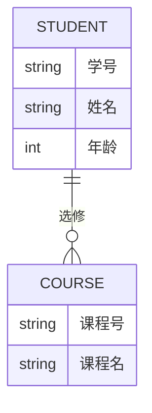
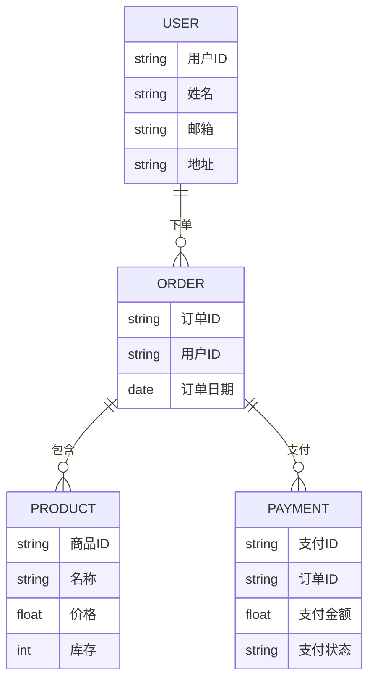

# 概念设计技术

在数据库设计中，**概念设计**是数据库开发的第一步，也是最重要的一步。它帮助我们从业务需求中抽象出数据模型，为后续的逻辑设计和物理设计奠定基础。概念设计的核心目标是创建一个**实体-关系模型（ER模型）**，用于描述系统中的实体、属性以及它们之间的关系。

## 什么是概念设计？

概念设计是数据库设计的第一阶段，主要目的是从业务需求中提取出数据需求，并将其转化为一个高层次的、与技术无关的模型。这个模型通常以**实体-关系图（ER图）**的形式呈现，帮助我们理解数据之间的关系。

:::note
**实体-关系模型（ER模型）** 是一种用于描述现实世界中实体及其关系的图形化工具。它由实体、属性和关系三部分组成。
:::

## 实体-关系模型的核心概念

### 1. 实体（Entity）
实体是现实世界中可以独立存在的事物或对象。例如，在一个学生管理系统中，`学生`、`课程`和`教师`都是实体。

### 2. 属性（Attribute）
属性是实体的特征或描述。例如，`学生`实体可能有`学号`、`姓名`、`年龄`等属性。

### 3. 关系（Relationship）
关系描述了实体之间的关联。例如，`学生`和`课程`之间可能存在`选修`关系。

### 4. 主键（Primary Key）
主键是唯一标识实体的属性。例如，`学号`可以作为`学生`实体的主键。

## 如何绘制实体-关系图？

实体-关系图通常使用以下符号表示：
- **矩形**：表示实体。
- **椭圆**：表示属性。
- **菱形**：表示关系。
- **直线**：连接实体、属性和关系。

下面是一个简单的学生管理系统的实体-关系图示例：

在这个图中：
- `STUDENT` 和 `COURSE` 是两个实体。
- `选修` 是它们之间的关系。
- `学号` 和 `课程号` 分别是 `STUDENT` 和 `COURSE` 的主键。

## 概念设计的步骤

### 1. 确定实体
首先，从业务需求中识别出所有重要的实体。例如，在一个图书馆管理系统中，实体可能包括`图书`、`读者`和`借阅记录`。

### 2. 确定属性
为每个实体定义属性。例如，`图书`实体可能有`书号`、`书名`、`作者`和`出版日期`等属性。

### 3. 确定关系
分析实体之间的关系。例如，`读者`和`图书`之间可能存在`借阅`关系。

### 4. 绘制实体-关系图
使用工具（如 Mermaid、Lucidchart 等）绘制实体-关系图，直观地展示实体、属性和关系。

### 5. 验证模型
与业务人员或开发团队一起验证模型，确保它准确地反映了业务需求。

## 实际案例：在线商店的数据库设计

假设我们需要为一个在线商店设计数据库。以下是概念设计的过程：

1. **确定实体**：`用户`、`商品`、`订单`、`支付`。
2. **确定属性**：
   - `用户`：`用户ID`、`姓名`、`邮箱`、`地址`。
   - `商品`：`商品ID`、`名称`、`价格`、`库存`。
   - `订单`：`订单ID`、`用户ID`、`订单日期`。
   - `支付`：`支付ID`、`订单ID`、`支付金额`、`支付状态`。
3. **确定关系**：
   - `用户` 和 `订单` 之间存在 `下单` 关系。
   - `订单` 和 `商品` 之间存在 `包含` 关系。
   - `订单` 和 `支付` 之间存在 `支付` 关系。

## 总结

概念设计是数据库设计的基础，它通过实体-关系模型帮助我们抽象出业务需求中的数据结构和关系。掌握概念设计技术，能够为后续的逻辑设计和物理设计提供清晰的指导。

:::tip
**练习**：尝试为一个简单的博客系统设计概念模型，包括`用户`、`文章`和`评论`实体，并绘制实体-关系图。
:::

## 附加资源
- [实体-关系模型 - 维基百科](https://zh.wikipedia.org/wiki/%E5%AE%9E%E4%BD%93%E5%85%B3%E7%B3%BB%E6%A8%A1%E5%9E%8B)
- [Mermaid 官方文档](https://mermaid-js.github.io/mermaid/#/)：学习如何使用 Mermaid 绘制实体-关系图。