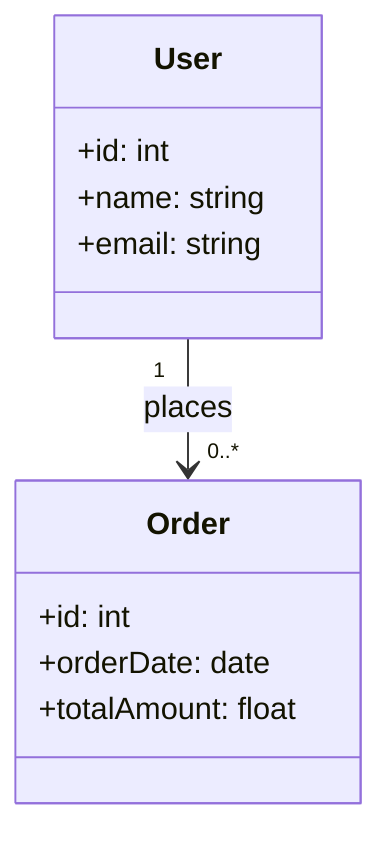
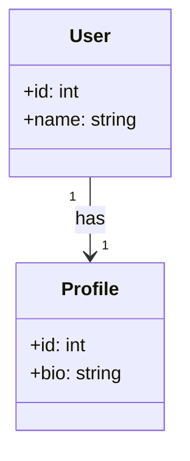
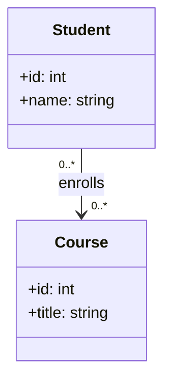
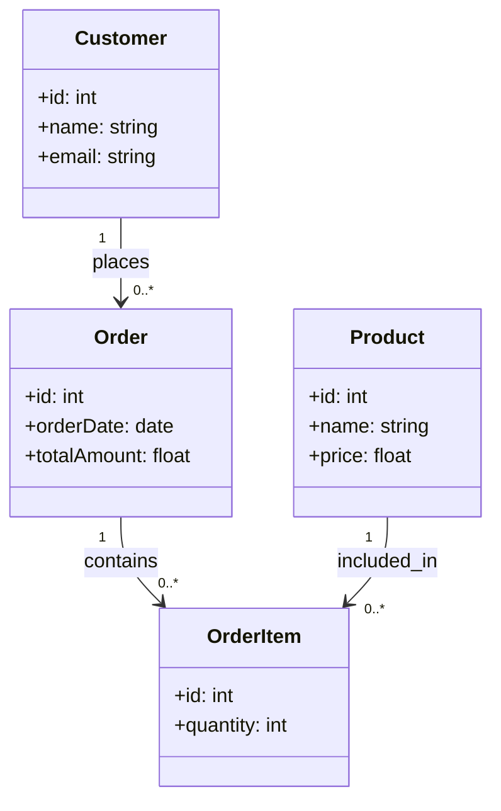

# UML 数据建模

## 介绍

UML（统一建模语言，Unified Modeling Language）是一种用于软件系统设计和建模的标准化语言。它通过图形化的方式帮助开发者和设计师清晰地表达系统的结构和行为。在数据库设计中，UML 数据建模是一种强大的工具，用于描述数据库的结构、实体之间的关系以及数据的流动。

UML 数据建模的核心是 **类图（Class Diagram）**，它用于表示数据库中的实体（表）、属性（字段）以及实体之间的关系（如一对一、一对多等）。通过 UML 类图，开发者可以在编写代码之前清晰地规划数据库的结构，从而减少设计错误和提高开发效率。

---

## UML 类图基础

UML 类图由以下几个主要元素组成：

1. **类（Class）**：表示数据库中的表。类名通常与表名一致。
2. **属性（Attributes）**：表示表中的字段。每个属性都有名称和数据类型。
3. **关系（Relationships）**：表示表之间的关系，如一对一、一对多、多对多等。

以下是一个简单的 UML 类图示例，展示了一个 `User` 表和一个 `Order` 表之间的关系：

在上面的示例中：
- `User` 类表示用户表，包含 `id`、`name` 和 `email` 三个属性。
- `Order` 类表示订单表，包含 `id`、`orderDate` 和 `totalAmount` 三个属性。
- `User` 和 `Order` 之间的关系表示一个用户可以下多个订单（一对多关系）。

---

## UML 类图中的关系类型

在 UML 数据建模中，常见的关系类型包括：

1. **一对一（1:1）**：一个实体只与另一个实体关联一次。
2. **一对多（1:N）**：一个实体可以与多个实体关联。
3. **多对多（N:M）**：多个实体可以相互关联。

### 一对一关系示例

以下是一个一对一关系的示例，表示一个用户只能有一个个人资料：

### 多对多关系示例

以下是一个多对多关系的示例，表示一个学生可以选修多门课程，一门课程也可以被多个学生选修：

---

## 实际案例：在线商店数据库设计

假设我们需要为一个在线商店设计数据库，以下是使用 UML 类图表示的数据库结构：

在这个案例中：
- `Customer` 表存储客户信息。
- `Order` 表存储订单信息。
- `Product` 表存储商品信息。
- `OrderItem` 表用于表示订单中的商品及其数量。

---

## 总结

UML 数据建模是数据库设计中的重要工具，它通过图形化的方式帮助开发者清晰地表达数据库的结构和关系。通过学习 UML 类图，你可以更好地规划数据库设计，减少开发中的错误。

:::tip 提示
在实际项目中，UML 类图不仅可以用于数据库设计，还可以用于描述系统的整体架构和模块之间的关系。
:::

---

## 附加资源与练习

### 资源
- [UML 官方文档](https://www.uml.org/)
- 《UML 精粹》—— Martin Fowler

### 练习
1. 设计一个图书馆管理系统的 UML 类图，包括 `Book`、`Author` 和 `Borrower` 表。
2. 尝试为一个社交媒体平台设计数据库，包括 `User`、`Post` 和 `Comment` 表。

通过实践，你将更好地掌握 UML 数据建模的技巧！