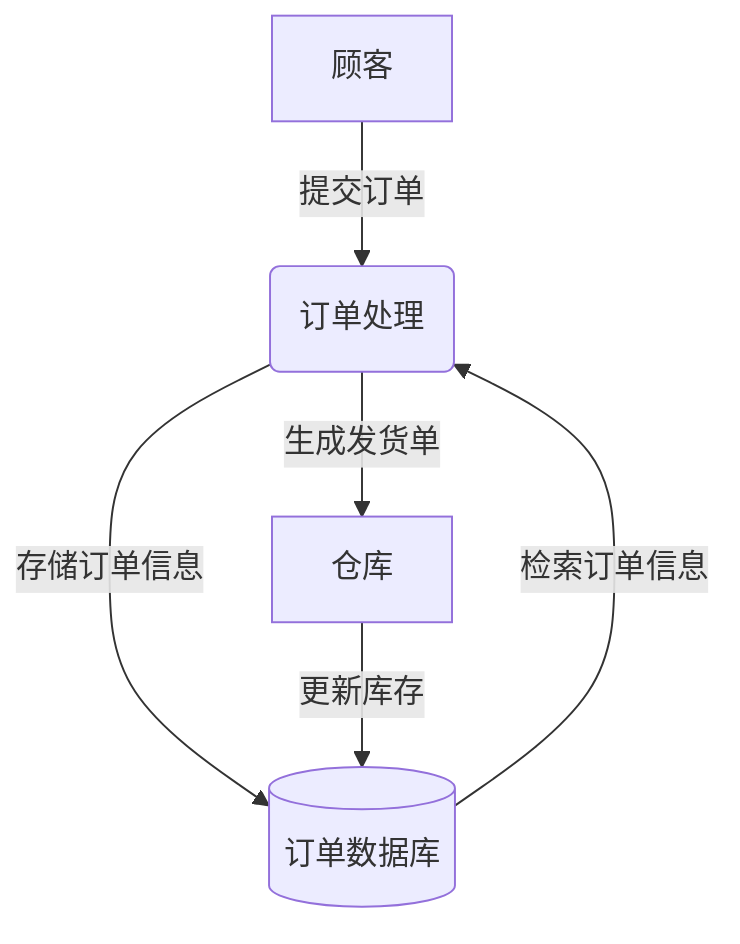
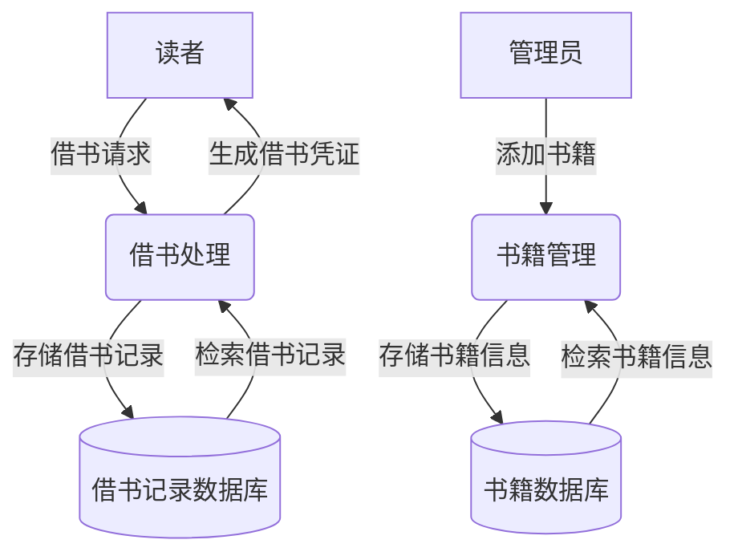
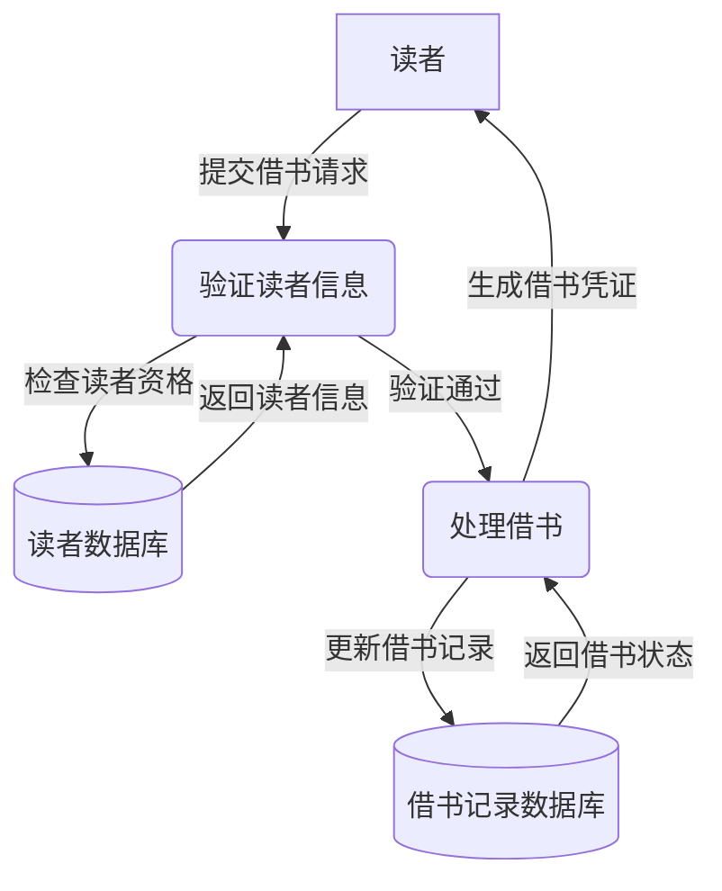

## 什么是数据流图(DFD)?

数据流图（Data Flow Diagram，简称DFD）是一种用于描述系统中数据流动和处理过程的图形化工具。它通过简单的符号和箭头，展示数据如何在系统中流动、存储和处理。DFD广泛应用于系统分析和设计阶段，帮助开发人员理解系统的功能需求和数据交互。

DFD的核心目标是：
- 描述数据的来源和去向。
- 展示数据在系统中的处理过程。
- 识别系统中的数据存储和外部实体。

:::tip
DFD 是一种高层次的设计工具，适合用于系统设计的早期阶段，帮助团队明确系统的功能需求。
:::

## DFD 的基本组成部分

DFD 由以下四个主要元素组成：

1. **外部实体（External Entity）**  
   表示与系统交互的外部对象，例如用户、其他系统或设备。通常用矩形表示。

2. **过程（Process）**  
   表示对数据的处理或转换操作。通常用圆角矩形或圆形表示。

3. **数据存储（Data Store）**  
   表示系统中存储数据的地方，例如数据库或文件。通常用两条平行线表示。

4. **数据流（Data Flow）**  
   表示数据在系统中的流动方向。通常用箭头表示。

以下是一个简单的DFD示例，展示了一个在线购物系统的数据流动：

## 如何绘制DFD？

绘制DFD通常分为以下几个步骤：

### 1. 确定系统的边界
首先，明确系统的范围，识别哪些是系统内部的功能，哪些是外部实体。

### 2. 识别外部实体
列出所有与系统交互的外部实体，例如用户、供应商或其他系统。

### 3. 识别主要过程
确定系统中需要处理的主要功能模块，例如订单处理、库存管理等。

### 4. 识别数据存储
列出系统中需要存储数据的地方，例如数据库、文件或缓存。

### 5. 绘制数据流
用箭头连接外部实体、过程和数据存储，展示数据的流动方向。

### 6. 逐步细化
从高层次的总览图开始，逐步细化每个过程，绘制更详细的子图。

:::caution
在绘制DFD时，避免过度复杂化。每个DFD图应该只展示一个层次的信息，细节可以在子图中进一步展开。
:::

## 实际案例：图书馆管理系统

让我们通过一个图书馆管理系统的例子，展示如何绘制DFD。

### 高层次DFD（Level 0）

### 细化借书处理过程（Level 1）

:::note
在实际项目中，DFD的层次可以根据系统的复杂度进行调整。通常，Level 0 是总览图，Level 1 是主要过程的细化，Level 2 是更详细的子过程。
:::

## 总结

数据流图（DFD）是一种强大的工具，能够帮助开发人员清晰地描述系统中的数据流动和处理过程。通过绘制DFD，团队可以更好地理解系统的功能需求，并为后续的数据库设计和系统开发奠定基础。

:::tip
如果你想进一步练习DFD的绘制，可以尝试为一个简单的系统（例如学生成绩管理系统）绘制DFD，并逐步细化每个过程。
:::

## 附加资源

- [Gane and Sarson符号指南](https://example.com/gane-sarson-guide)  
- [DFD绘制工具推荐](https://example.com/dfd-tools)  
- [系统分析与设计入门](https://example.com/system-analysis)