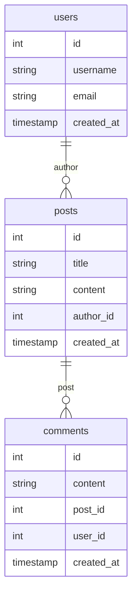

# MySQL基础

MySQL是一种广泛使用的关系型数据库管理系统（RDBMS），它使用结构化查询语言（SQL）来管理和操作数据。无论是小型项目还是大型企业应用，MySQL都是一个强大且灵活的选择。本文将带你从零开始学习MySQL的基础知识。

## 什么是MySQL？

MySQL是一个开源的关系型数据库管理系统，由瑞典公司MySQL AB开发，后被Oracle公司收购。它支持多用户、多线程，并且能够处理大量数据。MySQL以其高性能、可靠性和易用性而闻名，是许多Web应用程序的首选数据库。

## 安装MySQL

在开始使用MySQL之前，你需要先安装它。以下是在不同操作系统上安装MySQL的简要步骤：

- **Windows**: 下载MySQL Installer并按照向导进行安装。
- **macOS**: 使用Homebrew安装MySQL：`brew install mysql`。
- **Linux**: 使用包管理器安装MySQL，例如在Ubuntu上：`sudo apt-get install mysql-server`。

安装完成后，你可以通过命令行或图形界面工具（如MySQL Workbench）来管理数据库。

## 连接到MySQL

安装完成后，你可以通过命令行连接到MySQL服务器：

```bash
mysql -u root -p
```

输入密码后，你将进入MySQL的命令行界面。

## 创建数据库

在MySQL中，数据库是存储数据的容器。你可以使用以下命令创建一个新的数据库：

```sql
CREATE DATABASE mydatabase;
```

## 创建表

表是数据库中存储数据的基本结构。每个表由多个列组成，每列定义了数据的类型。以下是一个创建表的示例：

```sql
USE mydatabase;

CREATE TABLE users (
    id INT AUTO_INCREMENT PRIMARY KEY,
    username VARCHAR(50) NOT NULL,
    email VARCHAR(100) NOT NULL,
    created_at TIMESTAMP DEFAULT CURRENT_TIMESTAMP
);
```

在这个例子中，我们创建了一个名为`users`的表，包含`id`、`username`、`email`和`created_at`四个列。

## 插入数据

创建表后，你可以向表中插入数据。以下是一个插入数据的示例：

```sql
INSERT INTO users (username, email) VALUES ('john_doe', 'john@example.com');
```

## 查询数据

查询是数据库操作中最常见的任务之一。你可以使用`SELECT`语句从表中检索数据：

```sql
SELECT * FROM users;
```

这将返回`users`表中的所有数据。

## 更新数据

如果你需要更新表中的数据，可以使用`UPDATE`语句：

```sql
UPDATE users SET email = 'john.doe@example.com' WHERE username = 'john_doe';
```

## 删除数据

删除数据可以使用`DELETE`语句：

```sql
DELETE FROM users WHERE username = 'john_doe';
```

## 实际应用场景

假设你正在开发一个博客系统，你需要存储用户信息、文章内容和评论。你可以使用MySQL来管理这些数据。以下是一个简化的数据库设计：



在这个设计中，`users`表存储用户信息，`posts`表存储文章内容，`comments`表存储评论。每个表之间通过外键关联。

## 总结

本文介绍了MySQL的基础知识，包括安装、连接、创建数据库和表、插入、查询、更新和删除数据。通过这些基础操作，你可以开始使用MySQL来管理你的数据。

## 附加资源

- [MySQL官方文档](https://dev.mysql.com/doc/)
- [MySQL Tutorial](https://www.mysqltutorial.org/)
- [SQLZoo](https://sqlzoo.net/)

## 练习

1. 创建一个名为`products`的表，包含`id`、`name`、`price`和`stock`列。
2. 向`products`表中插入几条数据。
3. 查询`products`表中价格大于100的所有产品。
4. 更新`products`表中某个产品的库存数量。
5. 删除`products`表中某个产品。

通过完成这些练习，你将更好地掌握MySQL的基础操作。