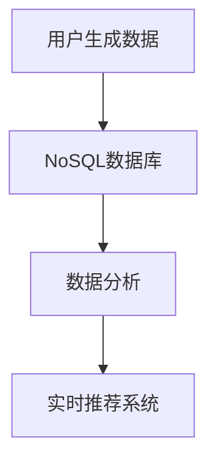
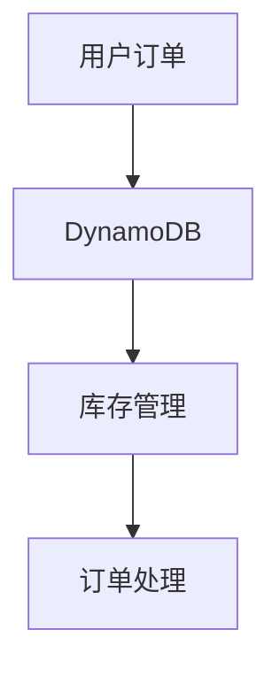
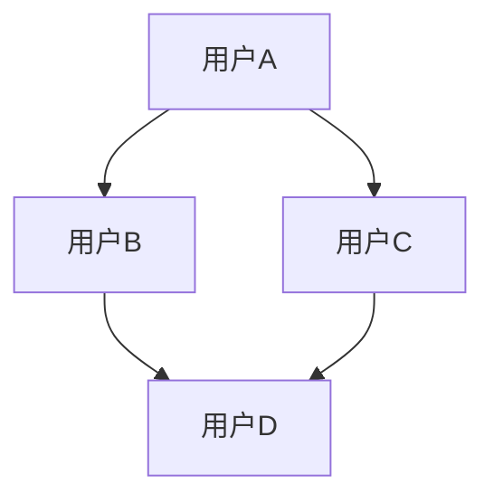

## 介绍

NoSQL（Not Only SQL）是一种非关系型数据库，它不依赖于传统的表格关系模型，而是使用更灵活的数据存储方式。NoSQL数据库通常用于处理大规模、非结构化或半结构化数据，适用于需要高扩展性、高性能和灵活性的场景。

与关系型数据库（如MySQL、PostgreSQL）不同，NoSQL数据库没有固定的表结构，数据可以以键值对、文档、列族或图的形式存储。这种灵活性使得NoSQL在处理大数据、实时应用和分布式系统时表现出色。

## NoSQL的主要应用场景

以下是NoSQL数据库常见的应用场景：

### 1. 大数据存储与分析

NoSQL数据库非常适合存储和处理大规模数据。例如，社交媒体平台每天生成海量的用户数据，这些数据通常是非结构化的（如日志、图片、视频等）。NoSQL数据库可以高效地存储和查询这些数据。

**案例**：  
Twitter使用NoSQL数据库（如Cassandra）来存储用户生成的内容和社交图谱数据。这种数据库能够快速处理高并发的读写请求，并支持水平扩展。



### 2. 实时应用

NoSQL数据库在实时应用中表现优异，例如实时聊天、在线游戏和物联网（IoT）设备数据收集。这些场景需要低延迟和高吞吐量。

**案例**：  
在线游戏平台使用NoSQL数据库（如Redis）来存储玩家的实时状态和游戏数据。Redis的内存存储特性使其能够快速响应玩家的操作。

```javascript
// 示例：使用Redis存储玩家状态
const redis = require("redis");
const client = redis.createClient();

client.set("player:123", JSON.stringify({ level: 5, score: 1000 }));
client.get("player:123", (err, reply) => {
    console.log(JSON.parse(reply)); // 输出：{ level: 5, score: 1000 }
});
```

### 3. 内容管理系统（CMS）

内容管理系统通常需要存储大量非结构化数据，如文章、图片和视频。NoSQL数据库（如MongoDB）可以轻松处理这些数据，并提供灵活的查询功能。

**案例**：  
一个新闻网站使用MongoDB来存储文章内容、用户评论和媒体文件。MongoDB的文档模型使得存储和检索复杂数据结构变得简单。

```javascript
// 示例：使用MongoDB存储文章
const mongoose = require("mongoose");
const articleSchema = new mongoose.Schema({
    title: String,
    content: String,
    comments: [{ body: String, date: Date }],
});
const Article = mongoose.model("Article", articleSchema);

const newArticle = new Article({
    title: NoSQL应用场景,
    content: "NoSQL数据库非常适合处理非结构化数据...",
    comments: [{ body: "很好的文章！", date: new Date() }],
});
newArticle.save();
```

### 4. 分布式系统

NoSQL数据库天生支持分布式架构，适合需要高可用性和容错性的系统。例如，电商平台需要处理全球用户的订单和库存数据。

**案例**：  
亚马逊使用DynamoDB来存储订单和库存数据。DynamoDB的分布式特性使其能够处理高并发请求，并保证数据的高可用性。



### 5. 图数据存储

NoSQL数据库中的图数据库（如Neo4j）非常适合存储和查询复杂的关系数据。例如，社交网络中的用户关系、推荐系统中的商品关联等。

**案例**：  
LinkedIn使用图数据库来存储用户之间的职业关系，并基于这些关系提供推荐服务。



## 总结

NoSQL数据库在以下场景中表现出色：
- 处理大规模、非结构化数据
- 实时应用和高并发系统
- 内容管理系统
- 分布式系统和高可用性需求
- 复杂关系数据的存储与查询

选择NoSQL数据库时，需要根据具体的业务需求和数据特点来决定。例如，如果需要高扩展性和灵活性，可以选择MongoDB；如果需要低延迟和高性能，可以选择Redis。

## 附加资源与练习

- **资源**：
  - [MongoDB官方文档](https://www.mongodb.com/docs/)
  - [Redis官方文档](https://redis.io/documentation)
  - [Cassandra官方文档](https://cassandra.apache.org/doc/)

- **练习**：
  1. 使用MongoDB创建一个简单的博客系统，存储文章和评论。
  2. 使用Redis实现一个实时在线用户状态跟踪系统。
  3. 使用Neo4j构建一个社交网络图，并查询用户之间的关系。

通过实践这些练习，你将更好地理解NoSQL数据库的应用场景和优势。