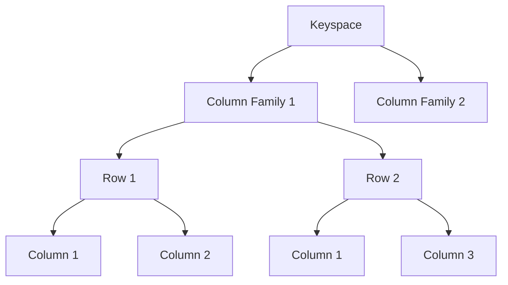

# 列族数据库(Cassandra)

## 介绍

列族数据库（Column Family Database）是一种非关系型数据库（NoSQL），它通过列族（Column Family）来组织数据。Cassandra 是其中最著名的代表之一，由 Facebook 开发并开源。Cassandra 被设计为分布式、高可用性和高性能的数据库，特别适合处理大规模数据集。

与关系型数据库不同，Cassandra 使用了一种称为“宽列存储”（Wide Column Store）的数据模型。这意味着数据是按行和列存储的，但列的数量可以动态变化，且每行可以有不同的列。

## 列族数据库的基本概念

### 1. 键空间（Keyspace）
键空间是 Cassandra 中最高层次的数据容器，类似于关系型数据库中的“数据库”。它定义了数据的复制策略和配置。

### 2. 列族（Column Family）
列族是 Cassandra 中数据的逻辑容器，类似于关系型数据库中的“表”。每个列族包含多行，每行包含多个列。

### 3. 行（Row）
行是 Cassandra 中的基本数据单元。每行由一个行键（Row Key）和多个列组成。

### 4. 列（Column）
列是 Cassandra 中的最小数据单元。每个列由列名（Column Name）和列值（Column Value）组成。

### 5. 超级列（Super Column）
超级列是一种特殊的列，它可以包含其他列。超级列在 Cassandra 的早期版本中使用，但在较新的版本中已被弃用。

## Cassandra 的数据模型

Cassandra 的数据模型是基于列族的。每个列族可以包含多个行，每行可以包含多个列。列的数量和名称可以动态变化，这使得 Cassandra 非常灵活。



## Cassandra 的查询语言（CQL）

Cassandra 使用一种类似于 SQL 的查询语言，称为 CQL（Cassandra Query Language）。CQL 提供了对 Cassandra 数据的增删改查操作。

### 创建键空间

```sql
CREATE KEYSPACE my_keyspace
WITH replication = {'class': 'SimpleStrategy', 'replication_factor': 3};
```

### 创建列族

```sql
CREATE TABLE my_keyspace.my_table (
    id UUID PRIMARY KEY,
    name TEXT,
    age INT
);
```

### 插入数据

```sql
INSERT INTO my_keyspace.my_table (id, name, age)
VALUES (uuid(), 'Alice', 30);
```

### 查询数据

```sql
SELECT * FROM my_keyspace.my_table WHERE name = 'Alice';
```

### 输出

```
 id                                   | name  | age
--------------------------------------+-------+-----
 123e4567-e89b-12d3-a456-426614174000 | Alice |  30
```

## 实际应用场景

### 1. 社交媒体平台
Cassandra 被广泛用于社交媒体平台，如 Facebook 和 Twitter，用于存储用户生成的内容（如帖子、评论等）。Cassandra 的高可用性和分布式特性使其能够处理大量的并发请求。

### 2. 物联网（IoT）
在物联网应用中，Cassandra 用于存储来自各种设备的大量传感器数据。Cassandra 的高写入吞吐量和可扩展性使其成为处理海量数据的理想选择。

### 3. 实时分析
Cassandra 可以用于实时分析系统，如日志分析和监控系统。Cassandra 的低延迟和高吞吐量使其能够快速处理和分析大量数据。

## 总结

Cassandra 是一种强大的列族数据库，特别适合处理大规模数据集和高并发请求。它的分布式架构和高可用性使其成为许多现代应用程序的首选数据库。

通过本文，你已经了解了 Cassandra 的基本概念、数据模型、查询语言以及实际应用场景。希望这些知识能够帮助你更好地理解和使用 Cassandra。

## 附加资源

- [Cassandra 官方文档](https://cassandra.apache.org/doc/latest/)
- [Cassandra 入门教程](https://www.tutorialspoint.com/cassandra/index.htm)
- [Cassandra 实战案例](https://www.datastax.com/resources/case-studies)

## 练习

1. 创建一个名为 `my_keyspace` 的键空间，并设置复制因子为 3。
2. 在 `my_keyspace` 中创建一个名为 `users` 的列族，包含 `id`、`name` 和 `email` 列。
3. 插入几条用户数据，并查询所有用户信息。

通过完成这些练习，你将更好地掌握 Cassandra 的基本操作。