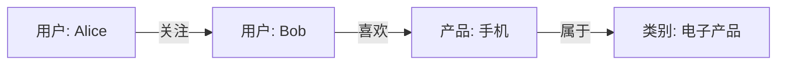

# 图数据库(Neo4j)

## 什么是图数据库？

图数据库是一种专门用于存储和查询图结构数据的数据库。与关系型数据库不同，图数据库使用节点（Nodes）和关系（Relationships）来表示数据，而不是表格。这种结构使得图数据库在处理复杂关系和网络数据时非常高效。

### 图数据库的核心概念

- **节点（Node）**：表示实体，例如人、地点或事物。每个节点可以包含属性（键值对）。
- **关系（Relationship）**：表示节点之间的连接。关系也可以包含属性。
- **属性（Property）**：节点和关系的附加信息，以键值对的形式存储。
- **标签（Label）**：用于对节点进行分类，例如“用户”或“产品”。

## 为什么选择 Neo4j？

Neo4j 是最流行的图数据库之一，具有以下优势：

- **高性能**：专为处理复杂关系设计，查询速度快。
- **灵活性**：数据模型可以轻松扩展和修改。
- **直观性**：使用 Cypher 查询语言，语法直观易学。

---

## Neo4j 基础

### 安装 Neo4j

你可以通过以下方式安装 Neo4j：

1. **下载并安装 Neo4j Desktop**：适用于本地开发和测试。
2. **使用 Docker**：快速部署 Neo4j 容器。

```bash
docker run --name neo4j -p 7474:7474 -p 7687:7687 -d neo4j
```

### 数据建模

在 Neo4j 中，数据建模的核心是定义节点和关系。以下是一个简单的例子：



在这个例子中：
- 节点：`用户: Alice`、`用户: Bob`、`产品: 手机`、`类别: 电子产品`
- 关系：`关注`、`喜欢`、`属于`

### Cypher 查询语言

Cypher 是 Neo4j 的查询语言，类似于 SQL，但专为图数据设计。以下是一些基本操作：

#### 创建节点和关系

```cypher
CREATE (alice:User {name: "Alice", age: 30})
CREATE (bob:User {name: "Bob", age: 25})
CREATE (alice)-[:FOLLOWS]->(bob)
```

#### 查询数据

```cypher
MATCH (a:User)-[:FOLLOWS]->(b:User)
RETURN a.name, b.name
```

**输出：**

| a.name | b.name |
|--------|--------|
| Alice  | Bob    |

#### 更新数据

```cypher
MATCH (a:User {name: "Alice"})
SET a.age = 31
RETURN a
```

#### 删除数据

```cypher
MATCH (a:User {name: "Alice"})
DETACH DELETE a
```

---

## 实际应用场景

### 社交网络分析

图数据库非常适合分析社交网络中的关系。例如，查找某个用户的朋友的朋友：

```cypher
MATCH (user:User {name: "Alice"})-[:FOLLOWS]->(friend)-[:FOLLOWS]->(fof)
RETURN fof.name
```

### 推荐系统

通过分析用户的行为和关系，可以构建个性化推荐系统。例如，推荐用户可能喜欢的产品：

```cypher
MATCH (user:User {name: "Alice"})-[:LIKES]->(product:Product)<-[:LIKES]-(otherUser)-[:LIKES]->(recommendedProduct)
WHERE NOT (user)-[:LIKES]->(recommendedProduct)
RETURN recommendedProduct.name
```

### 欺诈检测

图数据库可以用于检测异常行为。例如，识别可能存在欺诈的交易网络：

```cypher
MATCH (a:Account)-[:TRANSFER]->(b:Account)
WHERE a.balance < 0 AND b.balance > 10000
RETURN a, b
```

---

## 总结

图数据库（如 Neo4j）是处理复杂关系数据的强大工具。通过节点和关系，你可以轻松建模和查询网络结构数据。Cypher 查询语言直观易学，适合初学者快速上手。

### 附加资源

- [Neo4j 官方文档](https://neo4j.com/docs/)
- [Cypher 查询语言指南](https://neo4j.com/developer/cypher/)
- [Neo4j 社区论坛](https://community.neo4j.com/)

### 练习

1. 创建一个包含 5 个用户和 10 个关系的社交网络图。
2. 编写一个查询，查找某个用户的所有间接朋友（朋友的朋友）。
3. 尝试构建一个简单的推荐系统，推荐用户可能喜欢的产品。

:::tip
如果你在学习过程中遇到问题，可以访问 Neo4j 社区论坛，与其他开发者交流经验。
:::