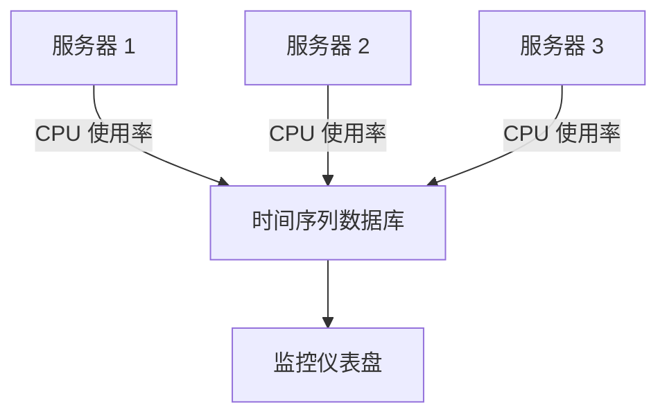
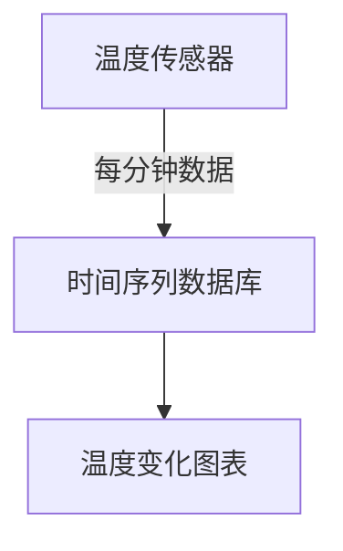

# 时间序列数据库

## 介绍

时间序列数据库（Time Series Database, TSDB）是一种专门用于存储和查询时间相关数据的数据库。时间序列数据是按时间顺序记录的数据点集合，通常用于监控、分析、预测等场景。例如，股票价格、传感器数据、服务器性能指标等都是典型的时间序列数据。

与传统的数据库不同，时间序列数据库针对时间序列数据的存储和查询进行了优化，能够高效地处理大量的时间戳数据，并提供快速的查询和分析功能。

## 时间序列数据的特点

时间序列数据具有以下特点：

1. **时间戳**：每个数据点都有一个时间戳，表示数据记录的时间。
2. **高写入频率**：时间序列数据通常以高频率写入，例如每秒或每分钟。
3. **数据量大**：由于数据持续生成，时间序列数据库通常需要处理大量的数据。
4. **查询模式**：查询通常基于时间范围，例如“过去一小时的平均温度”。

## 时间序列数据库的优势

时间序列数据库针对上述特点进行了优化，具有以下优势：

1. **高效存储**：使用压缩算法减少存储空间。
2. **快速查询**：针对时间范围的查询进行了优化。
3. **高写入吞吐量**：能够处理高频率的数据写入。
4. **数据保留策略**：支持自动删除旧数据，以节省存储空间。

## 时间序列数据库的应用场景

时间序列数据库广泛应用于以下场景：

1. **物联网（IoT）**：存储传感器数据，如温度、湿度、压力等。
2. **金融**：记录股票价格、交易数据等。
3. **监控系统**：存储服务器性能指标、网络流量等。
4. **日志分析**：记录和分析系统日志。

## 时间序列数据库示例

以下是一个使用 [InfluxDB](https://www.influxdata.com/)（一种流行的时间序列数据库）的简单示例。

### 安装 InfluxDB

首先，安装 InfluxDB：

```bash
# 使用 Docker 安装 InfluxDB
docker run -d -p 8086:8086 --name influxdb influxdb:latest
```

### 写入数据

接下来，我们向 InfluxDB 写入一些时间序列数据：

```bash
# 使用 curl 写入数据
curl -i -XPOST "http://localhost:8086/write?db=mydb" \
  --data-binary "temperature,location=room1 value=22.5 1633024800000000000"
```

### 查询数据

然后，我们可以查询这些数据：

```bash
# 使用 curl 查询数据
curl -G "http://localhost:8086/query?db=mydb" \
  --data-urlencode "q=SELECT * FROM temperature WHERE time > now() - 1h"
```

### 输出

查询结果可能如下所示：

```json
{
  "results": [
    {
      "statement_id": 0,
      "series": [
        {
          "name": "temperature",
          "columns": ["time", "location", "value"],
          "values": [
            ["2021-10-01T12:00:00Z", "room1", 22.5]
          ]
        }
      ]
    }
  ]
}
```

## 实际案例

### 案例 1：监控服务器性能

假设你有一个服务器集群，需要监控每台服务器的 CPU 使用率。你可以使用时间序列数据库来存储这些数据，并生成实时图表。



### 案例 2：物联网传感器数据

在一个智能家居系统中，温度传感器每分钟记录一次数据。你可以使用时间序列数据库来存储这些数据，并分析温度变化趋势。



## 总结

时间序列数据库是处理时间相关数据的强大工具，特别适合高频率写入和大规模数据存储的场景。通过优化存储和查询，时间序列数据库能够高效地支持监控、分析、预测等应用。

## 附加资源

- [InfluxDB 官方文档](https://docs.influxdata.com/influxdb/)
- [时间序列数据库比较](https://db-engines.com/en/ranking/time+series+dbms)
- [时间序列数据分析教程](https://www.timescale.com/learn)

## 练习

1. 安装 InfluxDB 并尝试写入和查询一些时间序列数据。
2. 设计一个简单的监控系统，使用时间序列数据库存储 CPU 使用率数据，并生成实时图表。
3. 探索其他时间序列数据库（如 Prometheus、TimescaleDB），并比较它们的特点和性能。

:::tip
时间序列数据库是数据密集型应用的理想选择，尤其是在需要处理大量时间相关数据的场景中。通过学习和实践，你将能够更好地理解和应用这一技术。
:::